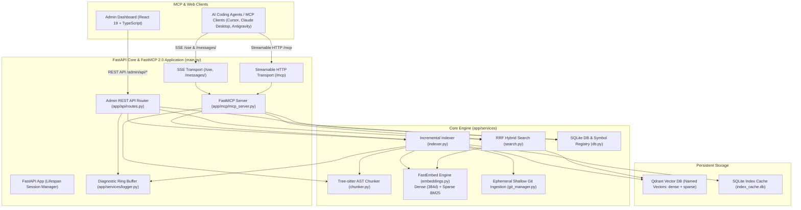
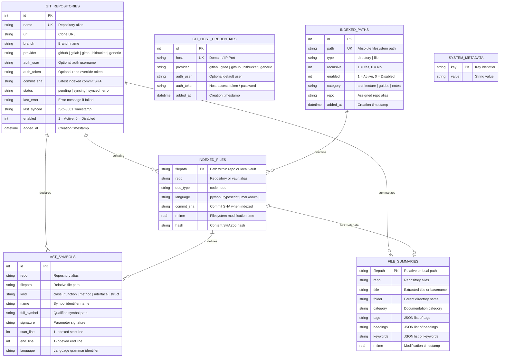
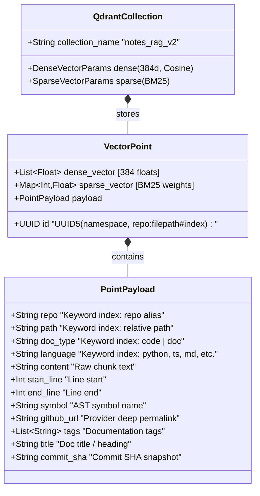

# Architecture: Notes & Code RAG MCP Server (v2.4.1)

The Notes & Code RAG MCP Server provides fast, local, syntax-aware semantic and hybrid search over codebases, git repositories, markdown notes, and system documentation. It is built natively on the **Model Context Protocol (MCP) SDK 2.0.0+** using `FastMCP`, with an integrated FastAPI web engine, real-time diagnostic logging, and a React 19 administrative dashboard.

---

## 🏗️ High-Level System Architecture



---

## 🧩 Core Architecture Components

### 1. FastMCP 2.0 Server & Transport Routing (`app/mcp/`)
- **FastMCP Foundation**: Implemented via `mcp.server.fastmcp.FastMCP` with lifespan session management (`mcp_server.session_manager.run()`).
- **Dual MCP Transports**:
  - **Server-Sent Events (SSE)**: Mounted via `mcp_server.sse_app().routes`, handling streaming events at `/sse` and message exchanges at `/messages/`.
  - **Streamable HTTP**: Mounted via `mcp_server.streamable_http_app().routes` at `/mcp` for direct bidirectional JSON-RPC.
- **Agent Tools (7 Tools)**:
  - `search_code`: Hybrid semantic + BM25 search over code functions and logic blocks with line numbers and GitHub links.
  - `search_docs`: Dedicated hybrid search across markdown notes, system architecture, and runbooks.
  - `find_symbol`: Instant exact/fuzzy symbol definitions from AST index.
  - `get_file_outline`: File symbol hierarchy without full token context costs.
  - `list_repositories`: Summary of all indexed Git repos and local paths.
  - `sync_repository`: On-demand re-sync for a specific repo or all sources.
  - `index_status`: Global vector stats, model metadata, and GitHub rate limits.
- **Dynamic Resource Providers**:
  - `notes://catalog/summary`: Markdown catalog summarizing indexed repositories, file counts, and AST symbol distributions.
- **Custom Agent Prompt Templates**:
  - `search_infrastructure_docs`: Parameterized workflow for infrastructure and deployment queries.
  - `find_implementation_symbol`: Parameterized workflow for locating implementation symbols.

---

### 2. Diagnostic Logging & System Observability (`app/services/logger.py`)
- **In-Memory Ring Buffer**: Implemented using `collections.deque(maxlen=500)` guarded by a `threading.Lock()`.
- **Diagnostic Log Handler**: Captures log records across all backend modules (`notes-rag-mcp`, `server.*`, `indexer`, `git`, `ast_parser`), preserving:
  - `timestamp`: ISO-8601 UTC timestamp.
  - `level`: `INFO`, `WARNING`, `ERROR`, `DEBUG`.
  - `logger`: Originating logger name.
  - `message`: Formatted log message.
  - `traceback`: Full exception stack trace when available.
- **REST Endpoints**:
  - `GET /admin/api/logs`: Retrieves formatted log records with level filtering and search query support.
  - `DELETE /admin/api/logs`: Atomically clears the ring buffer.

---

### 3. AST Code & Documentation Parsing Engine (`app/services/chunker.py`)
- **Tree-sitter AST Parser**: Parses syntactic structures across Python, TypeScript, JavaScript, Go, Rust, C#, C++, Java, Ruby, PHP, and more.
- **Boundary-Aware Chunking**: Chunks along class, method, function, and struct boundaries with exact line numbers and symbol names.
- **Contextual Markdown Chunker**: Chunks documentation files by header hierarchies (`#`, `##`, `###`) with breadcrumb enrichment.
- **Graceful Fallback**: Text-based fallback chunker for unsupported languages and malformed syntax.

---

### 4. Hybrid Embedding & Vector Engine (`app/services/embeddings.py`, `app/services/search.py`)
- **Named Multi-Vectors**: Qdrant collections configured with dual vector spaces:
  - **Dense Vectors**: `BAAI/bge-small-en-v1.5` (384 dimensions, Cosine distance).
  - **Sparse Vectors**: `Qdrant/bm25` (In-process FastEmbed BM25 sparse model).
- **Reciprocal Rank Fusion (RRF)**: Merges dense semantic similarity with sparse keyword retrieval using reciprocal rank fusion ($RRF\_score = \sum \frac{1}{60 + rank}$) for optimal search recall.
- **Local In-Process Execution**: ONNX runtime execution on CPU with zero external API latency or cost.

---

### 5. Universal Git Repository Ingestion (`app/services/git_manager.py`)
- **Universal Provider Support**:
  - Automatically identifies or configures providers: **GitHub**, **GitLab (Cloud, Enterprise & Self-Hosted)**, **Gitea & Forgejo**, **Bitbucket (Cloud & Server)**, and **Generic Git HTTP/HTTPS**.
  - Custom ports, local IPs, and self-hosted instances supported (e.g. `http://git.lan:3000/user/repo.git`).
- **Shallow Cloning**: Authenticated shallow clones (`git clone --depth 1 --branch <branch> --single-branch`) into temporary directories.
- **Remote SHA Tracking**: Queries remote commit SHAs via `git ls-remote` to skip redundant clones.
- **Zero Disk Bloat**: Prunes cloned directories immediately after AST extraction and vector upserts.
- **Provider-Exact Permalinks**:
  - GitHub: `{base}/blob/{sha}/{path}#L{start}-L{end}`
  - GitLab: `{base}/-/blob/{sha}/{path}#L{start}-{end}`
  - Gitea / Forgejo: `{base}/src/commit/{sha}/{path}#L{start}-L{end}`
  - Bitbucket: `{base}/src/{sha}/{path}#lines-{start}:{end}`
- **Multi-Tier Git Authentication Hierarchy**:
  1. Per-repository override token & optional username (`auth_token`, `auth_user`).
  2. Domain-level Custom Git Host Vault (`git_host_credentials`).
  3. Global provider tokens (`GITHUB_TOKEN`, `GITLAB_TOKEN`, `GITEA_TOKEN` in DB or Settings UI).
  4. Environment variable fallback.
- **Credential Masking & URL Sanitization**: Complete redaction of all passwords and tokens from log messages and UI payloads.

---

### 6. Database & Symbol Index (`app/services/db.py`)
- **SQLite Database (`index_cache.db`) with WAL mode**:
  - `git_repositories`: Registered remote Git repos, provider type, auth usernames, branches, commit SHAs, status, and last synced timestamps.
  - `git_host_credentials`: Host domain credential vault for self-hosted instances.
  - `indexed_paths`: Monitored local directories and files.
  - `ast_symbols`: Indexed symbol table (classes, functions, methods, line numbers, signatures) for instantaneous `find_symbol` and `get_file_outline`.
  - `indexed_files` & `file_summaries`: File metadata, mtime change detection, and topic tags.
  - `system_metadata`: Key-value storage for tokens and timestamps.

#### SQLite Relational Entity-Relationship Diagram (ERD)


#### Qdrant Hybrid Vector Store Schema


---

### 7. Modern Web Admin Dashboard (`frontend/`)
- **React 19 + TypeScript + Vite**: Fast, reactive dashboard served at `/admin/`.
- **Tabs**:
  - **Overview**: System metrics, embedding model specs, keyword cloud, and full reindex trigger.
  - **Git Repositories**: Repository registration modal, single-repo sync triggers, error diagnostics, and deletion.
  - **Local Paths**: Workspace directory browser, path configuration, and recursive indexing toggles.
  - **Search & Inspector**: Live hybrid search tester with code/doc toggle, repo filters, and RRF score inspect.
  - **Settings**: GitHub PAT configuration and rate limit status monitor.
  - **Diagnostics & Logs**: Real-time log inspector with level pills (ALL, INFO, WARNING, ERROR, DEBUG), keyword filtering, traceback view modal, and buffer clear action.

---

## 🧪 Test Topology & Quality Assurance

```
┌─────────────────────────────────────────────────────────────┐
│                    Test Suite Topology                      │
├──────────────────────────────┬──────────────────────────────┤
│ Python Backend (Pytest)      │ Frontend (Vitest & Playwright)│
├──────────────────────────────┼──────────────────────────────┤
│ - tests/backend/test_mcp.py  │ - Vitest Unit/Component:     │
│ - tests/backend/test_api.py  │   * App.test.tsx             │
│ - tests/backend/test_*.py    │   * DiagnosticsViewer.test   │
│ - >95% statement coverage    │   * GitRepoManager.test      │
│ - FastMCP 2.0 tools/prompts  │   * SearchInspector.test     │
│ - Ring buffer logging tests  │ - Playwright E2E (13 specs): │
│ - Ephemeral git clone tests  │   * Full UI navigation       │
│ - Hybrid search & RRF tests  │   * Modals & confirmation    │
│                              │   * Real-time sync feedback  │
│                              │   * Diagnostics log viewer   │
└──────────────────────────────┴──────────────────────────────┘
```
