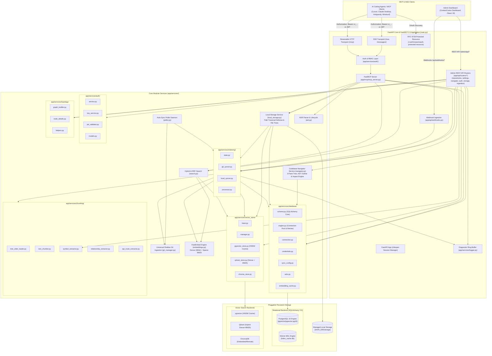
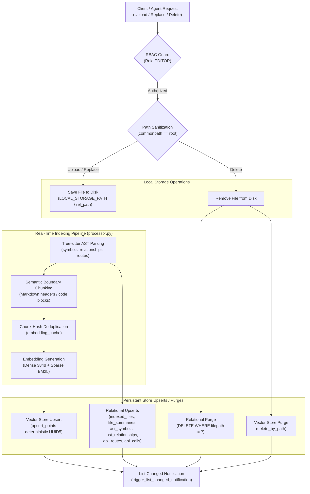
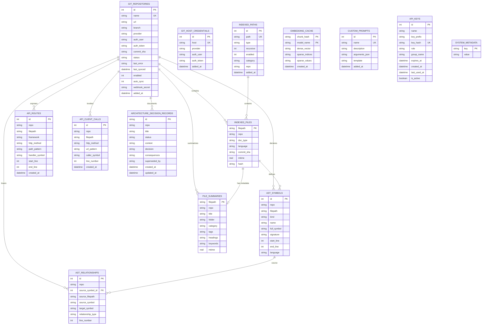

# Architecture: ContextCortex (v2.12.0)

ContextCortex provides fast, local, syntax-aware semantic and hybrid search over codebases, git repositories, markdown notes, architecture documents, and system documentation. It is built natively on the **Model Context Protocol (MCP) SDK 2.0.0+** using `FastMCP`, with an integrated FastAPI web engine, real-time diagnostic logging, pluggable relational and vector store backends (PostgreSQL 16 with pgvector, Qdrant, ChromaDB, and SQLite), automatic polling daemons, multi-provider webhooks, interactive dependency topology graph explorer, RFC 9728 OAuth 2.1 Protected Resource Server, 3-tier API key RBAC, and a React 19 administrative dashboard.

All backend services and frontend components are modularized into cohesive packages with a strict **sub-500 LOC per file** maintainability floor.

---

## 🏗️ High-Level System Architecture

---

## 🧩 Modular Architecture Packages

### 1. MCP 2026-07-28 OAuth 2.1 & RBAC Security Engine (`app/services/auth/` & `app/api/routers/auth.py`)
- **RFC 9728 Protected Resource Metadata (`/.well-known/oauth-protected-resource`)**:
  - Exposes resource URI indicator, supported authorization server issuers, token bearer methods (`header`), and available MCP scopes (`mcp:admin`, `mcp:editor`, `mcp:viewer`).
- **3-Tier Role Hierarchy & Permissions**:
  - `admin` (Level 30 / `mcp:admin`): Full administrative control over server settings, API key lifecycle, credentials vault, repository syncs, and MCP tools.
  - `editor` (Level 20 / `mcp:editor`): Mutation operations including repository triggering, ADR authoring/updating, and read-only searches.
  - `viewer` (Level 10 / `mcp:viewer`): Read-only retrieval across code search, documentation search, AST symbols, outlines, and architecture summaries.
- **JWT & OIDC Validation (`jwt_validator.py`)**:
  - Validates RS256/ES256 signed JWTs against OpenID Connect discovery endpoints (`/.well-known/openid-configuration`) and JWKS key sets with in-memory caching and automatic stale key refresh.
  - Verifies token claims: `iss` (issuer), `aud` or `resource` (resource indicator matching RFC 8707 / RFC 9728), `exp` (expiration with clock skew tolerance), and extracts roles from `roles`, `groups`, or `scope` claims.
- **Database-Backed API Keys (`key_service.py`)**:
  - Generates secure random keys prefixed with `cc_` (e.g. `cc_live_...`).
  - Stores SHA-256 hashes (`key_hash`) and 16-character public prefixes (`key_prefix`) in relational storage.
  - Tracks `last_used_at` timestamps, expiration policies, and active revocation flags.
- **Tool Authorization Guards (`enforce_tool_permission`)**:
  - ContextVar-based per-request security context propagation (`AuthContext`).
  - Guards MCP tool executions with clear `ForbiddenError` (403) or `AuthenticationError` (401) responses when permissions are insufficient.
- **Local Development Bypass & Auto-Bootstrap**:
  - Default bypass mode when `AUTH_ENABLED=false` grants full `admin` rights for zero-friction local development.
  - Automatically bootstraps admin keys from `ADMIN_INITIAL_KEY` environment variable during container startup.

---

### 2. Relational Database & Connection Management (`app/services/database/`)
- **Canonical Schema Single Source of Truth (`schema.py`)**:
  - Declares all relational tables using SQLAlchemy 2.0 Core (`MetaData`, `Table`, `Column`, `Index`, `ForeignKey`).
  - Maintains structural parity between SQLite and PostgreSQL 16.
- **Engine Factory & Connection Pool (`engine.py`)**:
  - Dynamic URL normalization for `postgresql+psycopg://` driver connection strings and `sqlite:///` paths.
  - Connection pooling with `pool_pre_ping=True`, configurable `pool_size` (default 10) and `max_overflow` (default 20) for PostgreSQL.
  - WAL mode, busy timeout (5000ms), and foreign keys enabled automatically on SQLite connections.
  - Cold-boot retry loop (`wait_for_db`) with exponential backoff for resilient container orchestration.
  - Idempotent table creation (`metadata.create_all`) and automatic default seeding (system metadata, default prompts, vault paths).
- **Embedding Cache (`embedding_cache.py`)**:
  - Fast chunk-hash deduplication cache storing dense and sparse embedding representations across reindexing runs.
- **Custom Git Host Vault & ADR Storage (`credentials.py`, `adrs.py`, `sync_config.py`)**:
  - Multi-tier credential hierarchy resolution and Architectural Decision Record lifecycle state machine.

---

### 3. Pluggable Multi-Backend Vector Layer (`app/services/vector_store/`)
- **Abstract Vector Interface (`base.py`)**:
  - Standardized `VectorStore` contract with `upsert_documents`, `search`, `delete_by_path`, `delete_by_repo`, `get_stats`, and `health_check`.
- **PostgreSQL 16 + pgvector Backend (`pgvector_store.py`)**:
  - Native `vector(384)` column storage with HNSW cosine distance index (`vector_cosine_ops`).
  - Cosine similarity ranking (`1 - (embedding <=> query_vec)`).
  - Native `JSONB` payload and tag filtering (`tags @> '["tag"]'`).
  - Parameterized chunked batch upserts with `ON CONFLICT (id) DO UPDATE`.
- **Qdrant Backend (`qdrant_store.py`)**:
  - Embedded disk and remote server support with dense + sparse BM25 multi-vectors and Reciprocal Rank Fusion (RRF).
- **ChromaDB Backend (`chroma_store.py`)**:
  - Lightweight persistent disk or remote vector store.
- **Vector Store Manager (`manager.py`)**:
  - Singleton provider supporting dynamic runtime backend switching across `pgvector`, `qdrant`, and `chroma`.

---

### 4. FastMCP 2.0 Server & Handlers (`app/mcp/`)
- **FastMCP Core (`app/mcp/mcp_server.py`)**: Manages MCP lifespan and session registration.
- **Dual Transports**:
  - **Server-Sent Events (SSE)**: Streaming events at `/sse` and message exchanges at `/messages/`.
  - **Streamable HTTP**: Bidirectional JSON-RPC at `/mcp`.
- **Extended Agent Tools (`app/mcp/tools.py` & `app/mcp/handlers/`)**:
  - `search_handlers.py`: `search_code`, `search_docs` hybrid search with RRF.
  - `symbol_handlers.py`: `find_symbol`, `get_file_outline` sub-50ms AST lookups.
  - `repo_handlers.py`: `list_repositories`, `sync_repository`, `index_status`.
  - `route_handlers.py`: `get_code_routes`, `trace_call_path` cross-repo API calls.
  - `architecture_handlers.py`: `get_architecture`, `manage_adr` ADR tracking.
  - `storage_handlers.py`: `manage_local_file` (upload, replace, delete, read), `what_is_ingested` (unified multi-source catalog filter).
- **Dynamic Resource Providers**:
  - `knowledge://catalog/summary`: Markdown catalog of repositories, document types, and symbols.
- **Agent Prompts**:
  - `search_infrastructure_docs`, `find_implementation_symbol`.

---

### 5. Multi-Language Tree-sitter AST & Chunking (`app/services/chunking/`)
- `tree_sitter_loader.py`: Lazy loader for 10 Tree-sitter grammars (Python, TS/JS, Go, Rust, C#, C++, Java, Ruby, PHP).
- `text_chunker.py`: Hierarchical markdown breadcrumbs (`# > ## > ###`) and sliding window text chunking.
- `symbol_extractor.py`: AST symbol declaration extraction with 1-indexed line numbers and signatures.
- `relationship_extractor.py`: AST relations extraction (`CALLS`, `IMPORTS`, `EXTENDS`).
- `api_route_extractor.py`: REST route definitions and client invocations across backend frameworks.

---

### 6. Incremental Ingestion & Syncing (`app/services/indexing/`)
- `state.py`: Global indexing lock, active session notifications (`send_tool_list_changed`), configuration constants.
- `git_syncer.py`: Ephemeral shallow git cloning, remote commit SHA tracking, AST symbol ingestion, vector upserts.
- `local_syncer.py`: Local filesystem directories and Obsidian markdown vault indexing with mtime caching.
- `processor.py`: Unified file parsing, YAML frontmatter extraction, and AST chunk generation.

---

### 7. Topology & Dependency Graph (`app/services/topology/`)
- `graph_builder.py`: Builds multi-repo dependency graphs combining files, classes, functions, and API routes with depth-bounded BFS filtering.
- `node_details.py`: Formats deep inspection data (code previews, line ranges, neighbor relations, permalinks).
- `helpers.py`: Cross-repo node ID generation, URL link normalization, and graph pruning.

---

### 8. Universal Git Management (`app/services/git_manager.py`)
- **Universal Provider Ingestion**: GitHub, GitLab (Cloud & Self-Hosted), Gitea/Forgejo, Bitbucket, and Generic Git HTTP/HTTPS.
- **Zero Disk Bloat**: Shallow ephemeral clones cleaned immediately after processing.
- **Provider-Exact Permalinks**: Deep code permalinks across all supported Git hosts.
- **Credential Sanitization**: URL sanitization masking tokens in logs and client responses.

---

### 9. Background Poller & Multi-Provider Webhooks
- `app/services/poller.py`: Background daemon checking remote commit SHAs at configured intervals.
- `app/api/webhooks.py`: Authenticated push event ingestion for GitHub, GitLab, Gitea, and Bitbucket.

---

### 10. Managed Local Storage Architecture & Security (`app/services/local_storage.py`)
- **Configurable Storage Directory**: Managed directory tree located at `DATA_DIR/storage` or configured via `LOCAL_STORAGE_PATH`.
- **Path Sanitization & Traversal Defense**:
  - Validates relative paths using `os.path.abspath(os.path.join(root, rel_path))`.
  - Canonical containment verification via `os.path.commonpath([resolved_path, root_dir]) == root_dir`.
  - Rejects `..`, absolute paths, leading slashes, and null bytes (`\x00`) with 400 Bad Request / error strings.
- **Directory Hierarchy & Tree Inspection**:
  - `get_file_tree(subfolder)` generates nested directories, file metadata (sizes, mtimes), and aggregate file counts for UI and catalog consumers.
- **Role-Based Access Enforcement**:
  - Mutation actions (`upload`, `replace`, `delete`) require `Role.EDITOR`.
  - Read actions (`read`, `tree`, `catalog`) require `Role.VIEWER`.

---

### 11. Real-Time Incremental Ingestion Pipeline Dataflow

The incremental ingestion engine allows documents, notes, and code files uploaded to Local Storage to be parsed, chunked, and vector-indexed with sub-second latency:

---

### 12. Unified Ingestion Catalog (`what_is_ingested` & `/admin/api/ingestion/catalog`)
- **Multi-Source Aggregation**: Single consolidated inventory querying across:
  1. **Git Repositories** (`git_repositories` table, branches, commit SHAs, URLs, sync status).
  2. **Monitored Local Paths** (`indexed_paths` table, categories, recursive scan settings).
  3. **Managed Local Storage** (`local_storage` namespace files in `indexed_files` and filesystem tree).
- **Multi-Dimensional Query Filtering**:
  - `source_type`: Filter by `all`, `git`, `monitored_path`, or `local_storage`.
  - `repo_name`: Exact match repository or namespace alias.
  - `path_prefix`: Filter files matching directory / prefix path.
  - `file_extension`: Filter by extension (e.g. `.md`, `.py`, `.ts`).
  - `detail_level`: `summary` for high-level repository stats, file counts, and symbol totals; `detailed` for comprehensive file-by-file inventories with doc types and languages.
- **MCP Tool & REST Parity**: Exposes identical catalog querying functionality via FastMCP tool (`what_is_ingested`) and FastAPI endpoint (`GET /admin/api/ingestion/catalog`) guarded by `Role.VIEWER`.

---

### 13. High-Performance 3-Pane Codebase Navigator (`app/services/navigator.py` & `app/api/routers/navigator.py`)
- **Architectural Motivation**: Replaces legacy 2D graph canvases with a structured, ultra-fast 3-pane navigation paradigm designed for instant codebase comprehension, symbol discovery, and architectural impact analysis.
- **Three-Pane Layout Topology**:
  - **Pane 1: Files & Modules (`NavigatorTree.tsx`)**:
    - Queries `GET /admin/api/navigator/tree?repo=...`.
    - Recursively organizes `indexed_files` into hierarchical directory trees with aggregate metrics (total symbol counts, detected API routes per folder/file).
    - Features instant search filtering (auto-expanding ancestor directories), Expand All / Collapse All controls, and active file highlighting.
  - **Pane 2: Symbols & Routes (`NavigatorOutline.tsx`)**:
    - Queries `GET /admin/api/navigator/file-outline?filepath=...&repo=...`.
    - Retrieves syntax-aware AST symbols from `ast_symbols` along with associated REST routes from `api_routes`.
    - Provides category chip filtering (`All`, `Functions`, `Classes`, `Routes`) and real-time symbol search.
    - Displays symbol kinds (function, class, struct, interface), start/end line numbers, and route method badges (`POST`, `GET`, etc.).
  - **Pane 3: Code Intelligence & Impact Inspector (`NavigatorInspector.tsx`)**:
    - Queries `GET /admin/api/navigator/symbol-impact?symbol_id=...` or `?name=...&filepath=...`.
    - Aggregates multi-source intelligence from `ast_symbols`, `ast_relationships`, and `api_routes`.
    - **4-Metric Impact Summary**: Count of incoming callers, outgoing callees, imported modules, and language scope.
    - **API Route Mapping Card**: Method badge (`POST`, `GET`, `PUT`, `DELETE`), path pattern (`/v1/chat/completions`), and framework tag (`FastAPI`, `Express`, `Gin`, etc.).
    - **Signature & Docstrings**: Syntax-highlighted code block and extracted documentation.
    - **Interactive Relationship Cards**: Clickable caller cards with filename, symbol name, and line numbers. Clicking a caller triggers bidirectional navigation (updates tree selection, switches file outline, and activates the caller symbol).
    - **Copy Permalink**: Generates and copies clean permalinks with file paths and line ranges.
- **Multi-Density Layout Engine & Persistent UX**:
  - `Balanced`: Default balanced layout optimized for standard desktop viewports.
  - `Compact`: High-density IDE layout reducing font sizes and padding for large file trees and complex outlines.
  - `Spacious`: Card-based layout with expanded line heights and spacious typography.
  - Layout density and last selected repository are persisted in `localStorage`.
- **Zero Horizontal Overflow & Responsive Adaptability**:
  - Flexbox and grid CSS architecture with `min-width: 0`, `overflow-wrap: anywhere`, and nested vertical scroll containers ensuring zero horizontal viewport overflow across desktop (1080p), tablet, and mobile displays.

---

## 🗄️ Relational Data Models (ERD)

