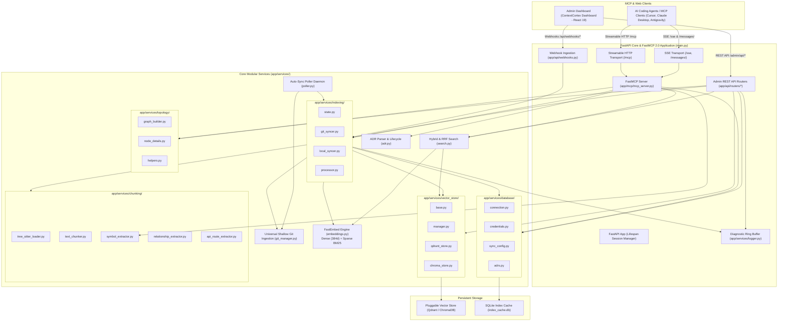
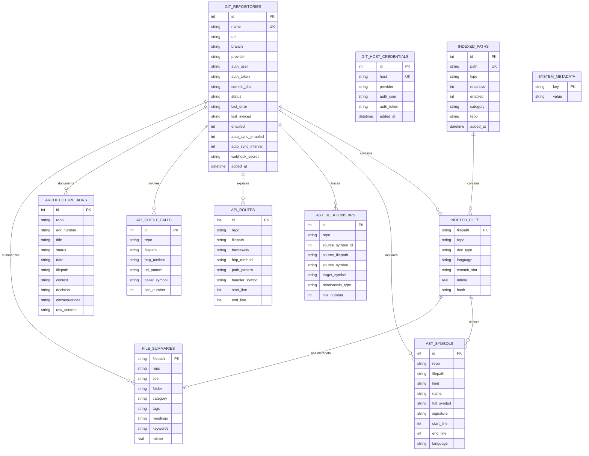

# Architecture: ContextCortex (v2.11.0)

ContextCortex provides fast, local, syntax-aware semantic and hybrid search over codebases, git repositories, markdown notes, architecture documents, and system documentation. It is built natively on the **Model Context Protocol (MCP) SDK 2.0.0+** using `FastMCP`, with an integrated FastAPI web engine, real-time diagnostic logging, pluggable vector store backends (Qdrant & ChromaDB), automatic polling daemons, multi-provider webhooks, interactive dependency topology graph explorer, and a React 19 administrative dashboard.

All backend services and frontend components are modularized into cohesive packages with a strict **sub-500 LOC per file** maintainability floor.

---

## 🏗️ High-Level System Architecture

---

## 🧩 Modular Architecture Packages

### 1. FastMCP 2.0 Server & Handlers (`app/mcp/`)
- **FastMCP Core (`app/mcp/mcp_server.py`)**: Manages MCP lifespan and session registration.
- **Dual Transports**:
  - **Server-Sent Events (SSE)**: Streaming events at `/sse` and message exchanges at `/messages/`.
  - **Streamable HTTP**: Bidirectional JSON-RPC at `/mcp`.
- **Extended Agent Tools (`app/mcp/tools.py` & `app/mcp/handlers/`)**:
  - `search_handlers.py`: `search_code`, `search_docs` hybrid search with RRF.
  - `symbol_handlers.py`: `find_symbol`, `get_file_outline` sub-50ms AST lookups.
  - `repo_handlers.py`: `list_repositories`, `sync_repository`, `index_status`.
  - `route_handlers.py`: `get_code_routes`, `trace_call_path` cross-repo API calls.
  - `architecture_handlers.py`: `get_architecture`, `manage_adr` ADR tracking.
- **Dynamic Resource Providers**:
  - `knowledge://catalog/summary`: Markdown catalog of repositories, document types, and symbols.
- **Agent Prompts**:
  - `search_infrastructure_docs`, `find_implementation_symbol`.

---

### 2. Multi-Language Tree-sitter AST & Chunking (`app/services/chunking/`)
- `tree_sitter_loader.py`: Lazy loader for 10 Tree-sitter grammars (Python, TS/JS, Go, Rust, C#, C++, Java, Ruby, PHP).
- `text_chunker.py`: Hierarchical markdown breadcrumbs (`# > ## > ###`) and sliding window text chunking.
- `symbol_extractor.py`: AST symbol declaration extraction with 1-indexed line numbers and signatures.
- `relationship_extractor.py`: AST relations extraction (`CALLS`, `IMPORTS`, `EXTENDS`).
- `api_route_extractor.py`: REST route definitions and client invocations across backend frameworks.

---

### 3. Incremental Ingestion & Syncing (`app/services/indexing/`)
- `state.py`: Global indexing lock, active session notifications (`send_tool_list_changed`), configuration constants.
- `git_syncer.py`: Ephemeral shallow git cloning, remote commit SHA tracking, AST symbol ingestion, vector upserts.
- `local_syncer.py`: Local filesystem directories and Obsidian markdown vault indexing with mtime caching.
- `processor.py`: Unified file parsing, YAML frontmatter extraction, and AST chunk generation.

---

### 4. Pluggable Multi-Backend Vector Layer (`app/services/vector_store/`)
- `base.py`: Abstract `VectorStore` base class and standard `VectorSearchResult` / `VectorDocument` models.
- `manager.py`: Singleton vector store provider with runtime backend switching (`/admin/api/settings/vector-store/switch`), health checks, and data migration.
- `qdrant_store.py`: Qdrant embedded (`/app/data/qdrant_storage`) and remote server (`http://qdrant:6333`) hybrid search (Dense 384d + Sparse BM25 with RRF).
- `chroma_store.py`: ChromaDB persistent disk (`/app/data/chroma_db`) and remote client storage.

---

### 5. Topology & Dependency Graph (`app/services/topology/`)
- `graph_builder.py`: Builds multi-repo dependency graphs combining files, classes, functions, and API routes with depth-bounded BFS filtering.
- `node_details.py`: Formats deep inspection data (code previews, line ranges, neighbor relations, permalinks).
- `helpers.py`: Cross-repo node ID generation, URL link normalization, and graph pruning.

---

### 6. Relational Database & Credential Vault (`app/services/database/`)
- `connection.py`: SQLite WAL connection management, automatic table migration, resilient stats count.
- `credentials.py`: Multi-tier credential hierarchy resolution and Custom Git Host Vault CRUD.
- `sync_config.py`: Auto-sync intervals and webhook secret configurations.
- `adrs.py`: Architectural Decision Record storage, search, and lifecycle status transitions.

---

### 7. Universal Git Management (`app/services/git_manager.py`)
- **Universal Provider Ingestion**: GitHub, GitLab (Cloud & Self-Hosted), Gitea/Forgejo, Bitbucket, and Generic Git HTTP/HTTPS.
- **Zero Disk Bloat**: Shallow ephemeral clones cleaned immediately after processing.
- **Provider-Exact Permalinks**: Deep code permalinks across all supported Git hosts.
- **Credential Sanitization**: URL sanitization masking tokens in logs and client responses.

---

### 8. Background Poller & Multi-Provider Webhooks
- `app/services/poller.py`: Background daemon checking remote commit SHAs at configured intervals.
- `app/api/webhooks.py`: Authenticated push event ingestion for GitHub, GitLab, Gitea, and Bitbucket.

---

## 🗄️ Relational Data Models (ERD)

