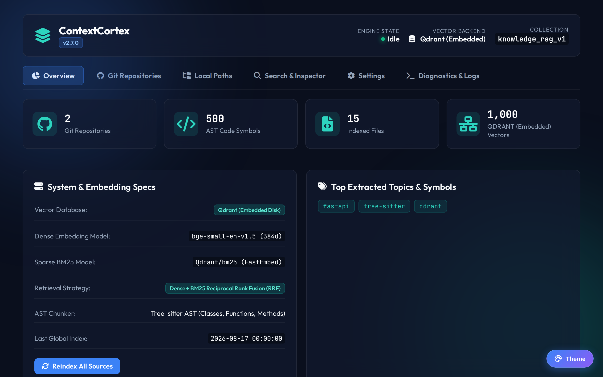
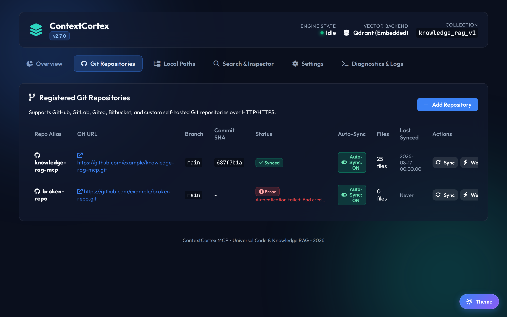
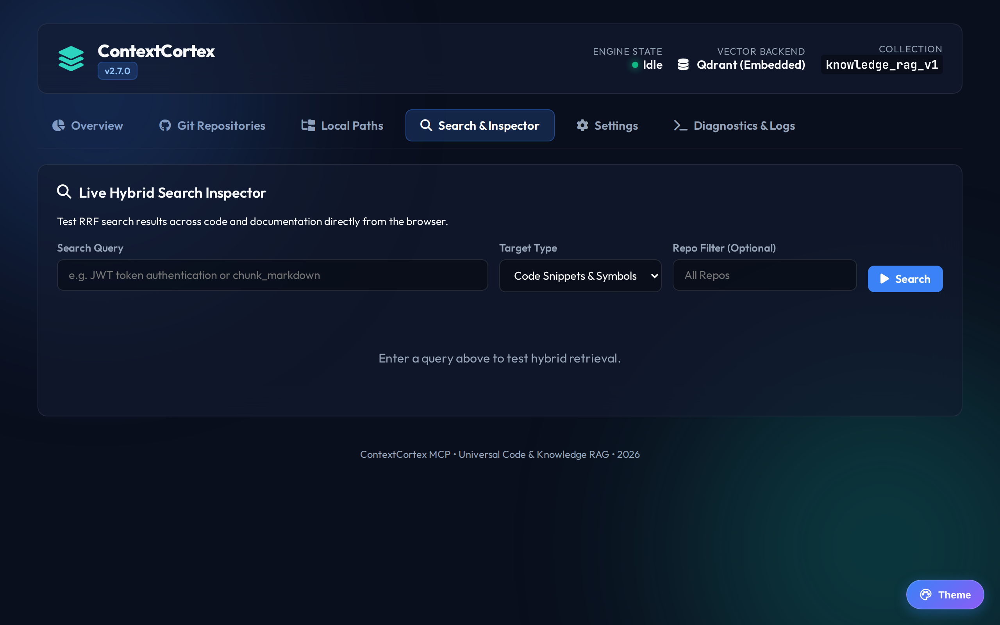
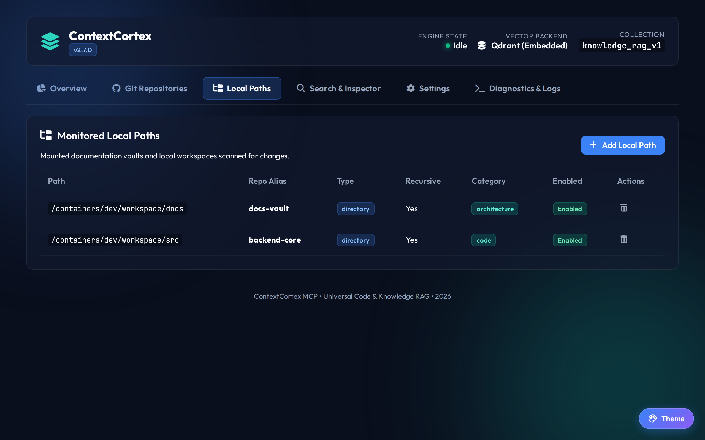
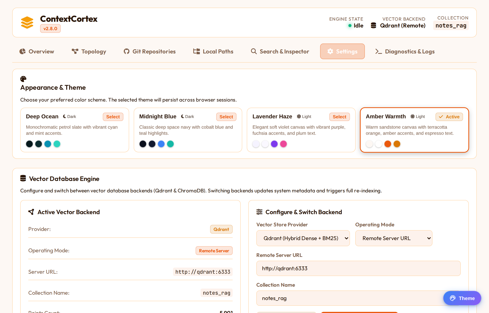
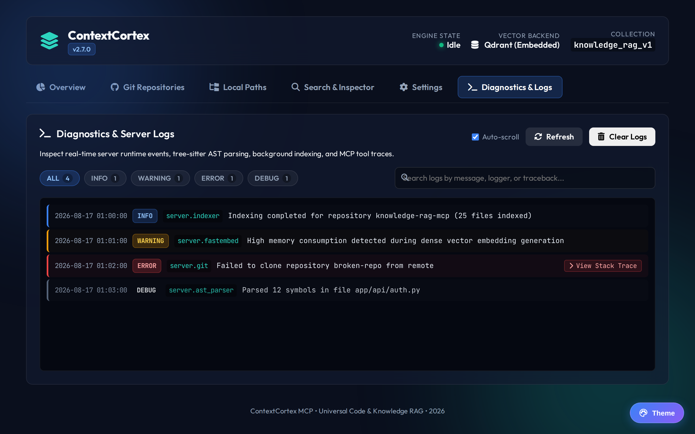

# ContextCortex (v2.9.0)


[](https://github.com/spelech/contextcortex/actions/workflows/docker-publish.yml)
[](https://github.com/spelech/contextcortex/pkgs/container/contextcortex)

A high-performance, multi-repo Model Context Protocol (MCP) server providing **syntax-aware Code RAG**, **Hybrid Retrieval (Dense + BM25)**, **Tree-sitter AST chunking**, **Multi-Vector Database Backends (Qdrant & ChromaDB)**, and **Universal Git Provider indexing** with an integrated Web Admin Dashboard (ContextCortex) and real-time Diagnostic Observability.
<details>
<summary><b>🖼️ View Dashboard Components</b></summary>

| Overview | Git Repositories |
|:---:|:---:|
|  |  |
| **Search & Inspector** | **Local Paths** |
|  |  |
| **Settings** | **Diagnostics & Logs** |
|  |  |

</details>


---

## 🌟 Key Features

- **FastMCP 2.0 Native Architecture**: Built on the official Model Context Protocol Python SDK 2.0.0+ (`FastMCP`), supporting modern decorator patterns, typed schemas, dynamic catalog resources, and custom agent prompts.
- **Dual MCP Transports**:
  - **Server-Sent Events (SSE)**: Full streaming events at `/sse` with POST message routing at `/messages/`.
  - **Streamable HTTP**: Bidirectional JSON-RPC transport endpoint at `/mcp`.
- **Multi-Vector Database Backends**:
  - **Qdrant**: High-scale vector engine supporting dense + sparse BM25 multi-vectors with Reciprocal Rank Fusion (RRF) in both embedded disk and remote server modes.
  - **ChromaDB**: Lightweight, zero-dependency embedded disk or remote vector store with automatic fallback.
  - **Dynamic Backend Switching**: Test and switch vector backends live from the Settings UI or REST API without server restarts.
- **Universal Git Provider Support**:
  - Ingest repositories from **any source where Git lives**: **GitHub**, **GitLab (Cloud, Enterprise & Self-Hosted)**, **Gitea & Forgejo**, **Bitbucket (Cloud & Server)**, and **Generic Git HTTP/HTTPS**.
  - **Provider-Aware Permalinks**: Automatically generates exact deep-links for code results (`/blob/`, `/-/blob/`, `/src/branch/`, `/src/commit/`, `/src/#lines-`).
  - **Custom Git Host Credential Vault**: Register per-host tokens and authentication types for private internal domains (e.g. `gitlab.company.internal` or `http://git.lan:3000`).
- **AST-Aware Code Chunking (Tree-sitter)**: Understands syntax structures across Python, TypeScript/JavaScript, Go, Rust, C#, C++, Java, Ruby, PHP, and more. Chunks along class, method, and function boundaries with exact line numbers and symbol names.
- **Ephemeral Repository Ingestion**: The server performs authenticated shallow clones (`--depth 1`), extracts AST symbols and hybrid vectors, and **immediately removes the cloned repository from disk** to conserve storage.
- **Multi-Tier Git Authentication Hierarchy**:
  1. Per-repository override token & optional username.
  2. Domain-level Custom Git Host Vault (`git_host_credentials`).
  3. Global provider tokens (`GITHUB_TOKEN`, `GITLAB_TOKEN`, `GITEA_TOKEN` in DB or Settings UI).
  4. Environment variable fallback.
- **Fast Deterministic Symbol Lookup**: Built-in SQLite symbol table (`ast_symbols`) powers instantaneous symbol searches (`find_symbol`) and file outlines (`get_file_outline`) without token bloat.
- **Diagnostic Logging & Observability**: In-memory ring buffer (500 events) capturing server warnings, errors, indexing lifecycle events, and expandable stack traces with a REST API (`/admin/api/logs`).
- **Modern Tabbed Web Dashboard (`/admin/`) - ContextCortex Dashboard**:
  - **Overview**: Real-time stats, vector counts, AST symbols, model specs, topic tag cloud, and manual full reindexing trigger.
  - **Git Repositories**: Register repos across GitHub, GitLab, Gitea, Bitbucket, or Generic Git, trigger shallow clone syncs, inspect commit SHAs, and manage sources.
  - **Local Paths**: Monitor local workspaces and notes vaults with recursive directory scanning and filesystem browser modal.
  - **Search & Inspector**: Interactive live hybrid search tester with RRF score previews, target type toggle (Code vs Docs), and syntax highlighted results.
  - **Settings**: Vector Database manager (Qdrant & ChromaDB switcher & connection tester), multi-provider token cards, GitHub rate limit monitor, and interactive Custom Git Host Credential Vault table/modal.
  - **Diagnostics & Logs**: Real-time log viewer with level filtering (ALL, INFO, WARNING, ERROR, DEBUG), keyword search, traceback modal/drawer, and buffer clearing.

---

## 🛠️ MCP Tools, Resources & Prompts

### Tools
| Tool | Parameters | Description |
| :--- | :--- | :--- |
| `search_code` | `query` (str), `repo` (str, opt), `language` (str, opt), `limit` (int, default 5) | Hybrid semantic + BM25 code search. Returns code blocks with line ranges & clickable git permalinks. |
| `search_docs` | `query` (str), `repo` (str, opt), `category` (str, opt), `tag` (str, opt), `limit` (int, default 5) | Hybrid search across markdown documentation, system architecture, and runbooks. |
| `find_symbol` | `name` (str), `repo` (str, opt), `exact` (bool, default True), `limit` (int, default 10) | Instant exact or prefix AST symbol lookup (functions, classes, structs, interfaces). |
| `get_file_outline` | `filepath` (str), `repo` (str, opt) | Returns the AST structure (classes, methods, signatures, lines) without full file token costs. |
| `list_repositories` | *None* | Lists all registered Git repositories and local paths with commit SHAs and indexing status. |
| `sync_repository` | `repo` (str, opt) | Triggers background shallow clone sync for a specific repository or all sources. |
| `index_status` | *None* | Returns vector counts, collection status, embedding models, and GitHub rate limits. |
| `get_architecture` | `repo` (str, opt) | Synthesizes codebase entry points, language breakdown, core directories, and architectural overview. |
| `manage_adr` | `action` (str: `list`\|`get`\|`create`\|`update`), `repo` (str, opt), `title` (str, opt), `decision` (str, opt), `status` (str, opt) | Query, create, or update Architectural Decision Records (MADR / Nygard format). |
| `get_code_routes` | `repo` (str, opt), `framework` (str, opt), `http_method` (str, opt) | Returns API endpoint route definitions and HTTP client invocations across backend frameworks. |
| `trace_call_path` | `target` (str), `repo` (str, opt), `direction` (str, default `downstream`), `depth` (int, default 3) | Traces AST symbol calls, imports, inheritance, and cross-repo API client-to-route connections via BFS. |

### Resources
| Resource URI | MIME Type | Description |
| :--- | :--- | :--- |
| `knowledge://catalog/summary` | `text/markdown` | Dynamic catalog of all indexed repositories, document distributions, and AST symbol totals. |


### Prompts
| Prompt Name | Arguments | Description |
| :--- | :--- | :--- |
| `search_infrastructure_docs` | `topic` (str) | Guided agent workflow to retrieve system architecture, container port mappings, and reverse proxy configs. |
| `find_implementation_symbol` | `symbol` (str), `repo` (str, opt) | Guided agent workflow to locate symbol definitions, class signatures, and implementations. |

---

## ⚙️ Environment Variables

| Variable | Description | Default |
| :--- | :--- | :--- |
| `VECTOR_STORE_PROVIDER` | Vector database backend (`qdrant` or `chroma`) | `qdrant` |
| `VECTOR_STORE_MODE` | Vector store mode (`embedded` or `remote`) | `embedded` |
| `COLLECTION_NAME` | Vector collection name | `knowledge_rag_v1` |
| `QDRANT_URL` | URL to remote Qdrant vector database (if mode is `remote`) | `http://localhost:6333` |
| `QDRANT_STORAGE_PATH` | Embedded Qdrant disk directory | `/app/data/qdrant_storage` |
| `CHROMA_STORAGE_PATH` | Embedded ChromaDB disk directory | `/app/data/chroma_db` |
| `EMBEDDING_PROVIDER` | Embedding engine (`local` for in-process ONNX, `api` for LiteLLM/OpenAI) | `local` |
| `EMBEDDING_MODEL` | FastEmbed dense model name | `BAAI/bge-small-en-v1.5` |
| `SPARSE_MODEL` | FastEmbed sparse BM25 model name | `Qdrant/bm25` |
| `GITHUB_TOKEN` | Optional GitHub Personal Access Token for higher rate limits & private repos | `None` |
| `VAULT_PATH` | Default path to the markdown documentation directory | `/docs` |
| `CACHE_DB_PATH` | Path to persistent SQLite cache database | `/app/data/index_cache.db` |
| `CHUNK_SIZE` | Maximum character length per chunk | `1500` |
| `CHUNK_OVERLAP` | Character overlap between consecutive chunks | `200` |

---

## 💻 Running Locally (Bare-Metal)

ContextCortex can be run directly on Linux, macOS, or Windows without Docker dependencies. By default, it operates with **zero external services required** by leveraging embedded Qdrant/ChromaDB, local SQLite (`index_cache.db`), and in-process CPU embeddings via FastEmbed/ONNX.

### 1. Prerequisites
- **Python 3.11+**
- **Node.js 20+** & **npm**
- **Git** (available on system `PATH`)

### 2. Automated Setup (Recommended)

Clone the repository and run the automated setup script for your platform:

**Linux / macOS (Bash):**
```bash
git clone git@github.com:spelech/contextcortex.git
cd contextcortex
./setup.sh
```

**Windows (PowerShell):**
```powershell
git clone git@github.com:spelech/contextcortex.git
cd contextcortex
.\setup.ps1
```

<details>
<summary><b>Or follow manual step-by-step setup</b></summary>

```bash
# 1. Create and activate a Python virtual environment
python3 -m venv venv
source venv/bin/activate  # On Windows: venv\Scripts\activate

# 2. Install Python dependencies
pip install -r requirements.txt

# 3. Build the React 19 administrative dashboard frontend
cd frontend
npm install
npm run build
cd ..
```
</details>

### 3. Start the Server
```bash
# Activate virtual environment (if not already active)
source venv/bin/activate  # On Windows: venv\Scripts\activate

# Run ContextCortex with embedded vector store and local SQLite database
python main.py
```

The server starts on port `3000`:
- **Web Dashboard**: Access the admin interface at `http://localhost:3000/admin/`
- **MCP SSE Transport**: `http://localhost:3000/sse`
- **MCP Streamable HTTP Transport**: `http://localhost:3000/mcp`
- **Health Check**: `http://localhost:3000/health`

---

## 🚀 Running via Docker

### Docker Compose
```yaml
services:
  contextcortex:
    image: ghcr.io/spelech/contextcortex:latest
    container_name: contextcortex
    restart: unless-stopped
    ports:
      - "8021:3000"
    environment:
      - VECTOR_STORE_PROVIDER=qdrant
      - EMBEDDING_PROVIDER=local
      - EMBEDDING_MODEL=BAAI/bge-small-en-v1.5
      - GITHUB_TOKEN=ghp_your_optional_token
      - VAULT_PATH=/docs
    volumes:
      - /path/to/my/docs:/docs:ro
      - ./data:/app/data
```

---

## 📡 Connecting MCP Clients

Connect any MCP client (VS Code, Cursor, Antigravity CLI, Claude Desktop, or Windsurf) using either Server-Sent Events (SSE) or Streamable HTTP.

### Server-Sent Events (SSE) Configuration (`claude_desktop_config.json` / Cursor)
```json
{
  "mcpServers": {
    "contextcortex": {
      "url": "http://localhost:3000/sse"
    }
  }
}
```

### Streamable HTTP Configuration
```json
{
  "mcpServers": {
    "contextcortex-http": {
      "url": "http://localhost:3000/mcp"
    }
  }
}
```

---

## 📚 Documentation & Specifications

- [**Software Requirements Specification (`REQUIREMENTS.md`)**](REQUIREMENTS.md): Authoritative functional and non-functional requirements with test-traceability matrix and Mermaid ERD data models.
- [**System Architecture (`ARCHITECTURE.md`)**](ARCHITECTURE.md): FastMCP 2.0 transport topologies, component interaction diagrams, SQLite schema ERD, and vector store data models.
- [**Developer Documentation (`DEVELOPER_DOCS.md`)**](DEVELOPER_DOCS.md): Setup, configuration, development workflow, and testing guidelines.
- [**Test Coverage Reports (`docs/TEST_COVERAGE.md`)**](docs/TEST_COVERAGE.md): Pytest, Vitest, and Playwright verification metrics.

---

## 🧪 Testing & Verification

Run the full automated test suites across backend and frontend:

```bash
# Python Backend Tests & Code Coverage
pytest -v --cov=app

# Frontend Unit & Component Tests (Vitest)
cd frontend && npm run test

# Frontend End-to-End Tests (Playwright)
cd frontend && npx playwright test
```
