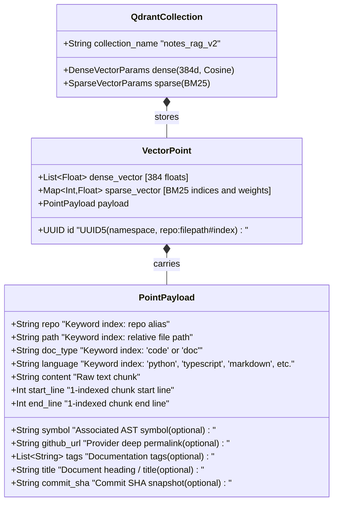

# Software Requirements Specification (v2.4.1)

This document specifies the authoritative software requirements for the **Notes & Code RAG MCP Server**, systematically derived and verified against the comprehensive test matrix (132 backend Python tests, 47 frontend React 19 unit tests, and 13 Playwright end-to-end user journeys).

---

## 1. System Overview & Architecture Scope

The Notes & Code RAG MCP Server provides high-precision, syntax-aware code and documentation retrieval for AI coding assistants and developers. It serves two distinct interfaces:
1. **Model Context Protocol (MCP SDK 2.0.0+) Interface**: Dual-transport server (SSE `/sse` & Streamable HTTP `/mcp`) exposing tools, resources, and prompt templates to AI clients (Claude Desktop, Cursor, Antigravity, VS Code, Windsurf).
2. **Web Administrative Dashboard (`/admin/`)**: React 19 + TypeScript single-page application providing source management, live hybrid search inspection, multi-provider credentials configuration, and real-time diagnostic logging.

---

## 2. Mermaid Data Models & Entity Relationship Diagrams (ERD)

### 2.1 SQLite Relational Data Model (ERD)

The persistent cache database (`index_cache.db`) runs SQLite in WAL (Write-Ahead Logging) mode with automatic schema initialization and non-destructive migrations.

---

### 2.2 Qdrant Hybrid Vector Store Data Model

The vector database stores document and code chunks as points inside the `notes_rag_v2` collection. Each point contains dual named vectors and metadata payloads indexed for sub-millisecond filtering.

---

## 3. Functional Requirements (FR)

### FR-1: Model Context Protocol (FastMCP 2.0.0+) Architecture
- **FR-1.1 (Dual Transports)**: The server MUST support dual MCP transports simultaneously:
  - Server-Sent Events (SSE) mounted at `/sse` with POST message routing at `/messages/`.
  - Streamable HTTP bidirectional JSON-RPC transport endpoint at `/mcp`.
  - *Verification*: `test_mcp_v2.py::test_fastmcp_streamable_http_transport`
- **FR-1.2 (Tool: `search_code`)**: MUST execute hybrid (Dense + BM25) code searches with reciprocal rank fusion (RRF), returning code chunks, line ranges, and clickable Git permalinks.
  - *Verification*: `test_db_and_tools.py::test_execute_tool_search_code`
- **FR-1.3 (Tool: `search_docs`)**: MUST execute hybrid searches across markdown notes and documentation, with category and tag filtering.
  - *Verification*: `test_db_and_tools.py::test_execute_tool_search_docs`
- **FR-1.4 (Tool: `find_symbol`)**: MUST perform sub-50ms exact and prefix symbol lookups against SQLite `ast_symbols` without vector search overhead.
  - *Verification*: `test_db_and_tools.py::test_execute_tool_find_symbol`
- **FR-1.5 (Tool: `get_file_outline`)**: MUST return the structural AST outline (classes, methods, signatures, start/end lines) for a specified file path.
  - *Verification*: `test_db_and_tools.py::test_execute_tool_get_file_outline`
- **FR-1.6 (Tool: `list_repositories`)**: MUST return all registered Git repositories (with provider tags e.g. `[GITHUB]`, `[GITLAB]`, commit SHAs, and sync status) and local paths.
  - *Verification*: `test_db_and_tools.py::test_execute_tool_list_repositories`
- **FR-1.7 (Tool: `sync_repository`)**: MUST trigger background incremental or shallow sync for a single repo or all sources.
  - *Verification*: `test_db_and_tools.py::test_execute_tool_sync_repository`
- **FR-1.8 (Tool: `index_status`)**: MUST report vector count, active embedding models, collection name, and provider rate limit status.
  - *Verification*: `test_db_and_tools.py::test_execute_tool_index_status`
- **FR-1.9 (Dynamic Catalog Resource)**: MUST expose dynamic resource `notes://catalog/summary` returning formatted markdown summary of indexed repositories, document distributions, and AST symbol counts.
  - *Verification*: `test_mcp_v2.py::test_fastmcp_resource_read`
- **FR-1.10 (Agent Prompts)**: MUST provide parameterized prompt templates `search_infrastructure_docs` and `find_implementation_symbol`.
  - *Verification*: `test_mcp_v2.py::test_fastmcp_prompt_get`

---

### FR-2: Universal Git Provider & Ephemeral Ingestion
- **FR-2.1 (Multi-Provider Support)**: MUST support repositories from GitHub, GitLab (Cloud & Self-Hosted), Gitea/Forgejo, Bitbucket, and Generic Git over HTTP/HTTPS (including custom ports like `http://git.lan:3000/org/repo.git`).
  - *Verification*: `test_multi_git_providers.py::test_detect_git_provider`
- **FR-2.2 (Multi-Tier Credential Hierarchy)**: Ingestion MUST resolve credentials in strict priority order:
  1. Per-repository override token & user (`auth_token`, `auth_user`).
  2. Domain-level Custom Git Host Vault (`git_host_credentials`).
  3. Global DB provider tokens (`GITHUB_TOKEN`, `GITLAB_TOKEN`, `GITEA_TOKEN`).
  4. Container environment variables.
  - *Verification*: `test_multi_git_providers.py::test_effective_git_token_hierarchy`
- **FR-2.3 (Ephemeral Shallow Cloning & Zero Disk Bloat)**: MUST clone via `--depth 1 --single-branch` into temporary directories and delete the cloned files immediately after AST extraction and vector upserts.
  - *Verification*: `test_git_manager.py::TestGitManager::test_shallow_clone_repo_success`
- **FR-2.4 (Remote SHA Tracking)**: MUST query remote commit SHAs via `git ls-remote` and skip redundant clones if the remote SHA matches the local SQLite record.
  - *Verification*: `test_indexer_edge_cases.py::test_sync_single_git_repo_unchanged_sha`
- **FR-2.5 (Provider Deep Permalinks)**: MUST format exact permalink URLs for each provider:
  - GitHub: `{base}/blob/{sha}/{path}#L{start}-L{end}`
  - GitLab: `{base}/-/blob/{sha}/{path}#L{start}-{end}`
  - Gitea / Forgejo: `{base}/src/commit/{sha}/{path}#L{start}-L{end}`
  - Bitbucket: `{base}/src/{sha}/{path}#lines-{start}:{end}`
  - *Verification*: `test_git_manager.py::TestGitManager::test_format_github_permalink`
- **FR-2.6 (Credential Masking & URL Sanitization)**: MUST redact all access tokens and passwords from log files, console output, and API responses (e.g. `https://***github.com/...`).
  - *Verification*: `test_multi_git_providers.py::test_sanitize_url_for_logging_multi_scheme`

---

### FR-3: Tree-sitter AST & Contextual Chunking
- **FR-3.1 (Multi-Language Tree-sitter AST Chunking)**: MUST parse code across Python, TypeScript, JavaScript, Go, Rust, C#, C++, Java, Ruby, and PHP along class, function, method, and struct boundaries with 1-indexed line numbers.
  - *Verification*: `test_chunker_languages.py` (16 test suites)
- **FR-3.2 (Contextual Markdown Chunking)**: MUST chunk markdown documents along `#`, `##`, `###` heading hierarchies with breadcrumb trail enrichment.
  - *Verification*: `test_chunker.py::test_chunk_markdown_structure`
- **FR-3.3 (Fallback Chunking)**: MUST provide graceful line-based fallback chunking for unsupported formats or malformed syntax.
  - *Verification*: `test_chunker.py::test_chunk_text_fallback`

---

### FR-4: Hybrid Vector Engine (Dense 384d + Sparse BM25)
- **FR-4.1 (Named Multi-Vectors)**: MUST configure Qdrant collections with dense 384-dimensional vectors (`BAAI/bge-small-en-v1.5`) and sparse BM25 vectors (`Qdrant/bm25`).
  - *Verification*: `test_indexer_and_embeddings.py::test_ensure_collection`
- **FR-4.2 (Reciprocal Rank Fusion)**: MUST fuse dense semantic vectors and sparse lexical search results using RRF with $k=60$.
  - *Verification*: `test_search.py::test_execute_hybrid_search_with_sparse`
- **FR-4.3 (Deterministic UUID5 Point IDs)**: MUST generate deterministic chunk UUIDs from `{repo}:{filepath}#{index}` to support atomic idempotent upserts and updates.
  - *Verification*: `test_indexer_and_embeddings.py::test_chunk_uuid_consistency`

---

### FR-5: REST Administration API & React 19 UI
- **FR-5.1 (Stats & Keyword Cloud)**: `GET /admin/api/stats` MUST return indexed file counts, symbol counts, points, provider auth states, and top extracted keywords.
  - *Verification*: `test_api_routes.py::test_api_get_stats`
- **FR-5.2 (Repository CRUD)**: `GET /admin/api/repos`, `POST /admin/api/repos`, `DELETE /admin/api/repos/{id}` MUST manage repositories with provider and auth configurations.
  - *Verification*: `test_api_routes.py::test_api_repos_crud`
- **FR-5.3 (Host Credential Vault)**: `GET /admin/api/settings/hosts`, `POST /admin/api/settings/hosts`, `DELETE /admin/api/settings/hosts/{id}` MUST manage domain-level credentials.
  - *Verification*: `test_multi_git_providers.py::test_host_credentials_api_endpoints`
- **FR-5.4 (Path Management & Filesystem Browser)**: `GET /admin/api/paths`, `POST /admin/api/paths`, `GET /admin/api/browse` MUST manage local paths and support interactive filesystem directory browsing.
  - *Verification*: `test_api_routes.py::test_api_paths_crud`, `test_api_browse`
- **FR-5.5 (Diagnostic Ring Buffer Logging)**: `GET /admin/api/logs` and `DELETE /admin/api/logs` MUST provide in-memory log access (500 entries) with level filtering (ALL, INFO, WARNING, ERROR, DEBUG), keyword search, and traceback retrieval.
  - *Verification*: `test_diagnostic_logger.py::test_logs_api_routes`
- **FR-5.6 (Full System Re-indexing)**: `POST /admin/api/reindex` MUST trigger full concurrent re-indexing of all registered Git repositories and local paths.
  - *Verification*: `test_api_routes.py::test_api_reindex_trigger`

---

## 4. Non-Functional Requirements (NFR)

- **NFR-1 (Performance & Latency)**:
  - AST symbol lookup (`find_symbol`, `get_file_outline`) response time MUST be $<50\text{ms}$.
  - Hybrid vector search response time MUST be $<150\text{ms}$ on CPU.
- **NFR-2 (Resource Footprint & Storage)**:
  - Ephemeral shallow cloning MUST leave 0 MB residual cloned files on disk.
  - In-process ONNX FastEmbed model memory usage MUST remain $\le 1.2\text{ GB}$ RAM.
- **NFR-3 (Security & Credential Safety)**:
  - Access tokens and passwords MUST NEVER appear in cleartext in logs, URLs, or client payloads.
  - SQLite database access MUST be isolated to container volume storage (`/app/data`).
- **NFR-4 (Reliability & Auto-Recovery)**:
  - SQLite MUST operate with WAL mode enabled to prevent database locking during concurrent reads/writes.
  - Qdrant collection schemas MUST automatically upgrade on startup if dimension or sparse vector mismatches are detected.
- **NFR-5 (Test & Verification Quality Floor)**:
  - Backend statement coverage MUST remain $\ge 95\%$.
  - Frontend line coverage MUST remain $\ge 90\%$.
  - 100% of automated Playwright E2E user journeys MUST pass.

---

## 5. Traceability Matrix

| Requirement | Primary Implementation | Backend Pytest Verification | Frontend / E2E Verification |
| :--- | :--- | :--- | :--- |
| **FR-1 (FastMCP 2.0)** | `app/mcp/mcp_server.py`, `app/mcp/tools.py` | `test_mcp_v2.py`, `test_db_and_tools.py`, `test_tools.py` | E2E Spec 1 |
| **FR-2 (Git Providers)** | `app/services/git_manager.py`, `app/services/indexer.py` | `test_multi_git_providers.py`, `test_git_manager.py`, `test_indexer_sync.py` | `GitRepoManager.test.tsx`, `Settings.test.tsx`, E2E Specs 2, 3, 4, 5, 10, 11 |
| **FR-3 (AST Chunking)** | `app/services/chunker.py` | `test_chunker.py`, `test_chunker_languages.py` | `SearchInspector.test.tsx`, E2E Spec 8 |
| **FR-4 (Hybrid Vectors)** | `app/services/embeddings.py`, `app/services/search.py` | `test_indexer_and_embeddings.py`, `test_search.py` | `SearchInspector.test.tsx`, E2E Specs 8, 9 |
| **FR-5 (REST & UI)** | `app/api/routes.py`, `frontend/src/*` | `test_api_routes.py`, `test_diagnostic_logger.py` | `App.test.tsx`, `Overview.test.tsx`, `DiagnosticsViewer.test.tsx`, `LocalPathManager.test.tsx`, E2E Specs 1-13 |
