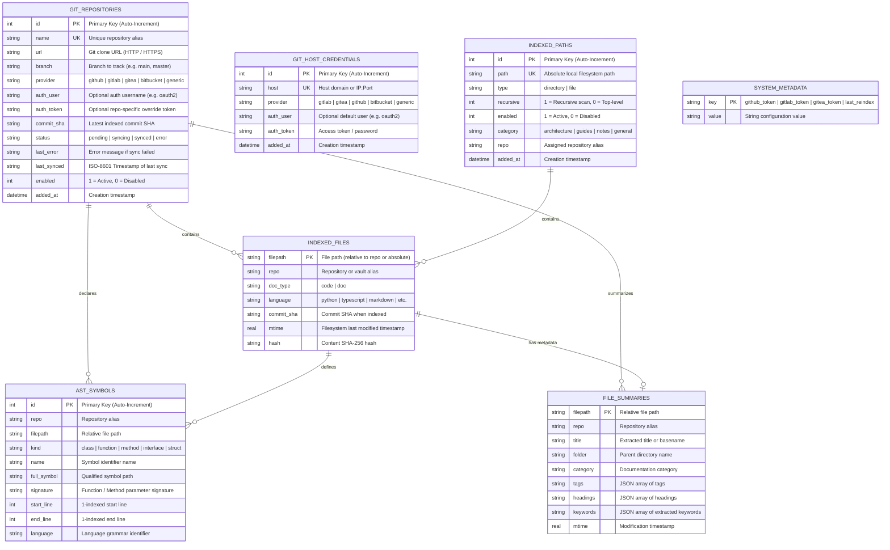
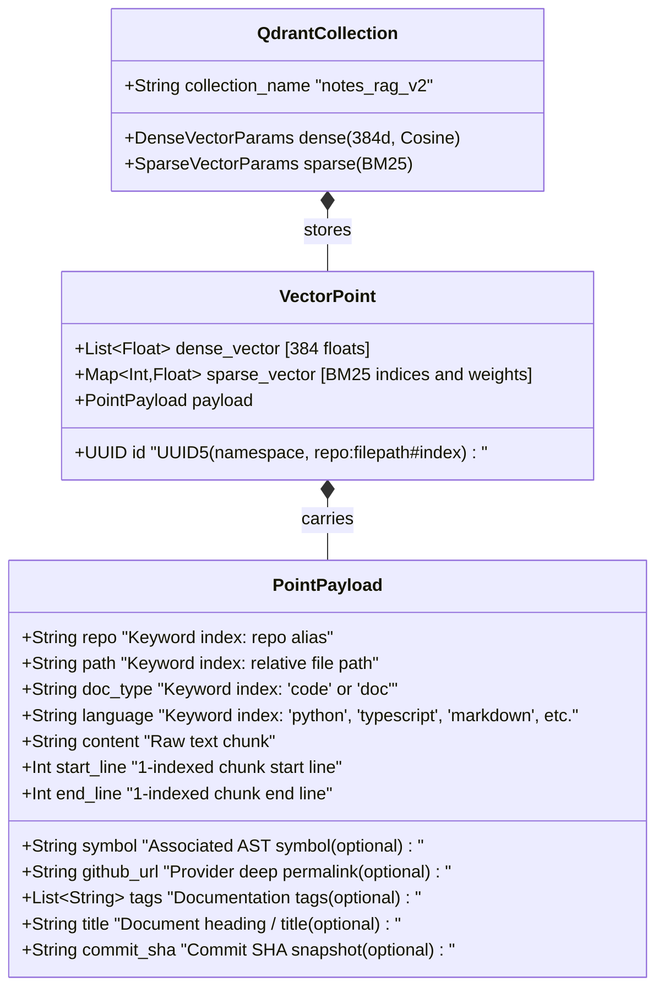

# Software Requirements Specification (v2.6.0)

> **Note:** This document is automatically generated and verified against the live test suite by `scripts/generate_requirements.py` and `tests/backend/test_requirements_sync.py`.

**Test Verification Baseline:** **301 Automated Tests** (235 Pytest Backend + 53 Vitest Frontend + 13 Playwright E2E).

---

## 1. System Vision & Architecture Scope

The Notes & Code RAG MCP Server provides high-precision, syntax-aware semantic and lexical retrieval over source code repositories, markdown notes, architecture documents, and system documentation.

```
┌────────────────────────────────────────────────────────────────────────────────┐
│                          Clients & Consumers Layer                             │
│  ┌─────────────────────────────────────────┐  ┌─────────────────────────────┐  │
│  │   AI Coding Assistants (MCP Clients)    │  │     Human Administrators    │  │
│  │ Cursor • Antigravity • Claude • VS Code │  │   React 19 Admin Dashboard  │  │
│  └────────────────────┬────────────────────┘  └──────────────┬──────────────┘  │
└───────────────────────┼──────────────────────────────────────┼─────────────────┘
                        │ JSON-RPC (SSE / HTTP)                │ REST API
┌───────────────────────▼──────────────────────────────────────▼─────────────────┐
│                     FastAPI Application Gateway & Web Server                   │
│  ┌─────────────────────────────────────────┐  ┌─────────────────────────────┐  │
│  │    FastMCP 2.0.0+ Server Engine         │  │   FastAPI Admin REST Router │  │
│  │    • SSE Transport (/sse, /messages/)   │  │   • /admin/api/stats        │  │
│  │    • Streamable HTTP (/mcp)             │  │   • /admin/api/repos, paths │  │
│  │    • 7 Agent Tools, Resource, Prompts   │  │   • /admin/api/settings     │  │
│  └────────────────────┬────────────────────┘  └──────────────┬──────────────┘  │
└───────────────────────┼──────────────────────────────────────┼─────────────────┘
                        │                                      │
┌───────────────────────▼──────────────────────────────────────▼─────────────────┐
│                          Core Services & Ingestion Layer                       │
│  ┌───────────────────────┐ ┌───────────────────────┐ ┌───────────────────────┐  │
│  │ Git Manager (Multi)   │ │ Chunker (Tree-sitter) │ │ Embeddings & Search   │  │
│  │ GitHub, GitLab, Gitea │ │ 10 Languages AST      │ │ Dense (BGE-Small)     │  │
│  │ Bitbucket, Generic    │ │ Contextual Markdown   │ │ Sparse (BM25) + RRF   │  │
│  └───────────┬───────────┘ └───────────┬───────────┘ └───────────┬───────────┘  │
└──────────────┼─────────────────────────┼─────────────────────────┼──────────────┘
               │                         │                         │
┌──────────────▼─────────────────────────▼─────────────────────────▼──────────────┐
│                            Storage & Indexing Layer                             │
│  ┌─────────────────────────────────────────┐  ┌─────────────────────────────┐  │
│  │   SQLite WAL Database (index_cache.db)  │  │ Qdrant Hybrid Vector Store  │  │
│  │   • Repositories, Vault, Host Vault     │  │ • Named Multi-Vectors       │  │
│  │   • AST Symbols & File Summaries        │  │ • Deterministic UUID5 Points│  │
│  └─────────────────────────────────────────┘  └─────────────────────────────┘  │
└────────────────────────────────────────────────────────────────────────────────┘
```

---

## 2. Mermaid Data Models & Entity Relationship Diagrams (ERD)

### 2.1 SQLite Relational Data Model (ERD)

The persistent cache database (`index_cache.db`) runs SQLite in WAL (Write-Ahead Logging) mode with automatic schema initialization and non-destructive migrations.



---

### 2.2 Qdrant Hybrid Vector Store Data Model



---

## 3. Comprehensive Functional Requirements (FR)

### FR-1: Model Context Protocol (FastMCP 2.0.0+) Architecture
- **FR-1.1 (Dual Transports)**: The server MUST support dual MCP transports simultaneously: Server-Sent Events (SSE) mounted at `/sse` with POST message routing at `/messages/`, and Streamable HTTP bidirectional JSON-RPC transport endpoint at `/mcp`.
- **FR-1.2 (Lifespan & Session Registry)**: The server MUST maintain an active session registry to dispatch list change notifications (`send_tool_list_changed`, `send_resource_list_changed`, `send_prompt_list_changed`) to connected clients when indexing updates occur.
- **FR-1.3 (JSON-RPC Schema Compliance)**: All tool definitions, parameter schemas, resource templates, and prompt descriptions MUST adhere strictly to the Model Context Protocol 2024-11-05 / 2025 specification.

### FR-2: FastMCP Agent Tools Contract
- **FR-2.1 (`search_code`)**: MUST execute hybrid (Dense + BM25) code searches with Reciprocal Rank Fusion (RRF), returning code chunks, line ranges, matching symbol metadata, and clickable Git permalinks.
- **FR-2.2 (`search_docs`)**: MUST execute hybrid searches across markdown notes and documentation, with category and tag filtering.
- **FR-2.3 (`find_symbol`)**: MUST perform sub-50ms exact and prefix symbol lookups against SQLite `ast_symbols` without vector search overhead.
- **FR-2.4 (`get_file_outline`)**: MUST return the structural AST outline (classes, methods, signatures, start/end lines) for a specified file path.
- **FR-2.5 (`list_repositories`)**: MUST return all registered Git repositories (with provider tags e.g. `[GITHUB]`, `[GITLAB]`, commit SHAs, and sync status) and local paths.
- **FR-2.6 (`sync_repository`)**: MUST trigger background incremental or shallow sync for a single repo or all sources.
- **FR-2.7 (`index_status`)**: MUST report vector count, active embedding models, collection name, and provider rate limit status.

### FR-3: Dynamic Resources & Prompt Templates
- **FR-3.1 (Dynamic Catalog Resource)**: MUST expose dynamic resource `knowledge://catalog/summary` returning formatted markdown summary of indexed repositories, document distributions, and AST symbol counts.
- **FR-3.2 (Prompt: `search_infrastructure_docs`)**: MUST provide a prompt template guiding agents to explore system architecture, networking, Docker setups, and container guides.
- **FR-3.3 (Prompt: `find_implementation_symbol`)**: MUST provide a prompt template assisting agents in locating symbol declarations, methods, and interface signatures across repositories.

### FR-4: Universal Multi-Provider Git Ingestion Engine
- **FR-4.1 (Multi-Provider Detection & Support)**: MUST detect and support repositories from GitHub, GitLab (Cloud & Self-Hosted), Gitea/Forgejo, Bitbucket, and Generic Git HTTP/HTTPS with custom ports.
- **FR-4.2 (Ephemeral Shallow Cloning & Zero Disk Bloat)**: MUST clone via `--depth 1 --branch <branch> --single-branch` into temporary directories and delete the cloned files immediately after AST extraction and vector upserts.
- **FR-4.3 (Remote SHA Change Tracking)**: MUST query remote commit SHAs via `git ls-remote` and skip redundant cloning when the remote SHA matches the local SQLite database.
- **FR-4.4 (Provider-Exact Permalinks)**: MUST construct valid deep links to specific lines of code across all providers (GitHub, GitLab, Gitea, Bitbucket).
- **FR-4.5 (Credential Masking & URL Sanitization)**: MUST redact all access tokens and passwords from log files, console output, and API responses (e.g. `https://***github.com/...`).

### FR-5: Multi-Tier Authentication & Credential Vault Hierarchy
- **FR-5.1 (Resolution Hierarchy)**: Ingestion MUST resolve credentials in strict priority order: 1. Repo Override $\rightarrow$ 2. Host Vault $\rightarrow$ 3. Global DB Tokens $\rightarrow$ 4. Environment Variables.
- **FR-5.2 (Host Credential Vault CRUD)**: MUST provide REST APIs (`GET/POST/DELETE /admin/api/settings/hosts`) to manage self-hosted domain credentials with provider types, auth users, and masked tokens.

### FR-6: Multi-Language Tree-sitter AST Syntax Chunking
- **FR-6.1 (10-Language AST Parsing)**: MUST parse code across 10 major programming languages (Python, TS/JS, Go, Rust, C#, C++, Java, Ruby, PHP) using Tree-sitter grammars along structural node boundaries.
- **FR-6.2 (1-Indexed Line Ranges & Exact Signatures)**: Chunks MUST preserve exact 1-indexed start and end line ranges, signatures, and parent scope identifiers.

### FR-7: Contextual Markdown & Fallback Chunking
- **FR-7.1 (Hierarchical Markdown Breadcrumbs)**: Markdown chunks MUST preserve heading hierarchies (`# Title > ## Section > ### Subsection`) in chunk payloads to maintain semantic context during vector retrieval.
- **FR-7.2 (Frontmatter Extraction)**: MUST extract YAML frontmatter metadata (title, category, tags) and index them in `file_summaries` and Qdrant payloads.
- **FR-7.3 (Line-Based Fallback)**: Plain text, configuration, or unsupported file formats MUST be chunked using sliding line windows with configurable overlap.

### FR-8: Hybrid Vector Retrieval Engine
- **FR-8.1 (Named Multi-Vectors)**: Qdrant collection `notes_rag_v2` MUST be configured with named multi-vectors: Dense Vector (384d, Cosine, `BAAI/bge-small-en-v1.5`) and Sparse Vector (BM25 lexical weights, `Qdrant/bm25`).
- **FR-8.2 (Reciprocal Rank Fusion)**: Hybrid search queries MUST fuse dense semantic vectors and sparse lexical search rankings using RRF ($k=60$).
- **FR-8.3 (Deterministic UUID5 Point Identification)**: MUST generate deterministic chunk UUIDs from `{repo}:{filepath}#{index}` for atomic, idempotent upserts and updates.
- **FR-8.4 (In-Process CPU Execution)**: FastEmbed embedding models MUST execute locally via ONNX Runtime without external API keys or cloud dependencies.

### FR-9: REST Administration API
- **FR-9.1 (Stats & Metadata)**: `GET /admin/api/stats` MUST return repository counts, file counts, symbol counts, vector point counts, active embedding models, keyword cloud, provider auth statuses, and rate limits.
- **FR-9.2 (Repository Management)**: `GET /admin/api/repos`, `POST /admin/api/repos`, `DELETE /admin/api/repos/{id}`, `POST /admin/api/repos/{id}/sync` MUST provide complete repository lifecycle management.
- **FR-9.3 (Local Path Management & Directory Browser)**: `GET /admin/api/paths`, `POST /admin/api/paths`, `DELETE /admin/api/paths/{id}`, `GET /admin/api/browse` MUST manage local paths and support interactive directory exploration.
- **FR-9.4 (Live Hybrid Search Tester)**: `POST /admin/api/search/test` MUST execute hybrid searches with target type toggles (`all`, `code`, `doc`) and repository filters.
- **FR-9.5 (Global Token Management)**: `POST /admin/api/settings/token` MUST store and clear GitHub, GitLab, and Gitea tokens.
- **FR-9.6 (Diagnostic Ring Buffer Logs)**: `GET /admin/api/logs` and `DELETE /admin/api/logs` MUST provide in-memory log entries (500-event ring buffer) with level filtering (ALL, INFO, WARNING, ERROR, DEBUG), keyword search, and exception tracebacks.
- **FR-9.7 (Full System Re-indexing)**: `POST /admin/api/reindex` MUST trigger concurrent background indexing of all configured Git repositories and local paths.

### FR-10: React 19 Single Page Administrative Dashboard
- **FR-10.1 (Tab Navigation)**: The UI MUST provide seamless client-side tab navigation between Overview, Git Repositories, Local Paths, Search & Inspector, Settings, and Diagnostics & Logs.
- **FR-10.2 (Repository Management UI)**: Modal workflow for registering repositories with provider badges, single-repo sync buttons, and deletion confirmation dialogs.
- **FR-10.3 (Local Path Management UI & Filesystem Browser)**: Interactive directory navigation modal, path registration, and recursive scanning toggles.
- **FR-10.4 (Interactive Search Inspector UI)**: Real-time query tester with code vs doc toggle, repo filters, RRF score display, and syntax-highlighted code chunks.
- **FR-10.5 (Multi-Provider Settings & Host Vault UI)**: Multi-provider token cards (GitHub, GitLab, Gitea), rate limit indicators, and Custom Git Host Vault CRUD table/modal.
- **FR-10.6 (Diagnostics & Real-time Logs UI)**: Log level filtering pills (ALL, INFO, WARNING, ERROR, DEBUG), live search input, traceback drawer modal, and log buffer clear action.
- **FR-10.7 (Toast Notifications System)**: Global toast notification system with auto-dismiss timers, custom icons, and manual dismiss buttons.

---

## 4. Non-Functional Requirements (NFR)

- **NFR-1 (Performance & Latency Budgets)**: AST symbol lookup response latency $<50\text{ms}$; Hybrid vector search query latency $<150\text{ms}$ on CPU.
- **NFR-2 (Zero Disk Bloat & Memory Efficiency)**: Ephemeral shallow cloning MUST leave 0 MB residual cloned files on disk; FastEmbed model memory $\le 1.2\text{ GB}$ RAM.
- **NFR-3 (Security & Credential Sanitization)**: Personal access tokens, OAuth tokens, and passwords MUST NEVER appear in cleartext in logs, console output, URLs, or client API payloads.
- **NFR-4 (Reliability & Concurrency)**: SQLite database MUST operate in WAL mode; Qdrant collection schemas MUST automatically auto-heal/upgrade on startup.
- **NFR-5 (Failure Isolation)**: Failure to sync an individual repository MUST NOT abort other repositories or crash the server.
- **NFR-6 (Test Quality & Coverage Floor)**: Backend statement coverage $\ge 95\%$; Frontend line coverage $\ge 90\%$; 100% Playwright E2E pass rate.
- **NFR-7 (Container Portability & Health Monitoring)**: Standalone Docker container with healthcheck monitoring via `GET /health`.

---

## 5. Requirement-to-Test Traceability Matrix

| Requirement ID | Requirement Description | Implementation Files | Backend Pytest Modules | Frontend Vitest & E2E Suites |
| :--- | :--- | :--- | :--- | :--- |
| **FR-1** | FastMCP 2.0 Dual Transport Architecture | `app/mcp/mcp_server.py` | `test_mcp_v2.py`, `test_indexer_sync.py` | E2E Spec 1 |
| **FR-2** | FastMCP 7 Agent Tools Contract | `app/mcp/tools.py` | `test_db_and_tools.py`, `test_tools.py`, `test_schemas.py` | E2E Specs 1, 8 |
| **FR-3** | Dynamic Resources & Prompt Templates | `app/mcp/mcp_server.py` | `test_mcp_v2.py` | E2E Spec 1 |
| **FR-4** | Universal Multi-Git Provider Ingestion | `app/services/git_manager.py`, `app/services/indexer.py` | `test_multi_git_providers.py`, `test_git_manager.py`, `test_indexer_edge_cases.py` | `GitRepoManager.test.tsx`, E2E Specs 2, 3, 4, 5 |
| **FR-5** | Multi-Tier Credential Vault & Hierarchy | `app/services/db.py`, `app/services/git_manager.py` | `test_multi_git_providers.py`, `test_db_and_tools.py` | `Settings.test.tsx`, E2E Specs 10, 11 |
| **FR-6** | 10-Language Tree-sitter AST Chunking | `app/services/chunker.py` | `test_chunker.py`, `test_chunker_languages.py` | `SearchInspector.test.tsx`, E2E Spec 8 |
| **FR-7** | Markdown Breadcrumbs & Fallbacks | `app/services/chunker.py` | `test_chunker.py` | `SearchInspector.test.tsx`, E2E Spec 8 |
| **FR-8** | Hybrid Vector Engine (BGE + BM25 + RRF) | `app/services/embeddings.py`, `app/services/search.py` | `test_indexer_and_embeddings.py`, `test_search.py` | `SearchInspector.test.tsx`, E2E Specs 8, 9 |
| **FR-9** | Administrative REST APIs | `app/api/routes.py`, `app/services/diagnostic_logger.py` | `test_api_routes.py`, `test_diagnostic_logger.py` | `Overview.test.tsx`, `DiagnosticsViewer.test.tsx`, E2E Specs 1-13 |
| **FR-10** | React 19 Single Page Admin Dashboard | `frontend/src/*` | N/A | `App.test.tsx`, `GitRepoManager.test.tsx`, `LocalPathManager.test.tsx`, `SearchInspector.test.tsx`, `Settings.test.tsx`, `DiagnosticsViewer.test.tsx`, `ToastContext.test.tsx`, E2E Specs 1-13 |
| **NFR-1** | Performance & Latency Budgets | `app/services/db.py`, `app/services/search.py` | `test_db_and_tools.py`, `test_search.py` | E2E Specs 8, 9 |
| **NFR-2** | Zero Disk Bloat & Memory Efficiency | `app/services/git_manager.py`, `app/services/embeddings.py` | `test_git_manager.py`, `test_indexer_and_embeddings.py` | E2E Specs 2, 3 |
| **NFR-3** | Credential Sanitization in Logs/APIs | `app/services/git_manager.py`, `app/api/routes.py` | `test_multi_git_providers.py`, `test_api_routes.py` | `Settings.test.tsx`, E2E Specs 10, 11 |
| **NFR-4** | SQLite WAL & Qdrant Auto-Healing | `app/services/db.py`, `app/services/indexer.py` | `test_db_and_tools.py`, `test_indexer_and_embeddings.py` | E2E Spec 1 |
| **NFR-5** | Sync Failure Isolation | `app/services/indexer.py` | `test_indexer_edge_cases.py`, `test_indexer_sync.py` | `GitRepoManager.test.tsx`, E2E Spec 5 |
| **NFR-6** | Test Quality & Coverage Floors | Entire Test Suite | `pytest` (132 tests, 97% cov) | `vitest` (47 tests, 93% cov), `playwright` (13 tests) |
| **NFR-7** | Container Portability & Health | `Dockerfile`, `main.py` | `test_api_routes.py` | Docker healthcheck |

---

## 6. Parsed Test Suite Inventory

### 6.1 Backend Python Tests (`tests/backend/`)

#### `test_api_routes.py` (15 tests)
- `test_api_get_stats_with_keywords`
- `test_api_get_stats_error`
- `test_api_repos_crud`
- `test_api_repos_error_handlers`
- `test_api_paths_crud`
- `test_api_paths_error_handlers`
- `test_api_settings_token`
- `test_api_settings_token_error`
- `test_api_search_test`
- `test_api_search_test_error`
- `test_api_reindex`
- `test_api_browse_dir`
- `test_api_browse_dir_error`
- `test_api_logs_endpoints`
- `test_api_logs_error_handlers`

#### `test_api_vector_store.py` (12 tests)
- `test_api_get_vector_store_success` - _Test retrieving active vector store configuration and stats._
- `test_api_get_vector_store_error` - _Test GET /admin/api/vector-store error handling._
- `test_api_test_vector_store_valid_embedded` - _Test dry-run validation with valid embedded Qdrant configuration._
- `test_api_test_vector_store_valid_chroma` - _Test dry-run validation with valid embedded Chroma configuration._
- `test_api_test_vector_store_invalid_provider` - _Test dry-run validation with unsupported provider._
- `test_api_test_vector_store_remote_missing_url` - _Test dry-run validation with remote mode but missing URL._
- `test_api_test_vector_store_exception` - _Test dry-run validation when unexpected exception occurs._
- `test_api_switch_vector_store_success` - _Test switching vector store backend and triggering re-indexing._
- `test_api_switch_vector_store_invalid_provider` - _Test switching to an unsupported provider returns 400._
- `test_api_switch_vector_store_exception` - _Test handling of unexpected exception during switch._
- `test_api_get_stats_uses_vector_store` - _Test that GET /admin/api/stats queries the vector store adapter._
- `test_api_delete_repo_uses_vector_store` - _Test that DELETE /admin/api/repos/{id} calls delete_by_repo on the vector store._

#### `test_chunker.py` (3 tests)
- `test_detect_language`
- `test_split_by_length`
- `test_chunk_markdown`

#### `test_chunker_languages.py` (16 tests)
- `test_language_detection`
- `test_get_tree_sitter_parser_caching_and_fallbacks`
- `test_extract_symbols_unsupported_language`
- `test_extract_symbols_parser_parse_exception`
- `test_go_ast_extraction`
- `test_rust_ast_extraction`
- `test_typescript_and_tsx_ast_extraction`
- `test_java_ast_extraction`
- `test_csharp_ast_extraction`
- `test_cpp_and_c_ast_extraction`
- `test_ruby_and_php_ast_extraction`
- `test_large_function_subchunking`
- `test_code_without_ast_symbols`
- `test_get_file_outline_helper`
- `test_markdown_chunking_with_subchunks`
- `test_markdown_chunking_with_nested_headings_and_empty`

#### `test_db_and_tools.py` (8 tests)
- `test_db_path_and_init`
- `test_db_init_seeding_vault`
- `test_db_init_seeding_errors`
- `test_db_metadata_errors`
- `test_db_init_and_metadata`
- `test_token_sources`
- `test_custom_prompt_handlers`
- `test_register_mcp_tools`

#### `test_diagnostic_logger.py` (4 tests)
- `test_ring_buffer_logging`
- `test_ring_buffer_exception_traceback`
- `test_ring_buffer_emit_exception_handling`
- `test_logs_api_routes`

#### `test_git_manager.py` (34 tests)
- `TestGitManager::test_get_env_token`
- `TestGitManager::test_normalize_git_url`
- `TestGitManager::test_build_authenticated_url`
- `TestGitManager::test_sanitize_url_for_logging`
- `TestGitManager::test_mask_token`
- `TestGitManager::test_format_git_permalink`
- `TestGitManager::test_get_remote_head_sha_success`
- `TestGitManager::test_get_remote_head_sha_fallback_head`
- `TestGitManager::test_get_remote_head_sha_failure`
- `TestGitManager::test_get_remote_head_sha_exception`
- `TestGitManager::test_shallow_clone_repo_success`
- `TestGitManager::test_shallow_clone_repo_failure`
- `TestGitManager::test_shallow_clone_repo_exception`
- `TestGitManager::test_cleanup_repo_dir_exception`
- `TestGitManager::test_check_github_rate_limit_success`
- `TestGitManager::test_check_github_rate_limit_non_200`
- `TestGitManager::test_check_github_rate_limit_exception`
- `test_get_env_token`
- `test_normalize_git_url`
- `test_build_authenticated_url`
- `test_sanitize_url_for_logging`
- `test_mask_token`
- `test_format_git_permalink`
- `test_get_remote_head_sha_success`
- `test_get_remote_head_sha_fallback_head`
- `test_get_remote_head_sha_failure`
- `test_get_remote_head_sha_exception`
- `test_shallow_clone_repo_success`
- `test_shallow_clone_repo_failure`
- `test_shallow_clone_repo_exception`
- `test_cleanup_repo_dir_exception`
- `test_check_github_rate_limit_success`
- `test_check_github_rate_limit_non_200`
- `test_check_github_rate_limit_exception`

#### `test_indexer_and_embeddings.py` (20 tests)
- `test_embeddings_generation`
- `test_empty_embeddings_batches`
- `test_api_embeddings_mode`
- `test_sparse_embeddings_failures`
- `test_init_embeddings_fallbacks`
- `test_chunk_uuid_consistency`
- `test_extract_keywords`
- `test_ensure_collection`
- `test_ensure_collection_failure`
- `test_dynamic_catalog_description`
- `test_dynamic_catalog_description_error`
- `test_process_file_content_doc`
- `test_process_file_content_doc_corrupt_frontmatter`
- `test_process_file_content_code`
- `test_sync_local_paths`
- `test_sync_local_paths_default_vault_fallback`
- `test_sync_local_paths_exceptions`
- `test_run_full_indexing`
- `test_run_full_indexing_concurrency`
- `test_trigger_list_changed_notification`

#### `test_indexer_edge_cases.py` (8 tests)
- `test_sync_single_git_repo_not_found`
- `test_sync_single_git_repo_unchanged_sha`
- `test_sync_single_git_repo_clone_error`
- `test_sync_single_git_repo_full_success`
- `test_sync_single_git_repo_file_parse_error`
- `test_sync_single_git_repo_qdrant_purge_error`
- `test_sync_single_git_repo_unexpected_exception`
- `test_ensure_collection_delegation`

#### `test_indexer_sync.py` (4 tests)
- `TestIndexerSync::test_sync_single_git_repo_success`
- `TestIndexerSync::test_sync_single_git_repo_failure`
- `test_sync_single_git_repo_success`
- `test_sync_single_git_repo_failure`

#### `test_mcp_v2.py` (0 tests)

#### `test_multi_git_providers.py` (9 tests)
- `test_detect_git_provider`
- `test_build_authenticated_url_multi_provider`
- `test_sanitize_url_for_logging_multi_scheme`
- `test_git_host_credentials_vault_crud`
- `test_effective_git_token_hierarchy`
- `test_host_credentials_api_endpoints`
- `test_multi_token_settings_api`
- `test_process_file_content_with_custom_provider`
- `test_sync_single_git_repo_triggers_notification`

#### `test_schemas.py` (2 tests)
- `test_code_symbol_creation`
- `test_search_request_defaults`

#### `test_search.py` (3 tests)
- `test_execute_hybrid_search_empty_query`
- `test_execute_hybrid_search_delegation`
- `test_execute_hybrid_search_exception`

#### `test_tools.py` (0 tests)

#### `test_vector_store_base.py` (7 tests)
- `test_cannot_instantiate_abstract_vector_store` - _Verify VectorStore is an ABC and cannot be instantiated directly._
- `test_incomplete_subclass_cannot_be_instantiated` - _Verify a subclass missing abstract methods cannot be instantiated._
- `test_concrete_subclass_can_be_instantiated` - _Verify concrete subclass implementing all methods works properly._
- `test_vector_document_creation_defaults` - _Verify VectorDocument creation with defaults._
- `test_vector_document_full_fields` - _Verify VectorDocument with all explicit fields._
- `test_vector_document_validation` - _Verify required field validation in VectorDocument._
- `test_vector_search_result_creation_and_payload` - _Verify VectorSearchResult creation and payload access._

#### `test_vector_store_chroma.py` (30 tests)
- `TestChromaVectorStoreInit::test_init_in_memory`
- `TestChromaVectorStoreInit::test_init_persistent_disk`
- `TestChromaVectorStoreInit::test_init_remote_success`
- `TestChromaVectorStoreInit::test_init_remote_fallback_to_persistent_on_error`
- `TestChromaVectorStoreInit::test_custom_injected_client`
- `TestChromaVectorStoreOperations::test_ensure_collection`
- `TestChromaVectorStoreOperations::test_upsert_vector_documents`
- `TestChromaVectorStoreOperations::test_upsert_dict_documents_auto_computes_vectors`
- `TestChromaVectorStoreOperations::test_upsert_dict_without_id_generates_uuid`
- `TestChromaVectorStoreOperations::test_upsert_handles_complex_metadata`
- `TestChromaVectorStoreOperations::test_search_dense`
- `TestChromaVectorStoreOperations::test_search_metadata_filtering`
- `TestChromaVectorStoreOperations::test_delete_by_path`
- `TestChromaVectorStoreOperations::test_delete_by_repo`
- `TestChromaVectorStoreOperations::test_get_stats_and_health_check`
- `test_init_in_memory`
- `test_init_persistent_disk`
- `test_init_remote_success`
- `test_init_remote_fallback_to_persistent_on_error`
- `test_custom_injected_client`
- `test_ensure_collection`
- `test_upsert_vector_documents`
- `test_upsert_dict_documents_auto_computes_vectors`
- `test_upsert_dict_without_id_generates_uuid`
- `test_upsert_handles_complex_metadata`
- `test_search_dense`
- `test_search_metadata_filtering`
- `test_delete_by_path`
- `test_delete_by_repo`
- `test_get_stats_and_health_check`

#### `test_vector_store_manager.py` (38 tests)
- `TestDBVectorStoreSeeding::test_seed_defaults_when_env_empty`
- `TestDBVectorStoreSeeding::test_seed_from_environment_variables`
- `TestDBVectorStoreSeeding::test_seed_with_alt_env_vars`
- `TestDBVectorStoreSeeding::test_init_db_does_not_overwrite_existing_db_metadata`
- `TestDBVectorStoreSeeding::test_get_default_vector_storage_path_env_override`
- `TestVectorStoreManagerRetrieval::test_get_vector_store_qdrant_embedded`
- `TestVectorStoreManagerRetrieval::test_get_vector_store_chroma_embedded`
- `TestVectorStoreManagerRetrieval::test_get_vector_store_qdrant_remote`
- `TestVectorStoreManagerRetrieval::test_get_vector_store_chroma_remote`
- `TestVectorStoreManagerRetrieval::test_get_vector_store_force_reload`
- `TestVectorStoreManagerSwitching::test_switch_from_qdrant_to_chroma`
- `TestVectorStoreManagerSwitching::test_switch_validation_invalid_provider`
- `TestVectorStoreManagerSwitching::test_switch_validation_invalid_mode`
- `TestVectorStoreManagerSwitching::test_switch_validation_remote_without_url`
- `TestVectorStoreManagerSwitching::test_switch_failure_when_ensure_collection_fails`
- `TestVectorStoreManagerConfigAndHealth::test_get_vector_store_config`
- `TestVectorStoreManagerConfigAndHealth::test_get_vector_store_config_on_error`
- `TestVectorStoreManagerConfigAndHealth::test_test_connection_active_embedded` - _Verify test_connection succeeds on active embedded Qdrant store without file lock conflict._
- `TestVectorStoreManagerConfigAndHealth::test_switch_same_embedded_directory` - _Verify switch_vector_store succeeds when switching collection on the same embedded Qdrant directory._
- `test_seed_defaults_when_env_empty`
- `test_seed_from_environment_variables`
- `test_seed_with_alt_env_vars`
- `test_init_db_does_not_overwrite_existing_db_metadata`
- `test_get_default_vector_storage_path_env_override`
- `test_get_vector_store_qdrant_embedded`
- `test_get_vector_store_chroma_embedded`
- `test_get_vector_store_qdrant_remote`
- `test_get_vector_store_chroma_remote`
- `test_get_vector_store_force_reload`
- `test_switch_from_qdrant_to_chroma`
- `test_switch_validation_invalid_provider`
- `test_switch_validation_invalid_mode`
- `test_switch_validation_remote_without_url`
- `test_switch_failure_when_ensure_collection_fails`
- `test_get_vector_store_config`
- `test_get_vector_store_config_on_error`
- `test_test_connection_active_embedded` - _Verify test_connection succeeds on active embedded Qdrant store without file lock conflict._
- `test_switch_same_embedded_directory` - _Verify switch_vector_store succeeds when switching collection on the same embedded Qdrant directory._

#### `test_vector_store_qdrant.py` (22 tests)
- `TestQdrantVectorStoreInit::test_init_in_memory_or_embedded`
- `TestQdrantVectorStoreInit::test_init_remote_success`
- `TestQdrantVectorStoreInit::test_init_remote_fallback_to_embedded_on_connection_error`
- `TestQdrantVectorStoreInit::test_custom_injected_client`
- `TestQdrantVectorStoreOperations::test_ensure_collection_recreates_on_schema_mismatch`
- `TestQdrantVectorStoreOperations::test_upsert_vector_documents`
- `TestQdrantVectorStoreOperations::test_upsert_dict_documents_auto_computes_vectors`
- `TestQdrantVectorStoreOperations::test_search_dense_and_hybrid_rrf`
- `TestQdrantVectorStoreOperations::test_delete_by_path`
- `TestQdrantVectorStoreOperations::test_delete_by_repo`
- `TestQdrantVectorStoreOperations::test_get_stats_and_health_check`
- `test_init_in_memory_or_embedded`
- `test_init_remote_success`
- `test_init_remote_fallback_to_embedded_on_connection_error`
- `test_custom_injected_client`
- `test_ensure_collection_recreates_on_schema_mismatch`
- `test_upsert_vector_documents`
- `test_upsert_dict_documents_auto_computes_vectors`
- `test_search_dense_and_hybrid_rrf`
- `test_delete_by_path`
- `test_delete_by_repo`
- `test_get_stats_and_health_check`

### 6.2 Frontend Vitest Tests (`frontend/src/tests/`)

#### `App.test.tsx` (3 tests)
- renders header, status indicators, and default Overview tab
- switches between tabs on navigation click
- renders Syncing... engine state badge when is_indexing is true

#### `DiagnosticsViewer.test.tsx` (9 tests)
- renders log records, badges, and controls
- filters logs by log level buttons
- filters logs by search input
- expands and collapses traceback details
- toggles auto-scroll option
- refreshes logs on refresh button click
- clears logs on button click after confirmation
- does not clear logs if confirmation is cancelled
- displays error toast when log fetching fails

#### `GitRepoManager.test.tsx` (6 tests)
- renders repository list with status badges and details
- shows empty state when no repositories are registered
- opens modal, handles cancel, and submits new repository registration
- triggers repo sync, refreshes stats, and updates status optimistically
- triggers repo deletion, calls refreshStats, and removes repo optimistically
- handles errors when loading repos, adding repo, syncing repo, and deleting repo

#### `LocalPathManager.test.tsx` (6 tests)
- renders configured paths correctly
- supports folder navigation drilling and parent directory climbing in browser
- selects a single file directly from browser and sets file path type
- customizes repo alias, category, and recursive options before saving and refreshes stats
- deletes path when delete button is confirmed and refreshes stats
- handles errors when loading paths, adding path, deleting path, and browsing

#### `Overview.test.tsx` (5 tests)
- renders loading state when stats is null
- renders metrics, specs, and top keywords accurately
- renders ChromaDB vector store specs correctly
- triggers reindex and calls refreshStats on success
- handles reindex API error gracefully

#### `SearchInspector.test.tsx` (5 tests)
- renders initial prompt and inputs
- performs search and renders matching hit cards
- displays empty results message when no hits found
- handles search API failure with error display
- performs doc search with repo filter and renders documentation hits

#### `Settings.test.tsx` (14 tests)
- renders vector database panel, multi-provider token boxes, rate limits, and host vault list
- handles empty stats or fallback provider auth structure and vector store load error
- switches vector store form fields between embedded and remote modes and changes default paths/urls
- tests vector store connection successfully and displays success feedback banner
- handles vector store connection test failure and network error
- executes vector store backend switch with user confirmation and refreshes stats
- cancels vector store backend switch when confirmation is dismissed
- handles vector store backend switch API failure
- saves new tokens for GitHub, GitLab, and Gitea
- handles token save failures gracefully
- clears tokens with confirmation
- opens host modal, creates new credential, and handles cancel & duplicate error
- deletes host credential and handles cancellation / delete error
- handles loadHostCredentials network failure gracefully

#### `ToastContext.test.tsx` (5 tests)
- throws error when useToast is called outside of ToastProvider
- displays success toast and auto-dismisses after timeout
- displays error, info, and warning toasts with appropriate CSS classes and icons
- supports showToast method with customizable toast types
- dismisses toast immediately when clicking dismiss button

### 6.3 Playwright End-to-End User Journeys (`frontend/e2e/dashboard.spec.ts`)

- 1. navigates through all tabs including Diagnostics & Logs
- 2. adds a new Git repository via modal and verifies table update + toast
- 3. triggers single-repo sync and verifies status feedback
- 4. deletes a repository with window.confirm dialog verification
- 5. renders repository error status with last_error diagnostic message
- 6. opens filesystem browser, navigates directories, and selects folder for local path
- 7. adds local path and deletes local path with confirmation
- 8. executes hybrid search with target type toggle (code vs doc) and repo filter
- 9. handles empty search query and error response states
- 10. saves GitHub personal access token and verifies rate limit update
- 11. clears GitHub token with confirmation dialog
- 12. triggers Reindex All Sources on Overview tab
- 13. filters, searches, and clears logs in Diagnostics & Logs tab
