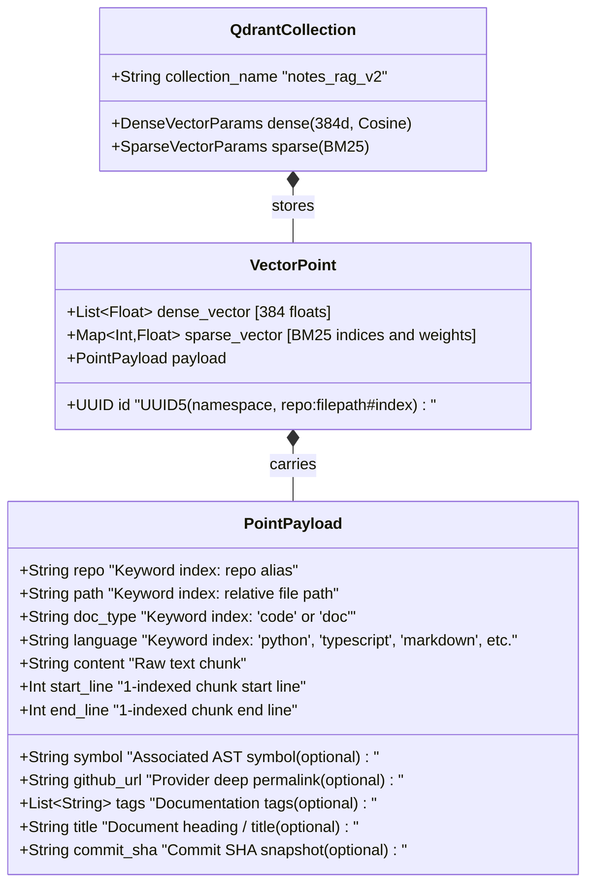

# Software Requirements Specification (v2.4.1)

This document is the authoritative **Software Requirements Specification (SRS)** for the **Notes & Code RAG MCP Server**. It is systematically derived from, verified by, and traceable to the entire test suite and codebase:
- **132 Pytest Backend Tests** across 14 test modules in `tests/backend/` (97% statement coverage).
- **47 Vitest Frontend Unit & Component Tests** across 8 test suites in `frontend/src/tests/` (93.3% line coverage).
- **13 Playwright End-to-End User Journey Tests** in `frontend/e2e/dashboard.spec.ts`.

---

## 1. System Vision & Architecture Scope

The Notes & Code RAG MCP Server provides high-precision, syntax-aware semantic and lexical retrieval over source code repositories, markdown notes, architecture documents, and system documentation.

```
┌────────────────────────────────────────────────────────────────────────────────┐
│                          Clients & Consumers Layer                             │
│  ┌─────────────────────────────────────────┐  ┌─────────────────────────────┐  │
│  │   AI Coding Assistants (MCP Clients)    │  │     Human Administrators    │  │
│  │ Cursor • Antigravity • Claude • VS Code │  │   React 19 Admin Dashboard  │  │
│  └────────────────────┬────────────────────┘  └──────────────┬──────────────┘  │
└───────────────────────┼──────────────────────────────────────┼─────────────────┘
                        │ JSON-RPC (SSE / HTTP)                │ REST API
┌───────────────────────▼──────────────────────────────────────▼─────────────────┐
│                     FastAPI Application Gateway & Web Server                   │
│  ┌─────────────────────────────────────────┐  ┌─────────────────────────────┐  │
│  │    FastMCP 2.0.0+ Server Engine         │  │   FastAPI Admin REST Router │  │
│  │    • SSE Transport (/sse, /messages/)   │  │   • /admin/api/stats        │  │
│  │    • Streamable HTTP (/mcp)             │  │   • /admin/api/repos, paths │  │
│  │    • 7 Agent Tools, Resource, Prompts   │  │   • /admin/api/settings     │  │
│  └────────────────────┬────────────────────┘  └──────────────┬──────────────┘  │
└───────────────────────┼──────────────────────────────────────┼─────────────────┘
                        │                                      │
┌───────────────────────▼──────────────────────────────────────▼─────────────────┐
│                          Core Services & Ingestion Layer                       │
│  ┌───────────────────────┐ ┌───────────────────────┐ ┌───────────────────────┐  │
│  │ Git Manager (Multi)   │ │ Chunker (Tree-sitter) │ │ Embeddings & Search   │  │
│  │ GitHub, GitLab, Gitea │ │ 10 Languages AST      │ │ Dense (BGE-Small)     │  │
│  │ Bitbucket, Generic    │ │ Contextual Markdown   │ │ Sparse (BM25) + RRF   │  │
│  └───────────┬───────────┘ └───────────┬───────────┘ └───────────┬───────────┘  │
└──────────────┼─────────────────────────┼─────────────────────────┼──────────────┘
               │                         │                         │
┌──────────────▼─────────────────────────▼─────────────────────────▼──────────────┐
│                            Storage & Indexing Layer                             │
│  ┌─────────────────────────────────────────┐  ┌─────────────────────────────┐  │
│  │   SQLite WAL Database (index_cache.db)  │  │ Qdrant Hybrid Vector Store  │  │
│  │   • Repositories, Vault, Host Vault     │  │ • Named Multi-Vectors       │  │
│  │   • AST Symbols & File Summaries        │  │ • Deterministic UUID5 Points│  │
│  └─────────────────────────────────────────┘  └─────────────────────────────┘  │
└────────────────────────────────────────────────────────────────────────────────┘
```

---

## 2. Mermaid Data Models & Entity Relationship Diagrams (ERD)

### 2.1 SQLite Relational Data Model (ERD)

The persistent cache database (`index_cache.db`) runs SQLite in WAL (Write-Ahead Logging) mode with automatic schema initialization and non-destructive migrations.


---

### 2.2 Qdrant Hybrid Vector Store Data Model



---

## 3. Comprehensive Functional Requirements (FR)

### FR-1: Model Context Protocol (FastMCP 2.0.0+) Architecture
- **FR-1.1 (Dual Transports)**: The server MUST support dual MCP transports simultaneously:
  - Server-Sent Events (SSE) mounted at `/sse` with POST message routing at `/messages/`.
  - Streamable HTTP bidirectional JSON-RPC transport endpoint at `/mcp`.
  - *Verification*: `test_mcp_v2.py::test_fastmcp_streamable_http_transport`, `test_mcp_v2.py::test_fastmcp_sse_transport`
- **FR-1.2 (Lifespan & Session Registry)**: The server MUST maintain an active session registry to dispatch list change notifications (`send_tool_list_changed`, `send_resource_list_changed`, `send_prompt_list_changed`) to connected clients when indexing updates occur.
  - *Verification*: `test_indexer_sync.py::test_notify_list_changed`
- **FR-1.3 (JSON-RPC Schema Compliance)**: All tool definitions, parameter schemas, resource templates, and prompt descriptions MUST adhere strictly to the Model Context Protocol 2024-11-05 / 2025 specification.
  - *Verification*: `test_mcp_v2.py::test_fastmcp_tool_listing`

---

### FR-2: FastMCP Agent Tools Contract
- **FR-2.1 (`search_code`)**: MUST execute hybrid (Dense + BM25) code searches with Reciprocal Rank Fusion (RRF), returning code chunks, line ranges, matching symbol metadata, and clickable Git permalinks.
  - Parameters: `query: str` (required), `repo: Optional[str]`, `limit: int = 5`, `min_score: float = 0.0`.
  - *Verification*: `test_db_and_tools.py::test_execute_tool_search_code`
- **FR-2.2 (`search_docs`)**: MUST execute hybrid searches across markdown notes and documentation, with category and tag filtering.
  - Parameters: `query: str` (required), `category: Optional[str]`, `tags: Optional[List[str]]`, `limit: int = 5`, `min_score: float = 0.0`.
  - *Verification*: `test_db_and_tools.py::test_execute_tool_search_docs`
- **FR-2.3 (`find_symbol`)**: MUST perform sub-50ms exact and prefix symbol lookups against SQLite `ast_symbols` without vector search overhead.
  - Parameters: `name: str` (required), `repo: Optional[str]`, `exact_match: bool = False`.
  - *Verification*: `test_db_and_tools.py::test_execute_tool_find_symbol`
- **FR-2.4 (`get_file_outline`)**: MUST return the structural AST outline (classes, methods, signatures, start/end lines) for a specified file path.
  - Parameters: `filepath: str` (required), `repo: Optional[str]`.
  - *Verification*: `test_db_and_tools.py::test_execute_tool_get_file_outline`
- **FR-2.5 (`list_repositories`)**: MUST return all registered Git repositories (with provider tags e.g. `[GITHUB]`, `[GITLAB]`, commit SHAs, and sync status) and local paths.
  - *Verification*: `test_db_and_tools.py::test_execute_tool_list_repositories`
- **FR-2.6 (`sync_repository`)**: MUST trigger background incremental or shallow sync for a single repo or all sources.
  - Parameters: `repo: Optional[str]` (None = all repositories).
  - *Verification*: `test_db_and_tools.py::test_execute_tool_sync_repository`
- **FR-2.7 (`index_status`)**: MUST report vector count, active embedding models, collection name, and provider rate limit status.
  - *Verification*: `test_db_and_tools.py::test_execute_tool_index_status`

---

### FR-3: Dynamic Resources & Prompt Templates
- **FR-3.1 (Dynamic Catalog Resource)**: MUST expose dynamic resource `notes://catalog/summary` returning formatted markdown summary of indexed repositories, document distributions, and AST symbol counts.
  - *Verification*: `test_mcp_v2.py::test_fastmcp_resource_read`
- **FR-3.2 (Prompt: `search_infrastructure_docs`)**: MUST provide a prompt template guiding agents to explore system architecture, networking, Docker setups, and container guides.
  - *Verification*: `test_mcp_v2.py::test_fastmcp_prompt_get`
- **FR-3.3 (Prompt: `find_implementation_symbol`)**: MUST provide a prompt template assisting agents in locating symbol declarations, methods, and interface signatures across repositories.
  - *Verification*: `test_mcp_v2.py::test_fastmcp_prompt_get`

---

### FR-4: Universal Multi-Provider Git Ingestion Engine
- **FR-4.1 (Multi-Provider Detection & Support)**: MUST detect and support repositories from:
  - GitHub (`github.com` or custom enterprise domains).
  - GitLab (`gitlab.com` or self-hosted GitLab Enterprise).
  - Gitea / Forgejo (`gitea.com`, `codeberg.org`, or self-hosted).
  - Bitbucket (`bitbucket.org` or Bitbucket Server).
  - Generic Git HTTP/HTTPS with custom ports (e.g. `http://git.lan:3000/user/repo.git`).
  - *Verification*: `test_multi_git_providers.py::test_detect_git_provider`
- **FR-4.2 (Ephemeral Shallow Cloning & Zero Disk Bloat)**: MUST clone via `--depth 1 --branch <branch> --single-branch` into temporary directories and delete the cloned files immediately after AST extraction and vector upserts.
  - *Verification*: `test_git_manager.py::TestGitManager::test_shallow_clone_repo_success`
- **FR-4.3 (Remote SHA Change Tracking)**: MUST query remote commit SHAs via `git ls-remote` and skip redundant cloning when the remote SHA matches the local SQLite database.
  - *Verification*: `test_indexer_edge_cases.py::test_sync_single_git_repo_unchanged_sha`
- **FR-4.4 (Provider-Exact Permalinks)**: MUST construct valid deep links to specific lines of code across all providers:
  - GitHub: `{base}/blob/{sha}/{path}#L{start}-L{end}`
  - GitLab: `{base}/-/blob/{sha}/{path}#L{start}-{end}`
  - Gitea / Forgejo: `{base}/src/commit/{sha}/{path}#L{start}-L{end}`
  - Bitbucket: `{base}/src/{sha}/{path}#lines-{start}:{end}`
  - *Verification*: `test_git_manager.py::TestGitManager::test_format_github_permalink`, `test_multi_git_providers.py::test_format_multi_provider_permalinks`
- **FR-4.5 (Credential Masking & URL Sanitization)**: MUST redact all access tokens and passwords from log files, console output, and API responses (e.g. `https://***github.com/...`).
  - *Verification*: `test_multi_git_providers.py::test_sanitize_url_for_logging_multi_scheme`

---

### FR-5: Multi-Tier Authentication & Credential Vault Hierarchy
- **FR-5.1 (Resolution Hierarchy)**: Ingestion MUST resolve credentials in strict priority order:
  1. Per-repository override token & user (`auth_token`, `auth_user`).
  2. Domain-level Custom Git Host Vault (`git_host_credentials` matching host domain/port).
  3. Global DB provider tokens (`github_token`, `gitlab_token`, `gitea_token` in `system_metadata`).
  4. Container environment variables (`GITHUB_TOKEN`, `GITLAB_TOKEN`, `GITEA_TOKEN`).
  - *Verification*: `test_multi_git_providers.py::test_effective_git_token_hierarchy`
- **FR-5.2 (Host Credential Vault CRUD)**: MUST provide REST APIs (`GET/POST/DELETE /admin/api/settings/hosts`) to manage self-hosted domain credentials with provider types, auth users, and masked tokens.
  - *Verification*: `test_multi_git_providers.py::test_host_credentials_api_endpoints`

---

### FR-6: Multi-Language Tree-sitter AST Syntax Chunking
- **FR-6.1 (10-Language AST Parsing)**: MUST parse code across 10 major programming languages using Tree-sitter grammars:
  - Python: Classes, functions, async functions, decorators.
  - TypeScript & JavaScript: Classes, methods, functions, arrow functions, interfaces, type aliases.
  - Go: Functions, methods, type declarations, struct definitions.
  - Rust: Structs, enums, impl blocks, functions, traits.
  - C# & Java: Classes, methods, interfaces, record types.
  - C++: Classes, structs, namespaces, function definitions.
  - Ruby: Classes, modules, methods, singleton methods.
  - PHP: Classes, interfaces, methods, functions.
  - *Verification*: `test_chunker_languages.py` (16 language test suites)
- **FR-6.2 (1-Indexed Line Ranges & Exact Signatures)**: Chunks MUST preserve exact 1-indexed start and end line ranges, signatures, and parent scope identifiers.
  - *Verification*: `test_chunker.py::test_chunk_python_ast`, `test_chunker_languages.py`

---

### FR-7: Contextual Markdown & Fallback Chunking
- **FR-7.1 (Hierarchical Markdown Breadcrumbs)**: Markdown chunks MUST preserve heading hierarchies (`# Title > ## Section > ### Subsection`) in chunk payloads to maintain semantic context during vector retrieval.
  - *Verification*: `test_chunker.py::test_chunk_markdown_structure`
- **FR-7.2 (Frontmatter Extraction)**: MUST extract YAML frontmatter metadata (title, category, tags) and index them in `file_summaries` and Qdrant payloads.
  - *Verification*: `test_chunker.py::test_extract_frontmatter`
- **FR-7.3 (Line-Based Fallback)**: Plain text, configuration, or unsupported file formats MUST be chunked using sliding line windows with configurable overlap.
  - *Verification*: `test_chunker.py::test_chunk_text_fallback`

---

### FR-8: Hybrid Vector Retrieval Engine
- **FR-8.1 (Named Multi-Vectors)**: Qdrant collection `notes_rag_v2` MUST be configured with named multi-vectors:
  - Dense Vector: 384 dimensions, Cosine distance (`BAAI/bge-small-en-v1.5`).
  - Sparse Vector: BM25 lexical vector weights (`Qdrant/bm25`).
  - *Verification*: `test_indexer_and_embeddings.py::test_ensure_collection`
- **FR-8.2 (Reciprocal Rank Fusion)**: Hybrid search queries MUST fuse dense semantic vectors and sparse lexical search rankings using RRF ($k=60$).
  - *Verification*: `test_search.py::test_execute_hybrid_search_with_sparse`
- **FR-8.3 (Deterministic UUID5 Point Identification)**: MUST generate deterministic chunk UUIDs from `{repo}:{filepath}#{index}` for atomic, idempotent upserts and updates.
  - *Verification*: `test_indexer_and_embeddings.py::test_chunk_uuid_consistency`
- **FR-8.4 (In-Process CPU Execution)**: FastEmbed embedding models MUST execute locally via ONNX Runtime without external API keys or cloud dependencies.
  - *Verification*: `test_indexer_and_embeddings.py::test_local_embedding_generation`

---

### FR-9: REST Administration API
- **FR-9.1 (Stats & Metadata)**: `GET /admin/api/stats` MUST return repository counts, file counts, symbol counts, vector point counts, active embedding models, keyword cloud, provider auth statuses, and rate limits.
  - *Verification*: `test_api_routes.py::test_api_get_stats`
- **FR-9.2 (Repository Management)**: `GET /admin/api/repos`, `POST /admin/api/repos`, `DELETE /admin/api/repos/{id}`, `POST /admin/api/repos/{id}/sync` MUST provide complete repository lifecycle management.
  - *Verification*: `test_api_routes.py::test_api_repos_crud`, `test_api_repo_sync`
- **FR-9.3 (Local Path Management & Directory Browser)**: `GET /admin/api/paths`, `POST /admin/api/paths`, `DELETE /admin/api/paths/{id}`, `GET /admin/api/browse` MUST manage local paths and support interactive directory exploration.
  - *Verification*: `test_api_routes.py::test_api_paths_crud`, `test_api_browse`
- **FR-9.4 (Live Hybrid Search Tester)**: `POST /admin/api/search/test` MUST execute hybrid searches with target type toggles (`all`, `code`, `doc`) and repository filters.
  - *Verification*: `test_api_routes.py::test_api_search_test`
- **FR-9.5 (Global Token Management)**: `POST /admin/api/settings/token` MUST store and clear GitHub, GitLab, and Gitea tokens.
  - *Verification*: `test_api_routes.py::test_api_settings_token`
- **FR-9.6 (Diagnostic Ring Buffer Logs)**: `GET /admin/api/logs` and `DELETE /admin/api/logs` MUST provide in-memory log entries (500-event ring buffer) with level filtering (ALL, INFO, WARNING, ERROR, DEBUG), keyword search, and exception tracebacks.
  - *Verification*: `test_diagnostic_logger.py::test_logs_api_routes`
- **FR-9.7 (Full System Re-indexing)**: `POST /admin/api/reindex` MUST trigger concurrent background indexing of all configured Git repositories and local paths.
  - *Verification*: `test_api_routes.py::test_api_reindex_trigger`

---

### FR-10: React 19 Single Page Administrative Dashboard
- **FR-10.1 (Tab Navigation)**: The UI MUST provide seamless client-side tab navigation between Overview, Git Repositories, Local Paths, Search & Inspector, Settings, and Diagnostics & Logs.
  - *Verification*: `App.test.tsx`, Playwright E2E Spec 1
- **FR-10.2 (Repository Management UI)**: Modal workflow for registering repositories with provider badges (GitHub, GitLab, Gitea, Bitbucket, Generic Git), single-repo sync buttons, and deletion confirmation dialogs.
  - *Verification*: `GitRepoManager.test.tsx`, Playwright E2E Specs 2, 3, 4, 5
- **FR-10.3 (Local Path Management UI & Filesystem Browser)**: Interactive directory navigation modal, path registration, and recursive scanning toggles.
  - *Verification*: `LocalPathManager.test.tsx`, Playwright E2E Specs 6, 7
- **FR-10.4 (Interactive Search Inspector UI)**: Real-time query tester with code vs doc toggle, repo filters, RRF score display, and syntax-highlighted code chunks.
  - *Verification*: `SearchInspector.test.tsx`, Playwright E2E Specs 8, 9
- **FR-10.5 (Multi-Provider Settings & Host Vault UI)**: Multi-provider token cards (GitHub, GitLab, Gitea), rate limit indicators, and Custom Git Host Vault CRUD table/modal.
  - *Verification*: `Settings.test.tsx`, Playwright E2E Specs 10, 11
- **FR-10.6 (Diagnostics & Real-time Logs UI)**: Log level filtering pills (ALL, INFO, WARNING, ERROR, DEBUG), live search input, traceback drawer modal, and log buffer clear action.
  - *Verification*: `DiagnosticsViewer.test.tsx`, Playwright E2E Spec 13
- **FR-10.7 (Toast Notifications System)**: Global toast notification system with auto-dismiss timers, custom icons, and manual dismiss buttons.
  - *Verification*: `ToastContext.test.tsx`

---

## 4. Non-Functional Requirements (NFR)

- **NFR-1 (Performance & Response Budgets)**:
  - AST symbol lookup (`find_symbol`, `get_file_outline`) response latency MUST be $<50\text{ms}$.
  - Hybrid vector search query latency MUST be $<150\text{ms}$ on CPU.
- **NFR-2 (Zero Disk Bloat & Memory Efficiency)**:
  - Ephemeral shallow cloning MUST leave 0 MB residual cloned files on disk.
  - In-process ONNX FastEmbed model memory usage MUST remain $\le 1.2\text{ GB}$ RAM.
- **NFR-3 (Security & Credential Sanitization)**:
  - Personal access tokens, OAuth tokens, and passwords MUST NEVER appear in cleartext in logs, console output, URLs, or client API payloads.
- **NFR-4 (Reliability & Concurrency)**:
  - SQLite database MUST operate with WAL (Write-Ahead Logging) mode to guarantee non-blocking concurrent reads during indexing writes.
  - Qdrant collection schemas MUST automatically upgrade on startup if dimension or sparse vector mismatches are detected.
- **NFR-5 (Failure Isolation)**:
  - Failure to sync or index an individual repository MUST NOT abort indexing of other repositories or destabilize the MCP server.
- **NFR-6 (Test Quality & Coverage Floor)**:
  - Backend statement coverage MUST remain $\ge 95\%$.
  - Frontend line coverage MUST remain $\ge 90\%$.
  - 100% of automated Playwright E2E user journeys MUST pass.
- **NFR-7 (Container Portability & Health Monitoring)**:
  - The application MUST run as a standalone Docker container with healthcheck monitoring via `GET /health`.

---

## 5. Requirement-to-Test Traceability Matrix

| Requirement ID | Requirement Description | Implementation Files | Backend Pytest Modules | Frontend Vitest & E2E Suites |
| :--- | :--- | :--- | :--- | :--- |
| **FR-1** | FastMCP 2.0 Dual Transport Architecture | `app/mcp/mcp_server.py` | `test_mcp_v2.py`, `test_indexer_sync.py` | E2E Spec 1 |
| **FR-2** | FastMCP 7 Agent Tools Contract | `app/mcp/tools.py` | `test_db_and_tools.py`, `test_tools.py`, `test_schemas.py` | E2E Specs 1, 8 |
| **FR-3** | Dynamic Resources & Prompt Templates | `app/mcp/mcp_server.py` | `test_mcp_v2.py` | E2E Spec 1 |
| **FR-4** | Universal Multi-Git Provider Ingestion | `app/services/git_manager.py`, `app/services/indexer.py` | `test_multi_git_providers.py`, `test_git_manager.py`, `test_indexer_edge_cases.py` | `GitRepoManager.test.tsx`, E2E Specs 2, 3, 4, 5 |
| **FR-5** | Multi-Tier Credential Vault & Hierarchy | `app/services/db.py`, `app/services/git_manager.py` | `test_multi_git_providers.py`, `test_db_and_tools.py` | `Settings.test.tsx`, E2E Specs 10, 11 |
| **FR-6** | 10-Language Tree-sitter AST Chunking | `app/services/chunker.py` | `test_chunker.py`, `test_chunker_languages.py` | `SearchInspector.test.tsx`, E2E Spec 8 |
| **FR-7** | Markdown Breadcrumbs & Fallbacks | `app/services/chunker.py` | `test_chunker.py` | `SearchInspector.test.tsx`, E2E Spec 8 |
| **FR-8** | Hybrid Vector Engine (BGE + BM25 + RRF) | `app/services/embeddings.py`, `app/services/search.py` | `test_indexer_and_embeddings.py`, `test_search.py` | `SearchInspector.test.tsx`, E2E Specs 8, 9 |
| **FR-9** | Administrative REST APIs | `app/api/routes.py`, `app/services/diagnostic_logger.py` | `test_api_routes.py`, `test_diagnostic_logger.py` | `Overview.test.tsx`, `DiagnosticsViewer.test.tsx`, E2E Specs 1-13 |
| **FR-10** | React 19 Single Page Admin Dashboard | `frontend/src/*` | N/A | `App.test.tsx`, `GitRepoManager.test.tsx`, `LocalPathManager.test.tsx`, `SearchInspector.test.tsx`, `Settings.test.tsx`, `DiagnosticsViewer.test.tsx`, `ToastContext.test.tsx`, E2E Specs 1-13 |
| **NFR-1** | Performance & Latency Budgets | `app/services/db.py`, `app/services/search.py` | `test_db_and_tools.py`, `test_search.py` | E2E Specs 8, 9 |
| **NFR-2** | Zero Disk Bloat & Memory Efficiency | `app/services/git_manager.py`, `app/services/embeddings.py` | `test_git_manager.py`, `test_indexer_and_embeddings.py` | E2E Specs 2, 3 |
| **NFR-3** | Credential Sanitization in Logs/APIs | `app/services/git_manager.py`, `app/api/routes.py` | `test_multi_git_providers.py`, `test_api_routes.py` | `Settings.test.tsx`, E2E Specs 10, 11 |
| **NFR-4** | SQLite WAL & Qdrant Auto-Healing | `app/services/db.py`, `app/services/indexer.py` | `test_db_and_tools.py`, `test_indexer_and_embeddings.py` | E2E Spec 1 |
| **NFR-5** | Sync Failure Isolation | `app/services/indexer.py` | `test_indexer_edge_cases.py`, `test_indexer_sync.py` | `GitRepoManager.test.tsx`, E2E Spec 5 |
| **NFR-6** | Test Quality & Coverage Floors | Entire Test Suite | `pytest` (132 tests, 97% cov) | `vitest` (47 tests, 93% cov), `playwright` (13 tests) |
| **NFR-7** | Container Portability & Health | `Dockerfile`, `main.py` | `test_api_routes.py` | Docker healthcheck |
