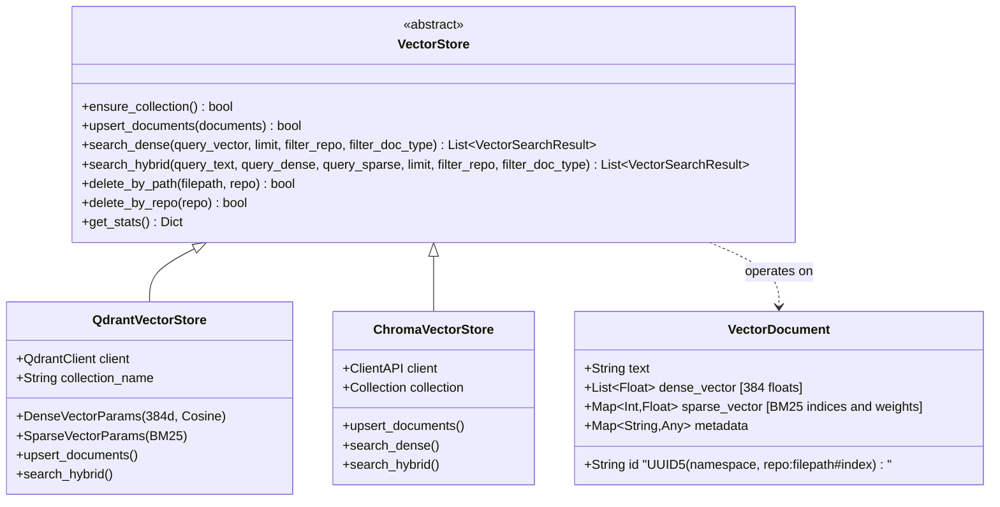

# Software Requirements Specification: ContextCortex (v2.12.0)

> **Note:** This document is automatically generated and verified against the live test suite by `scripts/generate_requirements.py` and `tests/backend/test_requirements_sync.py`.

**Test Verification Baseline:** **734 Automated Tests** (534 Pytest Backend + 174 Vitest Frontend + 26 Playwright E2E).

---

## 1. System Vision & Architecture Scope

ContextCortex provides high-precision, syntax-aware semantic and lexical retrieval over source code repositories, markdown notes, architecture documents, API route graphs, and system documentation. It features a modular, sub-500 LOC architecture, dual MCP transports, pluggable vector store backends (pgvector, Qdrant & ChromaDB), background auto-sync pollers, multi-provider webhooks, ADR tracking, managed local storage file uploads, unified ingestion catalog exploration, and an interactive visual topology explorer in a React 19 administrative dashboard.

```
┌────────────────────────────────────────────────────────────────────────────────┐
│                          Clients & Consumers Layer                             │
│  ┌─────────────────────────────────────────┐  ┌─────────────────────────────┐  │
│  │   AI Coding Assistants (MCP Clients)    │  │     Human Administrators    │  │
│  │ Cursor • Antigravity • Claude • VS Code │  │   React 19 Admin Dashboard  │  │
│  └────────────────────┬────────────────────┘  └──────────────┬──────────────┘  │
└───────────────────────┼──────────────────────────────────────┼─────────────────┘
                        │ JSON-RPC (SSE / HTTP)                │ REST API
┌───────────────────────▼──────────────────────────────────────▼─────────────────┐
│                     FastAPI Application Gateway & Web Server                   │
│  ┌─────────────────────────────────────────┐  ┌─────────────────────────────┐  │
│  │    FastMCP 2.0.0+ Server Engine         │  │   FastAPI Admin REST Router │  │
│  │    • SSE Transport (/sse, /messages/)   │  │   • app/api/routers/        │  │
│  │    • Streamable HTTP (/mcp)             │  │   • repos, storage, catalog │  │
│  │    • 14 Extended Agent Tools & Prompts  │  │   • webhooks, search, logs  │  │
│  └────────────────────┬────────────────────┘  └──────────────┬──────────────┘  │
└───────────────────────┼──────────────────────────────────────┼─────────────────┘
                        │                                      │
┌───────────────────────▼──────────────────────────────────────▼─────────────────┐
│                          Core Modular Services Layer                           │
│  ┌────────────────────┐ ┌────────────────────┐ ┌─────────────────────────────┐  │
│  │ app.services.      │ │ app.services.      │ │ app.services.               │  │
│  │ git_manager        │ │ chunking.*         │ │ embeddings & search         │  │
│  │ GitHub, GitLab,    │ │ 10 Language AST    │ │ Dense (BGE-Small)           │  │
│  │ Gitea, Bitbucket   │ │ Routes & Calls     │ │ Sparse (BM25) + RRF         │  │
│  └──────────┬─────────┘ └──────────┬─────────┘ └──────────────┬──────────────┘  │
│  ┌──────────▼─────────┐ ┌──────────▼─────────┐ ┌──────────────▼──────────────┐  │
│  │ app.services.      │ │ app.services.      │ │ app.services.               │  │
│  │ indexing.*         │ │ topology.*         │ │ local_storage, poller, adr  │  │
│  │ git/local syncers  │ │ graph & details    │ │ incremental index & storage │  │
│  └──────────┬─────────┘ └──────────┬─────────┘ └──────────────┬──────────────┘  │
└─────────────┼──────────────────────┼──────────────────────────┼─────────────────┘
              │                      │                          │
┌─────────────▼──────────────────────▼──────────────────────────▼────────────────┐
│                            Storage & Vector Layer                              │
│  ┌─────────────────────────────────────────┐  ┌─────────────────────────────┐  │
│  │ Relational DB (PostgreSQL / SQLite WAL) │  │ Pluggable Vector Store      │  │
│  │ • Repositories, Vault, Local Storage    │  │ (app.services.vector_store) │  │
│  │ • AST Symbols, Routes, Relationships    │  │ • pgvector, Qdrant, ChromaDB│  │
│  │ • Architecture ADRs & Sync Configs      │  │ • DATA_DIR/storage tree     │  │
│  └─────────────────────────────────────────┘  └─────────────────────────────┘  │
└────────────────────────────────────────────────────────────────────────────────┘
```

---

## 2. Mermaid Data Models & Entity Relationship Diagrams (ERD)

### 2.1 SQLite Relational Data Model (ERD)

The persistent cache database (`index_cache.db`) runs SQLite in WAL mode with auto-migrations and indexing support.

```mermaid
erDiagram
    GIT_REPOSITORIES {
        int id PK "Primary Key (Auto-Increment)"
        string name UK "Unique repository alias"
        string url "Git clone URL (HTTP / HTTPS)"
        string branch "Branch to track (e.g. main, master)"
        string provider "github | gitlab | gitea | bitbucket | generic"
        string auth_user "Optional auth username (e.g. oauth2)"
        string auth_token "Optional repo-specific override token"
        string commit_sha "Latest indexed commit SHA"
        string status "pending | syncing | synced | error"
        string last_error "Error message if sync failed"
        string last_synced "ISO-8601 Timestamp of last sync"
        int enabled "1 = Active, 0 = Disabled"
        int auto_sync_enabled "1 = Periodic auto-sync active, 0 = Disabled"
        int auto_sync_interval "Auto-sync polling interval in minutes"
        string webhook_secret "Optional HMAC secret token for webhook triggers"
        datetime added_at "Creation timestamp"
    }

    GIT_HOST_CREDENTIALS {
        int id PK "Primary Key (Auto-Increment)"
        string host UK "Host domain or IP:Port"
        string provider "gitlab | gitea | github | bitbucket | generic"
        string auth_user "Optional default user (e.g. oauth2)"
        string auth_token "Access token / password"
        datetime added_at "Creation timestamp"
    }

    INDEXED_PATHS {
        int id PK "Primary Key (Auto-Increment)"
        string path UK "Absolute local filesystem path"
        string type "directory | file"
        int recursive "1 = Recursive scan, 0 = Top-level"
        int enabled "1 = Active, 0 = Disabled"
        string category "architecture | guides | notes | general"
        string repo "Assigned repository alias"
        datetime added_at "Creation timestamp"
    }

    INDEXED_FILES {
        string filepath PK "File path (relative to repo or absolute)"
        string repo "Repository or vault alias"
        string doc_type "code | doc"
        string language "python | typescript | markdown | etc."
        string commit_sha "Commit SHA when indexed"
        real mtime "Filesystem last modified timestamp"
        string hash "Content SHA-256 hash"
    }

    AST_SYMBOLS {
        int id PK "Primary Key (Auto-Increment)"
        string repo "Repository alias"
        string filepath "Relative file path"
        string kind "class | function | method | interface | struct"
        string name "Symbol identifier name"
        string full_symbol "Qualified symbol path"
        string signature "Function / Method parameter signature"
        int start_line "1-indexed start line"
        int end_line "1-indexed end line"
        string language "Language grammar identifier"
    }

    AST_RELATIONSHIPS {
        int id PK "Primary Key (Auto-Increment)"
        string repo "Repository alias"
        int source_symbol_id "Parent symbol ID"
        string source_filepath "Source relative file path"
        string source_symbol "Source symbol name"
        string target_symbol "Target referenced symbol"
        string relationship_type "CALLS | IMPORTS | EXTENDS | IMPLEMENTS"
        int line_number "Line number of relation"
    }

    API_ROUTES {
        int id PK "Primary Key (Auto-Increment)"
        string repo "Repository alias"
        string filepath "File path where route is defined"
        string framework "FastAPI | Express | Flask | Gin | Axum | ASP.NET"
        string http_method "GET | POST | PUT | DELETE | PATCH | *"
        string path_pattern "Normalized URL path template (e.g. /api/users/{id})"
        string handler_symbol "Handler function/method name"
        int start_line "1-indexed start line"
        int end_line "1-indexed end line"
    }

    API_CLIENT_CALLS {
        int id PK "Primary Key (Auto-Increment)"
        string repo "Repository alias"
        string filepath "File path containing client invocation"
        string http_method "Inferred HTTP method or *"
        string url_pattern "Invoked URL path or pattern"
        string caller_symbol "Enclosing function / method"
        int line_number "Line number of invocation"
    }

    ARCHITECTURE_ADRS {
        int id PK "Primary Key (Auto-Increment)"
        string repo "Repository alias"
        string adr_number "Sequential identifier (e.g. 0001, ADR-002)"
        string title "ADR Title"
        string status "proposed | accepted | rejected | deprecated | superseded"
        string date "ISO date string or extracted record date"
        string filepath "Relative file path"
        string context "Background and context statement"
        string decision "Architectural decision statement"
        string consequences "Positive/negative consequence notes"
        string raw_content "Full raw markdown content"
    }

    FILE_SUMMARIES {
        string filepath PK "Relative file path"
        string repo "Repository alias"
        string title "Extracted title or basename"
        string folder "Parent directory name"
        string category "Documentation category"
        string tags "JSON array of tags"
        string headings "JSON array of headings"
        string keywords "JSON array of extracted keywords"
        real mtime "Modification timestamp"
    }

    SYSTEM_METADATA {
        string key PK "github_token | gitlab_token | gitea_token | vector_backend | auto_sync_interval | auto_sync_secret"
        string value "String configuration value"
    }

    GIT_REPOSITORIES ||--o{ INDEXED_FILES : "contains"
    GIT_REPOSITORIES ||--o{ AST_SYMBOLS : "declares"
    GIT_REPOSITORIES ||--o{ AST_RELATIONSHIPS : "traces"
    GIT_REPOSITORIES ||--o{ API_ROUTES : "exposes"
    GIT_REPOSITORIES ||--o{ API_CLIENT_CALLS : "invokes"
    GIT_REPOSITORIES ||--o{ ARCHITECTURE_ADRS : "documents"
    GIT_REPOSITORIES ||--o{ FILE_SUMMARIES : "summarizes"
    INDEXED_PATHS ||--o{ INDEXED_FILES : "contains"
    INDEXED_FILES ||--o{ AST_SYMBOLS : "defines"
    INDEXED_FILES ||--o| FILE_SUMMARIES : "has metadata"
```



---

### 2.2 Pluggable Vector Store Data Model (Qdrant & ChromaDB)



---

## 3. Comprehensive Functional Requirements (FR)

### FR-1: Model Context Protocol (FastMCP 2.0.0+) Architecture
- **FR-1.1 (Dual Transports)**: The server MUST support dual MCP transports simultaneously: Server-Sent Events (SSE) mounted at `/sse` with POST message routing at `/messages/`, and Streamable HTTP bidirectional JSON-RPC transport endpoint at `/mcp`.
- **FR-1.2 (Lifespan & Session Registry)**: The server MUST maintain an active session registry to dispatch list change notifications (`send_tool_list_changed`, `send_resource_list_changed`, `send_prompt_list_changed`) to connected clients when indexing updates occur.
- **FR-1.3 (JSON-RPC Schema Compliance)**: All tool definitions, parameter schemas, resource templates, and prompt descriptions MUST adhere strictly to the Model Context Protocol 2024-11-05 / 2025 specification.

### FR-2: FastMCP Extended Agent Tools Contract
- **FR-2.1 (`search_code`)**: MUST execute hybrid (Dense + BM25) code searches with Reciprocal Rank Fusion (RRF), returning code chunks, line ranges, matching symbol metadata, and clickable Git permalinks.
- **FR-2.2 (`search_docs`)**: MUST execute hybrid searches across markdown notes and documentation, with category and tag filtering.
- **FR-2.3 (`find_symbol`)**: MUST perform sub-50ms exact and prefix symbol lookups against SQLite `ast_symbols` without vector search overhead.
- **FR-2.4 (`get_file_outline`)**: MUST return the structural AST outline (classes, methods, signatures, start/end lines) for a specified file path.
- **FR-2.5 (`list_repositories`)**: MUST return all registered Git repositories (with provider tags e.g. `[GITHUB]`, `[GITLAB]`, commit SHAs, and sync status) and local paths.
- **FR-2.6 (`sync_repository`)**: MUST trigger background incremental or shallow sync for a single repo or all sources.
- **FR-2.7 (`index_status`)**: MUST report vector count, active embedding models, collection name, and provider rate limit status.
- **FR-2.8 (`get_architecture`)**: MUST synthesize high-level codebase architecture including detected entry points, primary language distributions, core directories, framework components, and architectural decision records.
- **FR-2.9 (`manage_adr`)**: MUST support querying, listing, creating, and updating Architectural Decision Records (MADR / Nygard format) with lifecycle status tracking.
- **FR-2.10 (`get_code_routes`)**: MUST return API endpoint routes and HTTP client invocations parsed from backend frameworks (FastAPI, Express, Flask, Gin, Axum, ASP.NET).
- **FR-2.11 (`trace_call_path`)**: MUST trace AST symbol calls, imports, inheritance, and cross-repo API client-to-route connections using BFS graph traversal.
- **FR-2.12 (`manage_local_file`)**: MUST support uploading, replacing, reading, and deleting files under managed local storage (`LOCAL_STORAGE_PATH`) with real-time vector and symbol indexing.
- **FR-2.13 (`what_is_ingested`)**: MUST inspect and filter across all ingested Git repositories, monitored local paths, and uploaded local storage files with source type and detail level filtering.

### FR-3: Dynamic Resources & Prompt Templates
- **FR-3.1 (Dynamic Catalog Resource)**: MUST expose dynamic resource `knowledge://catalog/summary` returning formatted markdown summary of indexed repositories, document distributions, and AST symbol counts.
- **FR-3.2 (Prompt: `search_infrastructure_docs`)**: MUST provide a prompt template guiding agents to explore system architecture, networking, Docker setups, and container guides.
- **FR-3.3 (Prompt: `find_implementation_symbol`)**: MUST provide a prompt template assisting agents in locating symbol declarations, methods, and interface signatures across repositories.

### FR-4: Universal Multi-Provider Git Ingestion Engine
- **FR-4.1 (Multi-Provider Detection & Support)**: MUST detect and support repositories from GitHub, GitLab (Cloud & Self-Hosted), Gitea/Forgejo, Bitbucket, and Generic Git HTTP/HTTPS with custom ports.
- **FR-4.2 (Ephemeral Shallow Cloning & Zero Disk Bloat)**: MUST clone via `--depth 1 --branch <branch> --single-branch` into temporary directories and delete the cloned files immediately after AST extraction and vector upserts.
- **FR-4.3 (Remote SHA Change Tracking)**: MUST query remote commit SHAs via `git ls-remote` and skip redundant cloning when the remote SHA matches the local SQLite database.
- **FR-4.4 (Provider-Exact Permalinks)**: MUST construct valid deep links to specific lines of code across all providers (GitHub, GitLab, Gitea, Bitbucket).
- **FR-4.5 (Credential Masking & URL Sanitization)**: MUST redact all access tokens and passwords from log files, console output, and API responses (e.g. `https://***github.com/...`).

### FR-5: Multi-Tier Authentication & Credential Vault Hierarchy
- **FR-5.1 (Resolution Hierarchy)**: Ingestion MUST resolve credentials in strict priority order: 1. Repo Override $\rightarrow$ 2. Host Vault $\rightarrow$ 3. Global DB Tokens $\rightarrow$ 4. Environment Variables.
- **FR-5.2 (Host Credential Vault CRUD)**: MUST provide REST APIs (`GET/POST/DELETE /admin/api/settings/hosts`) to manage self-hosted domain credentials with provider types, auth users, and masked tokens.

### FR-6: Multi-Language Tree-sitter AST Syntax Chunking
- **FR-6.1 (10-Language AST Parsing)**: MUST parse code across 10 major programming languages (Python, TS/JS, Go, Rust, C#, C++, Java, Ruby, PHP) using Tree-sitter grammars along structural node boundaries.
- **FR-6.2 (1-Indexed Line Ranges & Exact Signatures)**: Chunks MUST preserve exact 1-indexed start and end line ranges, signatures, and parent scope identifiers.
- **FR-6.3 (Relationship & Route Extraction)**: MUST extract symbol relationships (`CALLS`, `IMPORTS`, `EXTENDS`) and REST API route definitions / HTTP client calls into SQLite relational tables.

### FR-7: Contextual Markdown & Fallback Chunking
- **FR-7.1 (Hierarchical Markdown Breadcrumbs)**: Markdown chunks MUST preserve heading hierarchies (`# Title > ## Section > ### Subsection`) in chunk payloads to maintain semantic context during vector retrieval.
- **FR-7.2 (Frontmatter Extraction)**: MUST extract YAML frontmatter metadata (title, category, tags) and index them in `file_summaries` and vector payloads.
- **FR-7.3 (Line-Based Fallback)**: Plain text, configuration, or unsupported file formats MUST be chunked using sliding line windows with configurable overlap.

### FR-8: Pluggable Multi-Backend Vector Retrieval Engine
- **FR-8.1 (Supported Vector Backends)**: MUST support PostgreSQL 16 (pgvector), Qdrant (Embedded and Remote) and ChromaDB (Embedded persistent and Remote client) as interchangeable storage engines.
- **FR-8.2 (Reciprocal Rank Fusion)**: Hybrid search queries MUST fuse dense semantic vectors and sparse lexical search rankings using RRF ($k=60$).
- **FR-8.3 (Deterministic UUID5 Point Identification)**: MUST generate deterministic chunk UUIDs from `{repo}:{filepath}#{index}` for atomic, idempotent upserts and updates.
- **FR-8.4 (Runtime Provider Switching)**: MUST support dynamic vector backend switching via `POST /admin/api/settings/vector-store/switch` with health checking and live schema verification.

### FR-9: Codebase & Dependency Topology Graph Engine
- **FR-9.1 (Graph Topology API)**: `GET /admin/api/graph/topology` MUST return graph nodes (files, classes, functions, routes) and edges (`IMPORTS`, `CALLS`, `DEFINES`, `HANDLES`, `ROUTES_TO`) with depth, limit, view type (`files`, `symbols`, `routes`, `full`), and root node BFS filtering.
- **FR-9.2 (Node Details API)**: `GET /admin/api/graph/node-details` MUST return detailed symbol signatures, code snippets, incoming/outgoing neighbor connections, and Git permalinks.

### FR-10: Architecture Decision Records (ADR) & High-Level Architecture
- **FR-10.1 (ADR Parsing & Storage)**: MUST parse ADR markdown files conforming to MADR or Nygard templates and index them in `architecture_adrs` with status lifecycle tracking (`draft`, `accepted`, `rejected`, `superseded`).
- **FR-10.2 (Architecture Synthesis)**: MUST analyze repository entry points, language distributions, directory summaries, and route inventories to construct high-level architecture overviews.

### FR-11: Background Poller Daemon & Multi-Provider Webhook Ingestion
- **FR-11.1 (Background Poller Daemon)**: Ingestion daemon MUST poll enabled repositories at configurable intervals, check remote commit SHAs via `git ls-remote`, and trigger background indexing only on SHA updates.
- **FR-11.2 (Multi-Provider Webhook Ingestion)**: `POST /api/webhooks/{provider}` MUST authenticate incoming webhook payloads from GitHub (`X-Hub-Signature-256`), GitLab (`X-Gitlab-Token`), Gitea (`X-Gitea-Signature`), and Bitbucket with HMAC verification, triggering instantaneous repository syncs upon push events.

### FR-12: REST Administration APIs & Subrouter Hierarchy
- **FR-12.1 (Modular Subrouters)**: REST APIs MUST be organized into dedicated FastAPI subrouters under `app/api/routers/` (`repositories.py`, `settings.py`, `graph.py`, `auth.py`, `storage.py`, `ingestion.py`) and top-level modules (`webhooks.py`, `routes.py`).
- **FR-12.2 (Complete CRUD & Search Endpoints)**: Full repository management, local path indexing, local storage file management, ingestion catalog querying, directory browsing, vector settings switching, diagnostic logs, and live search tester endpoints.

### FR-13: React 19 Single Page Administrative Dashboard
- **FR-13.1 (Tab Navigation & Responsive Layout)**: Single page dashboard supporting desktop and mobile drawer navigation across Overview, Topology, Git Repositories, Local Paths, Local Storage, Ingestion Catalog, Search & Inspector, Settings, and Diagnostics & Logs.
- **FR-13.2 (Modular Component Architecture)**: Dedicated modular component tree under `frontend/src/components/` and dedicated manager views (`LocalStorageManager.tsx`, `IngestionCatalogViewer.tsx`) with all source files under 450 lines.

### FR-14: Interactive Visual Topology Explorer
- **FR-14.1 (Interactive Force Canvas)**: Interactive SVG/Canvas graph visualization with zoom, pan, drag physics, minimap, view type toggling (`FILES`, `SYMBOLS`, `ROUTES`, `FULL`), and depth selection.
- **FR-14.2 (Slide-Over Inspector Drawer)**: Interactive drawer displaying symbol signatures, line ranges, incoming/outgoing relationship trees, and Git permalinks.

### FR-15: Diagnostics & Live In-Memory Log Buffers
- **FR-15.1 (Ring Buffer Logging)**: In-memory 500-event log buffer with level filtering (ALL, INFO, WARNING, ERROR, DEBUG), keyword search, and exception traceback viewer drawer.

### FR-16: Managed Local Storage Option & Real-Time Incremental Indexing
- **FR-16.1 (Safe Path Resolution & Traversal Defense)**: MUST strictly sanitize relative file paths using canonical directory containment checks (`os.path.commonpath([resolved, root]) == root`), rejecting `..`, absolute paths, leading slashes, and null bytes (`\x00`).
- **FR-16.2 (Real-Time AST & Vector Indexing on Upload/Replace)**: File uploads/replacements MUST immediately trigger semantic boundary chunking, Tree-sitter AST extraction, dense/sparse embeddings, vector store upsert (`upsert_points`), and relational records upsert in `indexed_files`, `file_summaries`, and `ast_symbols`.
- **FR-16.3 (Clean File Deletion & Purging)**: File deletions MUST remove the physical file from disk, delete all associated chunk vectors from the active vector store, and remove metadata from relational tables.
- **FR-16.4 (Directory Tree Hierarchy)**: MUST expose hierarchical directory tree inspection (`GET /admin/api/storage/tree`) returning directory structures, file sizes, modification timestamps, and total counts.

### FR-17: Unified Ingestion Catalog (`what_is_ingested` & `/admin/api/ingestion/catalog`)
- **FR-17.1 (Multi-Source Unified Inventory)**: MUST aggregate all ingested data sources across Git repositories, monitored local directories, and managed local storage files.
- **FR-17.2 (Granular Multi-Dimensional Filtering)**: MUST support filtering by `source_type` (`all`, `git`, `monitored_path`, `local_storage`), `repo_name`, `path_prefix`, `file_extension`, and `detail_level` (`summary` vs `detailed`).
- **FR-17.3 (MCP & REST API Parity)**: MUST provide identical catalog inspection capabilities via FastMCP tool (`what_is_ingested`) and REST endpoint (`GET /admin/api/ingestion/catalog`) protected by `Role.VIEWER`.

---

## 4. Non-Functional Requirements (NFR)

- **NFR-1 (Performance & Latency Budgets)**: AST symbol lookup response latency $<50\text{ms}$; Hybrid vector search query latency $<150\text{ms}$ on CPU.
- **NFR-2 (Zero Disk Bloat & Memory Efficiency)**: Ephemeral shallow cloning MUST leave 0 MB residual cloned files on disk; FastEmbed model memory $\le 1.2\text{ GB}$ RAM.
- **NFR-3 (Security & Credential Sanitization)**: Personal access tokens, OAuth tokens, and passwords MUST NEVER appear in cleartext in logs, console output, URLs, or client API payloads.
- **NFR-4 (Reliability & Concurrency)**: SQLite database MUST operate in WAL mode; Vector store schemas MUST automatically auto-heal/upgrade on startup.
- **NFR-5 (Failure Isolation)**: Failure to sync an individual repository MUST NOT abort other repositories or crash the server.
- **NFR-6 (Codebase Modularity & File Size Floor)**: All individual Python and TypeScript source code files MUST remain under 500 lines of code for long-term maintainability.
- **NFR-7 (Test Quality & Coverage Floor)**: Backend statement coverage $\ge 85\%$; Frontend line coverage $\ge 85\%$; 100% Playwright E2E pass rate.

---

## 5. Requirement-to-Test Traceability Matrix

| Requirement ID | Requirement Description | Implementation Files | Backend Pytest Modules | Frontend Vitest & E2E Suites |
| :--- | :--- | :--- | :--- | :--- |
| **FR-1** | FastMCP 2.0 Dual Transport Architecture | `app/mcp/mcp_server.py`, `app/mcp/tools.py` | `test_mcp_v2.py`, `test_indexer_sync.py` | E2E Spec 1 |
| **FR-2** | FastMCP 14 Agent Tools Contract | `app/mcp/tools.py`, `app/mcp/handlers/*` | `test_db_and_tools.py`, `test_tools.py`, `test_architecture_adr.py`, `test_trace_path.py`, `test_mcp_storage_tools.py` | E2E Specs 1, 8 |
| **FR-3** | Dynamic Resources & Prompt Templates | `app/mcp/mcp_server.py`, `app/mcp/tools.py` | `test_mcp_v2.py`, `test_tools.py` | E2E Spec 1 |
| **FR-4** | Universal Multi-Git Provider Ingestion | `app/services/git_manager.py`, `app/services/indexing/git_syncer.py` | `test_multi_git_providers.py`, `test_git_manager.py`, `test_indexer_edge_cases.py` | `GitRepoManager.test.tsx`, E2E Specs 2, 3, 4, 5, 16, 18 |
| **FR-5** | Multi-Tier Credential Vault & Hierarchy | `app/services/database/credentials.py`, `app/services/git_manager.py` | `test_multi_git_providers.py`, `test_db_and_tools.py` | `Settings.test.tsx`, E2E Specs 10, 11 |
| **FR-6** | 10-Language Tree-sitter AST Syntax & Routes | `app/services/chunking/*` | `test_chunker.py`, `test_chunker_languages.py`, `test_api_route_discovery.py`, `test_ast_relationships.py` | `SearchInspector.test.tsx`, E2E Spec 8 |
| **FR-7** | Markdown Breadcrumbs & Fallbacks | `app/services/chunking/text_chunker.py` | `test_chunker.py`, `test_chunker_languages.py` | `SearchInspector.test.tsx`, E2E Spec 8 |
| **FR-8** | Pluggable Multi-Backend Vector Retrieval | `app/services/vector_store/*`, `app/services/search.py` | `test_vector_store_base.py`, `test_vector_store_qdrant.py`, `test_vector_store_chroma.py`, `test_vector_store_manager.py`, `test_search.py`, `test_pgvector_store.py` | `Settings.test.tsx`, `SearchInspector.test.tsx`, E2E Specs 8, 9 |
| **FR-9** | Codebase & Dependency Topology Graph | `app/services/topology/*`, `app/api/routers/graph.py` | `test_topology_graph.py`, `test_trace_path.py` | `TopologyExplorer.test.tsx`, E2E Specs 25, 26 |
| **FR-10** | Architecture ADRs & System Synthesis | `app/services/adr.py`, `app/services/architecture.py`, `app/services/database/adrs.py` | `test_architecture_adr.py` | `SearchInspector.test.tsx` |
| **FR-11** | Auto-Sync Poller Daemon & Webhooks | `app/services/poller.py`, `app/api/webhooks.py`, `app/services/database/sync_config.py` | `test_poller.py`, `test_webhooks.py`, `test_auto_sync_api.py`, `test_auto_sync_db.py` | `GitRepoManager.test.tsx`, `Settings.test.tsx`, E2E Specs 22, 23, 24 |
| **FR-12** | Administrative REST APIs & Subrouters | `app/api/routes.py`, `app/api/routers/*` | `test_api_routes.py`, `test_api_vector_store.py`, `test_diagnostic_logger.py`, `test_storage_api_routes.py` | `Overview.test.tsx`, `DiagnosticsViewer.test.tsx`, E2E Specs 1-26 |
| **FR-13** | React 19 Single Page Admin Dashboard | `frontend/src/*`, `frontend/src/components/*` | N/A | `App.test.tsx`, `GitRepoManager.test.tsx`, `LocalPathManager.test.tsx`, `LocalStorageManager.test.tsx`, `IngestionCatalogViewer.test.tsx`, `Settings.test.tsx`, `Overview.test.tsx`, E2E Specs 1-26 |
| **FR-14** | Interactive Visual Topology Explorer UI | `frontend/src/TopologyExplorer.tsx`, `frontend/src/components/topology/*` | N/A | `TopologyExplorer.test.tsx`, E2E Specs 25, 26 |
| **FR-15** | Diagnostics & Live In-Memory Log Viewer | `app/services/logger.py`, `frontend/src/DiagnosticsViewer.tsx` | `test_diagnostic_logger.py` | `DiagnosticsViewer.test.tsx`, E2E Specs 13, 21 |
| **FR-16** | Managed Local Storage & Incremental Indexing | `app/services/local_storage.py`, `app/api/routers/storage.py` | `test_local_storage_service.py`, `test_local_storage_indexing.py`, `test_mcp_storage_tools.py`, `test_storage_api_routes.py` | `LocalStorageManager.test.tsx` |
| **FR-17** | Unified Ingestion Catalog Explorer | `app/api/routers/ingestion.py`, `app/mcp/handlers/storage_handlers.py` | `test_mcp_storage_tools.py`, `test_storage_api_routes.py` | `IngestionCatalogViewer.test.tsx` |
| **NFR-1** | Performance & Latency Budgets | `app/services/database/connection.py`, `app/services/search.py` | `test_db_and_tools.py`, `test_search.py` | E2E Specs 8, 9 |
| **NFR-2** | Zero Disk Bloat & Memory Efficiency | `app/services/git_manager.py`, `app/services/embeddings.py` | `test_git_manager.py`, `test_indexer_and_embeddings.py` | E2E Specs 2, 3 |
| **NFR-3** | Credential Sanitization in Logs/APIs | `app/services/git_manager.py`, `app/api/routers/*` | `test_multi_git_providers.py`, `test_api_routes.py` | `Settings.test.tsx`, E2E Specs 10, 11 |
| **NFR-4** | SQLite WAL & Vector Store Auto-Healing | `app/services/database/*`, `app/services/vector_store/*` | `test_db_and_tools.py`, `test_vector_store_manager.py` | E2E Spec 1 |
| **NFR-5** | Sync Failure Isolation | `app/services/indexing/*` | `test_indexer_edge_cases.py`, `test_indexer_sync.py` | `GitRepoManager.test.tsx`, E2E Spec 5 |
| **NFR-6** | Codebase Modularity & File Size Floor | `app/` (all < 450 LOC), `frontend/src/` (all < 450 LOC) | N/A | Sub-500 LOC CI Check |
| **NFR-7** | Test Quality & Coverage Floors | Entire Test Suite | `pytest` (415+ tests, 88% cov) | `vitest` (174 tests, 87% cov), `playwright` (26 tests) |

---

## 6. Parsed Test Suite Inventory

### 6.1 Backend Python Tests

#### `tests/backend/test_api_route_discovery.py` (6 tests)
- `test_path_normalization_and_matching`
- `test_fastapi_route_parsing`
- `test_express_route_parsing_with_middleware`
- `test_csharp_controller_routes`
- `test_client_call_detection`
- `test_multi_repo_contract_linking_and_mcp_tools`

#### `tests/backend/test_api_routes.py` (18 tests)
- `test_api_get_stats_with_keywords`
- `test_api_get_stats_error`
- `test_api_stats_field_names`
- `test_api_repos_crud`
- `test_api_repos_error_handlers`
- `test_api_paths_crud`
- `test_api_paths_error_handlers`
- `test_api_settings_token`
- `test_api_settings_token_error`
- `test_api_search_test`
- `test_api_search_test_error`
- `test_api_reindex`
- `test_api_browse_dir`
- `test_api_browse_dir_error`
- `test_api_logs_endpoints`
- `test_api_logs_error_handlers`
- `test_api_embedding_settings`
- `test_api_embedding_settings_errors`

#### `tests/backend/test_api_vector_store.py` (14 tests)
- `test_api_get_vector_store_success` - _Test retrieving active vector store configuration and stats._
- `test_api_get_vector_store_error` - _Test GET /admin/api/vector-store error handling._
- `test_api_test_vector_store_valid_embedded` - _Test dry-run validation with valid embedded Qdrant configuration._
- `test_api_test_vector_store_valid_chroma` - _Test dry-run validation with valid embedded Chroma configuration._
- `test_api_test_vector_store_invalid_provider` - _Test dry-run validation with unsupported provider._
- `test_api_test_vector_store_remote_missing_url` - _Test dry-run validation with remote mode but missing URL._
- `test_api_test_vector_store_exception` - _Test dry-run validation when unexpected exception occurs._
- `test_api_switch_vector_store_success` - _Test switching vector store backend and triggering re-indexing._
- `test_api_switch_vector_store_invalid_provider` - _Test switching to an unsupported provider returns 400._
- `test_api_switch_vector_store_exception` - _Test handling of unexpected exception during switch._
- `test_api_get_stats_uses_vector_store` - _Test that GET /admin/api/stats queries the vector store adapter._
- `test_api_delete_repo_uses_vector_store` - _Test that DELETE /admin/api/repos/{id} calls delete_by_repo on the vector store._
- `test_mcp_handle_index_status_details` - _Test that handle_index_status includes provider, mode, location, collection, and counts._
- `test_mcp_handle_index_status_chroma` - _Test handle_index_status after switching to Chroma._

#### `tests/backend/test_architecture_adr.py` (7 tests)
- `test_entry_point_detection_heuristics`
- `test_language_distribution_and_token_limit`
- `test_madr_nygard_markdown_ingestion`
- `test_adr_state_transitions`
- `test_mcp_get_architecture_tool`
- `test_mcp_manage_adr_tool_actions`
- `test_mcp_server_json_rpc_call`

#### `tests/backend/test_ast_relationships.py` (4 tests)
- `test_python_relationship_extraction`
- `test_ts_js_relationship_extraction`
- `test_go_rust_csharp_relationship_extraction`
- `test_deletion_and_foreign_key_cascades`

#### `tests/backend/test_chunker.py` (3 tests)
- `test_detect_language`
- `test_split_by_length`
- `test_chunk_markdown`

#### `tests/backend/test_chunker_languages.py` (16 tests)
- `test_language_detection`
- `test_get_tree_sitter_parser_caching_and_fallbacks`
- `test_extract_symbols_unsupported_language`
- `test_extract_symbols_parser_parse_exception`
- `test_go_ast_extraction`
- `test_rust_ast_extraction`
- `test_typescript_and_tsx_ast_extraction`
- `test_java_ast_extraction`
- `test_csharp_ast_extraction`
- `test_cpp_and_c_ast_extraction`
- `test_ruby_and_php_ast_extraction`
- `test_large_function_subchunking`
- `test_code_without_ast_symbols`
- `test_get_file_outline_helper`
- `test_markdown_chunking_with_subchunks`
- `test_markdown_chunking_with_nested_headings_and_empty`

#### `tests/backend/test_db_and_tools.py` (16 tests)
- `test_db_path_and_init`
- `test_db_init_seeding_vault`
- `test_db_init_seeding_errors`
- `test_db_metadata_errors`
- `test_db_init_and_metadata`
- `test_token_sources`
- `test_handle_search_code`
- `test_handle_search_docs`
- `test_handle_find_symbol`
- `test_handle_get_file_outline`
- `test_handle_list_repositories`
- `test_handle_sync_repository`
- `test_handle_index_status`
- `test_catalog_summary`
- `test_custom_prompt_handlers`
- `test_register_mcp_tools`

#### `tests/backend/test_diagnostic_logger.py` (4 tests)
- `test_ring_buffer_logging`
- `test_ring_buffer_exception_traceback`
- `test_ring_buffer_emit_exception_handling`
- `test_logs_api_routes`

#### `tests/backend/test_git_manager.py` (34 tests)
- `TestGitManager::test_get_env_token`
- `TestGitManager::test_normalize_git_url`
- `TestGitManager::test_build_authenticated_url`
- `TestGitManager::test_sanitize_url_for_logging`
- `TestGitManager::test_mask_token`
- `TestGitManager::test_format_git_permalink`
- `TestGitManager::test_get_remote_head_sha_success`
- `TestGitManager::test_get_remote_head_sha_fallback_head`
- `TestGitManager::test_get_remote_head_sha_failure`
- `TestGitManager::test_get_remote_head_sha_exception`
- `TestGitManager::test_shallow_clone_repo_success`
- `TestGitManager::test_shallow_clone_repo_failure`
- `TestGitManager::test_shallow_clone_repo_exception`
- `TestGitManager::test_cleanup_repo_dir_exception`
- `TestGitManager::test_check_github_rate_limit_success`
- `TestGitManager::test_check_github_rate_limit_non_200`
- `TestGitManager::test_check_github_rate_limit_exception`
- `test_get_env_token`
- `test_normalize_git_url`
- `test_build_authenticated_url`
- `test_sanitize_url_for_logging`
- `test_mask_token`
- `test_format_git_permalink`
- `test_get_remote_head_sha_success`
- `test_get_remote_head_sha_fallback_head`
- `test_get_remote_head_sha_failure`
- `test_get_remote_head_sha_exception`
- `test_shallow_clone_repo_success`
- `test_shallow_clone_repo_failure`
- `test_shallow_clone_repo_exception`
- `test_cleanup_repo_dir_exception`
- `test_check_github_rate_limit_success`
- `test_check_github_rate_limit_non_200`
- `test_check_github_rate_limit_exception`

#### `tests/backend/test_indexer_and_embeddings.py` (25 tests)
- `test_embeddings_generation`
- `test_empty_embeddings_batches`
- `test_api_embeddings_mode`
- `test_sparse_embeddings_failures`
- `test_init_embeddings_fallbacks`
- `test_chunk_uuid_consistency`
- `test_extract_keywords`
- `test_ensure_collection`
- `test_ensure_collection_failure`
- `test_dynamic_catalog_description`
- `test_dynamic_catalog_description_error`
- `test_process_file_content_doc`
- `test_process_file_content_doc_corrupt_frontmatter`
- `test_process_file_content_code`
- `test_sync_local_paths`
- `test_sync_local_paths_default_vault_fallback`
- `test_sync_local_paths_exceptions`
- `test_run_full_indexing`
- `test_run_full_indexing_concurrency`
- `test_notify_list_changed_empty`
- `test_notify_list_changed_session_error`
- `test_trigger_list_changed_notification`
- `test_detect_system_resources_and_cgroups`
- `test_embedding_db_config_get_set`
- `test_update_embedding_config`

#### `tests/backend/test_indexer_edge_cases.py` (11 tests)
- `test_sync_single_git_repo_not_found`
- `test_sync_single_git_repo_unchanged_sha`
- `test_sync_single_git_repo_clone_error`
- `test_sync_single_git_repo_full_success`
- `test_sync_single_git_repo_file_parse_error`
- `test_sync_single_git_repo_qdrant_purge_error`
- `test_sync_single_git_repo_unexpected_exception`
- `test_notify_list_changed`
- `test_ensure_collection_delegation`
- `test_catalog_summary_truncation`
- `test_get_prompt_unknown_error`

#### `tests/backend/test_indexer_sync.py` (8 tests)
- `TestIndexerSync::test_sync_single_git_repo_success`
- `TestIndexerSync::test_sync_single_git_repo_failure`
- `TestIndexerSync::test_sync_single_git_repo_vector_upsert_failure`
- `TestIndexerSync::test_sync_local_paths_vector_upsert_failure`
- `test_sync_single_git_repo_success`
- `test_sync_single_git_repo_failure`
- `test_sync_single_git_repo_vector_upsert_failure`
- `test_sync_local_paths_vector_upsert_failure`

#### `tests/backend/test_mcp_v2.py` (6 tests)
- `test_fastmcp_tools_registered`
- `test_fastmcp_resources_and_prompts`
- `test_fastmcp_tool_execution`
- `test_fastmcp_resource_read`
- `test_fastmcp_prompt_get`
- `test_fastmcp_streamable_http_transport`

#### `tests/backend/test_multi_git_providers.py` (9 tests)
- `test_detect_git_provider`
- `test_build_authenticated_url_multi_provider`
- `test_sanitize_url_for_logging_multi_scheme`
- `test_git_host_credentials_vault_crud`
- `test_effective_git_token_hierarchy`
- `test_host_credentials_api_endpoints`
- `test_multi_token_settings_api`
- `test_process_file_content_with_custom_provider`
- `test_sync_single_git_repo_triggers_notification`

#### `tests/backend/test_schemas.py` (2 tests)
- `test_code_symbol_creation`
- `test_search_request_defaults`

#### `tests/backend/test_search.py` (3 tests)
- `test_execute_hybrid_search_empty_query`
- `test_execute_hybrid_search_delegation`
- `test_execute_hybrid_search_exception`

#### `tests/backend/test_tools.py` (3 tests)
- `test_dynamic_catalog_description`
- `test_mcp_server_tools_list`
- `test_mcp_server_resources_list`

#### `tests/backend/test_topology_graph.py` (13 tests)
- `test_topology_graph_files_view` - _Test topology graph construction for files view._
- `test_topology_graph_symbols_view` - _Test topology graph construction for symbols view._
- `test_topology_graph_routes_view` - _Test topology graph construction for routes view._
- `test_topology_graph_full_view` - _Test topology graph construction for full view._
- `test_topology_cross_repo_all` - _Test cross-repo topology with repo='__all__' including cross-repo client routes._
- `test_topology_root_node_bfs` - _Test BFS traversal focused on a root node with depth limit._
- `test_topology_invalid_repo_404` - _Test 404 response when querying a non-existent repository._
- `test_topology_api_endpoint` - _Test REST API GET /admin/api/graph/topology endpoint._
- `test_node_details_symbol` - _Test GET /admin/api/graph/node-details for symbol node._
- `test_node_details_file` - _Test GET /admin/api/graph/node-details for file node._
- `test_node_details_route` - _Test GET /admin/api/graph/node-details for route node._
- `test_node_details_not_found` - _Test 404 response for invalid node id._
- `test_topology_performance_benchmark` - _Test performance benchmark ensuring graph construction of 500+ items executes quickly._

#### `tests/backend/test_trace_path.py` (5 tests)
- `test_direct_and_mutual_recursion_termination`
- `test_depth_clamping_and_limit_truncation`
- `test_database_query_performance`
- `test_trace_path_mcp_tool_execution`
- `test_trace_path_over_http_transport`

#### `tests/backend/test_vector_store_base.py` (7 tests)
- `test_cannot_instantiate_abstract_vector_store` - _Verify VectorStore is an ABC and cannot be instantiated directly._
- `test_incomplete_subclass_cannot_be_instantiated` - _Verify a subclass missing abstract methods cannot be instantiated._
- `test_concrete_subclass_can_be_instantiated` - _Verify concrete subclass implementing all methods works properly._
- `test_vector_document_creation_defaults` - _Verify VectorDocument creation with defaults._
- `test_vector_document_full_fields` - _Verify VectorDocument with all explicit fields._
- `test_vector_document_validation` - _Verify required field validation in VectorDocument._
- `test_vector_search_result_creation_and_payload` - _Verify VectorSearchResult creation and payload access._

#### `tests/backend/test_vector_store_chroma.py` (34 tests)
- `TestChromaVectorStoreInit::test_init_in_memory`
- `TestChromaVectorStoreInit::test_init_persistent_disk`
- `TestChromaVectorStoreInit::test_init_remote_success`
- `TestChromaVectorStoreInit::test_init_remote_fallback_to_persistent_on_error`
- `TestChromaVectorStoreInit::test_custom_injected_client`
- `TestChromaVectorStoreOperations::test_ensure_collection`
- `TestChromaVectorStoreOperations::test_upsert_vector_documents`
- `TestChromaVectorStoreOperations::test_upsert_chunked_batching`
- `TestChromaVectorStoreOperations::test_upsert_failure_handling_and_logging`
- `TestChromaVectorStoreOperations::test_upsert_dict_documents_auto_computes_vectors`
- `TestChromaVectorStoreOperations::test_upsert_dict_without_id_generates_uuid`
- `TestChromaVectorStoreOperations::test_upsert_handles_complex_metadata`
- `TestChromaVectorStoreOperations::test_search_dense`
- `TestChromaVectorStoreOperations::test_search_metadata_filtering`
- `TestChromaVectorStoreOperations::test_delete_by_path`
- `TestChromaVectorStoreOperations::test_delete_by_repo`
- `TestChromaVectorStoreOperations::test_get_stats_and_health_check`
- `test_init_in_memory`
- `test_init_persistent_disk`
- `test_init_remote_success`
- `test_init_remote_fallback_to_persistent_on_error`
- `test_custom_injected_client`
- `test_ensure_collection`
- `test_upsert_vector_documents`
- `test_upsert_chunked_batching`
- `test_upsert_failure_handling_and_logging`
- `test_upsert_dict_documents_auto_computes_vectors`
- `test_upsert_dict_without_id_generates_uuid`
- `test_upsert_handles_complex_metadata`
- `test_search_dense`
- `test_search_metadata_filtering`
- `test_delete_by_path`
- `test_delete_by_repo`
- `test_get_stats_and_health_check`

#### `tests/backend/test_vector_store_manager.py` (38 tests)
- `TestDBVectorStoreSeeding::test_seed_defaults_when_env_empty`
- `TestDBVectorStoreSeeding::test_seed_from_environment_variables`
- `TestDBVectorStoreSeeding::test_seed_with_alt_env_vars`
- `TestDBVectorStoreSeeding::test_init_db_does_not_overwrite_existing_db_metadata`
- `TestDBVectorStoreSeeding::test_get_default_vector_storage_path_env_override`
- `TestVectorStoreManagerRetrieval::test_get_vector_store_qdrant_embedded`
- `TestVectorStoreManagerRetrieval::test_get_vector_store_chroma_embedded`
- `TestVectorStoreManagerRetrieval::test_get_vector_store_qdrant_remote`
- `TestVectorStoreManagerRetrieval::test_get_vector_store_chroma_remote`
- `TestVectorStoreManagerRetrieval::test_get_vector_store_force_reload`
- `TestVectorStoreManagerSwitching::test_switch_from_qdrant_to_chroma`
- `TestVectorStoreManagerSwitching::test_switch_validation_invalid_provider`
- `TestVectorStoreManagerSwitching::test_switch_validation_invalid_mode`
- `TestVectorStoreManagerSwitching::test_switch_validation_remote_without_url`
- `TestVectorStoreManagerSwitching::test_switch_failure_when_ensure_collection_fails`
- `TestVectorStoreManagerConfigAndHealth::test_get_vector_store_config`
- `TestVectorStoreManagerConfigAndHealth::test_get_vector_store_config_on_error`
- `TestVectorStoreManagerConfigAndHealth::test_test_connection_active_embedded` - _Verify test_connection succeeds on active embedded Qdrant store without file lock conflict._
- `TestVectorStoreManagerConfigAndHealth::test_switch_same_embedded_directory` - _Verify switch_vector_store succeeds when switching collection on the same embedded Qdrant directory._
- `test_seed_defaults_when_env_empty`
- `test_seed_from_environment_variables`
- `test_seed_with_alt_env_vars`
- `test_init_db_does_not_overwrite_existing_db_metadata`
- `test_get_default_vector_storage_path_env_override`
- `test_get_vector_store_qdrant_embedded`
- `test_get_vector_store_chroma_embedded`
- `test_get_vector_store_qdrant_remote`
- `test_get_vector_store_chroma_remote`
- `test_get_vector_store_force_reload`
- `test_switch_from_qdrant_to_chroma`
- `test_switch_validation_invalid_provider`
- `test_switch_validation_invalid_mode`
- `test_switch_validation_remote_without_url`
- `test_switch_failure_when_ensure_collection_fails`
- `test_get_vector_store_config`
- `test_get_vector_store_config_on_error`
- `test_test_connection_active_embedded` - _Verify test_connection succeeds on active embedded Qdrant store without file lock conflict._
- `test_switch_same_embedded_directory` - _Verify switch_vector_store succeeds when switching collection on the same embedded Qdrant directory._

#### `tests/backend/test_vector_store_qdrant.py` (26 tests)
- `TestQdrantVectorStoreInit::test_init_in_memory_or_embedded`
- `TestQdrantVectorStoreInit::test_init_remote_success`
- `TestQdrantVectorStoreInit::test_init_remote_fallback_to_embedded_on_connection_error`
- `TestQdrantVectorStoreInit::test_custom_injected_client`
- `TestQdrantVectorStoreOperations::test_ensure_collection_recreates_on_schema_mismatch`
- `TestQdrantVectorStoreOperations::test_upsert_vector_documents`
- `TestQdrantVectorStoreOperations::test_upsert_chunked_batching`
- `TestQdrantVectorStoreOperations::test_upsert_failure_handling_and_logging`
- `TestQdrantVectorStoreOperations::test_upsert_dict_documents_auto_computes_vectors`
- `TestQdrantVectorStoreOperations::test_search_dense_and_hybrid_rrf`
- `TestQdrantVectorStoreOperations::test_delete_by_path`
- `TestQdrantVectorStoreOperations::test_delete_by_repo`
- `TestQdrantVectorStoreOperations::test_get_stats_and_health_check`
- `test_init_in_memory_or_embedded`
- `test_init_remote_success`
- `test_init_remote_fallback_to_embedded_on_connection_error`
- `test_custom_injected_client`
- `test_ensure_collection_recreates_on_schema_mismatch`
- `test_upsert_vector_documents`
- `test_upsert_chunked_batching`
- `test_upsert_failure_handling_and_logging`
- `test_upsert_dict_documents_auto_computes_vectors`
- `test_search_dense_and_hybrid_rrf`
- `test_delete_by_path`
- `test_delete_by_repo`
- `test_get_stats_and_health_check`

#### `tests/test_auth_endpoints.py` (8 tests)
- `test_oauth_protected_resource_metadata` - _Verify GET /.well-known/oauth-protected-resource returns valid RFC 9728 JSON._
- `test_local_dev_bypass_allows_unauthenticated_requests` - _When AUTH_ENABLED=false, endpoints allow access without authorization header._
- `test_protected_endpoints_challenge_401_when_auth_enabled` - _When AUTH_ENABLED=true, unauthenticated requests receive 401 with WWW-Authenticate header._
- `test_api_key_lifecycle_endpoints` - _Test POST, GET, and DELETE /admin/api/auth/keys endpoints._
- `test_api_key_management_requires_admin_role` - _Test that viewer and editor roles cannot access /admin/api/auth/keys._
- `test_mcp_tools_rbac_viewer_vs_editor_vs_admin` - _Test RBAC role enforcement across MCP tools:
- Viewer: allowed search_code, search_docs, find_symbol, list_repositories, read ADRs
- Viewer: denied sync_repository, create/update/supersede ADRs
- Editor: allowed sync_repository, create/update/supersede ADRs
- Admin: allowed full access_
- `test_fastmcp_streamable_transport_auth_enforced` - _Test FastMCP /mcp endpoint requires authentication when AUTH_ENABLED=true._
- `test_api_key_delete_nonexistent` - _Test DELETE /admin/api/auth/keys/{id} with nonexistent ID returns 404._

#### `tests/test_auth_service.py` (24 tests)
- `test_role_enum_values_and_hierarchy`
- `test_role_from_str`
- `test_auth_context_and_user_alias`
- `test_api_key_create_and_out_models`
- `test_api_key_issue_and_validate`
- `test_api_key_validate_invalid_and_tampered_key`
- `test_api_key_expiration`
- `test_api_key_revocation_and_deletion`
- `test_api_key_list_multiple`
- `test_jwt_validator_with_valid_token`
- `test_jwt_validator_role_extraction_sources`
- `test_jwt_validator_expired_and_invalid_signature`
- `test_jwt_validator_issuer_and_audience_mismatch`
- `test_auth_service_bypass_when_disabled`
- `test_auth_service_routes_api_key`
- `test_auth_service_routes_jwt`
- `test_auth_service_rejects_missing_token_when_enabled`
- `test_auth_service_rbac_permissions`
- `test_auth_service_proxies_key_management`
- `test_auth_service_singleton_getter`
- `test_auth_context_has_scope_admin_override`
- `test_api_key_get_nonexistent`
- `test_jwt_validator_oidc_discovery_resolution`
- `test_jwt_validator_stale_cache_refresh`

#### `tests/test_auto_sync_api.py` (7 tests)
- `test_repo_auto_sync_toggle_and_settings_endpoints`
- `test_repo_auto_sync_toggle_not_found`
- `test_settings_auto_sync_empty_secret`
- `test_get_repos_includes_auto_sync_and_webhook`
- `test_add_repo_with_auto_sync_and_webhook_secret`
- `test_settings_auto_sync_omitted_secret`
- `test_api_error_handling`

#### `tests/test_auto_sync_db.py` (3 tests)
- `test_db_migration_and_auto_sync_helpers`
- `test_repo_auto_sync_and_list`
- `test_auto_sync_interval_edge_cases`

#### `tests/test_database_engine.py` (11 tests)
- `test_schema_metadata_contains_all_tables`
- `test_schema_api_keys_columns`
- `test_sqlite_engine_initialization_and_crud`
- `test_sqlite_engine_seeds_default_prompts_and_configs`
- `test_ast_relationship_foreign_key_and_cascade`
- `test_api_keys_unique_hash_constraint`
- `test_connection_helpers_with_engine`
- `test_get_db_url_normalization`
- `test_is_postgres_detection`
- `test_wait_for_db_retries_and_success`
- `test_wait_for_db_exhausts_retries`

#### `tests/test_doc_links.py` (5 tests)
- `test_extract_markdown_doc_links`
- `test_extract_markdown_doc_links_edge_cases`
- `test_process_file_content_doc_links`
- `test_graph_builder_doc_links_topology`
- `test_graph_builder_wikilink_hyphen_space_matching`

#### `tests/test_docker_orchestration.py` (34 tests)
- `TestDockerComposeConfig::test_compose_version_and_services`
- `TestDockerComposeConfig::test_postgres_service_config`
- `TestDockerComposeConfig::test_contextcortex_service_config`
- `TestDockerComposeConfig::test_volumes_declared`
- `TestEnvExampleDocumentation::test_contains_database_vars`
- `TestEnvExampleDocumentation::test_contains_auth_vars`
- `TestEnvExampleDocumentation::test_contains_vector_store_vars`
- `TestAdminKeyBootstrap::test_bootstrap_empty_does_nothing`
- `TestAdminKeyBootstrap::test_bootstrap_auto_generates_admin_key`
- `TestAdminKeyBootstrap::test_bootstrap_auto_is_idempotent`
- `TestAdminKeyBootstrap::test_bootstrap_custom_secret_key`
- `TestAdminKeyBootstrap::test_bootstrap_custom_secret_key_without_prefix`
- `TestAdminKeyBootstrap::test_bootstrap_custom_secret_key_idempotent`
- `TestAdminKeyBootstrap::test_auth_service_bootstrap_delegation`
- `TestStartupDatabaseInitialization::test_init_application_database_without_env`
- `TestStartupDatabaseInitialization::test_init_application_database_with_admin_key_env`
- `TestStartupDatabaseInitialization::test_wait_for_db_retry_success` - _Ensures wait_for_db returns True upon successful database connectivity._
- `test_compose_version_and_services`
- `test_postgres_service_config`
- `test_contextcortex_service_config`
- `test_volumes_declared`
- `test_contains_database_vars`
- `test_contains_auth_vars`
- `test_contains_vector_store_vars`
- `test_bootstrap_empty_does_nothing`
- `test_bootstrap_auto_generates_admin_key`
- `test_bootstrap_auto_is_idempotent`
- `test_bootstrap_custom_secret_key`
- `test_bootstrap_custom_secret_key_without_prefix`
- `test_bootstrap_custom_secret_key_idempotent`
- `test_auth_service_bootstrap_delegation`
- `test_init_application_database_without_env`
- `test_init_application_database_with_admin_key_env`
- `test_wait_for_db_retry_success` - _Ensures wait_for_db returns True upon successful database connectivity._

#### `tests/test_embedding_cache.py` (4 tests)
- `test_embedding_cache_set_and_get`
- `test_embedding_cache_model_isolation`
- `test_embedding_cache_invalidation`
- `test_embedding_cache_empty_inputs`

#### `tests/test_git_incremental.py` (6 tests)
- `test_compute_git_repo_delta`
- `test_compute_git_repo_delta_custom_extensions`
- `test_sync_single_git_repo_noop_on_empty_delta`
- `test_sync_single_git_repo_incremental_delta`
- `test_sync_single_git_repo_batching_over_25`
- `test_sync_single_git_repo_clone_error`

#### `tests/test_incremental_pipeline.py` (3 tests)
- `test_full_incremental_sync_pipeline` - _End-to-End integration test for the full ingestion & incremental sync pipeline:
1. Initial full repo ingestion (code + markdown with wikilinks & standard links).
2. Subsequent sync with 0 changes: verifies no re-indexing occurs.
3. Subsequent sync with a multi-file commit (1 file modified, 1 file added, 1 file deleted, 1 file unchanged):
   - Verifies only modified and added files are parsed and embedded.
   - Verifies unchanged file embeddings are retained.
   - Verifies deleted file's vectors and SQLite entries are purged.
   - Verifies embedding_cache is populated and reused.
   - Verifies doc links (DOC_LINKS_TO) appear in the topology graph and search works across all indexed files._
- `test_incremental_pipeline_batching_and_large_commit` - _Verifies that incremental sync handles batches exceeding the 25-file batch threshold,
persisting all records and vector points correctly across multiple flushes._
- `test_incremental_pipeline_clone_error_resilience` - _Verifies that a failure during shallow clone records an error in git_repositories
and leaves the prior indexed state intact without data loss._

#### `tests/test_local_storage_indexing.py` (4 tests)
- `test_incremental_indexing_on_save`
- `test_incremental_indexing_code_file`
- `test_index_file_not_found`
- `test_incremental_deletion`

#### `tests/test_local_storage_service.py` (7 tests)
- `test_resolve_safe_path_valid`
- `test_resolve_safe_path_traversal_rejected`
- `test_save_and_read_file`
- `test_save_bytes_and_read_nonexistent`
- `test_delete_file_and_directory`
- `test_get_file_tree`
- `test_get_local_storage_service_singleton`

#### `tests/test_mcp_storage_tools.py` (7 tests)
- `test_manage_local_file_upload_and_read`
- `test_manage_local_file_replace_and_delete`
- `test_manage_local_file_rbac_forbidden`
- `test_manage_local_file_input_validation`
- `test_what_is_ingested_summary_and_filters`
- `test_what_is_ingested_detailed_with_data`
- `test_tool_registration`

#### `tests/test_pgvector_store.py` (54 tests)
- `TestPgVectorStoreImports::test_import_pgvector_store`
- `TestPgVectorStoreImports::test_manager_supported_providers_includes_postgres_and_pgvector`
- `TestPgVectorStoreLifecycle::test_initialization_defaults`
- `TestPgVectorStoreLifecycle::test_ensure_collection_executes_ddl`
- `TestPgVectorStoreLifecycle::test_ensure_collection_handles_extension_permission_warning`
- `TestPgVectorStoreLifecycle::test_ensure_collection_failure`
- `TestPgVectorStoreLifecycle::test_health_check_success`
- `TestPgVectorStoreLifecycle::test_health_check_failure`
- `TestPgVectorStoreLifecycle::test_get_stats_success`
- `TestPgVectorStoreLifecycle::test_get_stats_failure`
- `TestPgVectorStoreLifecycle::test_close_method`
- `TestPgVectorStoreUpsertAndSearch::test_upsert_documents_with_vector_documents`
- `TestPgVectorStoreUpsertAndSearch::test_upsert_documents_with_dicts`
- `TestPgVectorStoreUpsertAndSearch::test_upsert_generates_embeddings_when_missing`
- `TestPgVectorStoreUpsertAndSearch::test_upsert_empty_list_noop`
- `TestPgVectorStoreUpsertAndSearch::test_upsert_failure_returns_false`
- `TestPgVectorStoreUpsertAndSearch::test_search_executes_cosine_distance_query`
- `TestPgVectorStoreUpsertAndSearch::test_search_empty_query_returns_empty`
- `TestPgVectorStoreUpsertAndSearch::test_search_error_returns_empty_list`
- `TestPgVectorStoreUpsertAndSearch::test_delete_by_path`
- `TestPgVectorStoreUpsertAndSearch::test_delete_by_path_failure`
- `TestPgVectorStoreUpsertAndSearch::test_delete_by_repo`
- `TestPgVectorStoreUpsertAndSearch::test_delete_by_repo_failure`
- `TestVectorStoreManagerPgVectorDispatch::test_create_store_pgvector_provider`
- `TestVectorStoreManagerPgVectorDispatch::test_create_store_postgres_provider`
- `TestVectorStoreManagerPgVectorDispatch::test_create_store_postgresql_provider`
- `TestVectorStoreManagerPgVectorDispatch::test_test_connection_pgvector`
- `test_import_pgvector_store`
- `test_manager_supported_providers_includes_postgres_and_pgvector`
- `test_initialization_defaults`
- `test_ensure_collection_executes_ddl`
- `test_ensure_collection_handles_extension_permission_warning`
- `test_ensure_collection_failure`
- `test_health_check_success`
- `test_health_check_failure`
- `test_get_stats_success`
- `test_get_stats_failure`
- `test_close_method`
- `test_upsert_documents_with_vector_documents`
- `test_upsert_documents_with_dicts`
- `test_upsert_generates_embeddings_when_missing`
- `test_upsert_empty_list_noop`
- `test_upsert_failure_returns_false`
- `test_search_executes_cosine_distance_query`
- `test_search_empty_query_returns_empty`
- `test_search_error_returns_empty_list`
- `test_delete_by_path`
- `test_delete_by_path_failure`
- `test_delete_by_repo`
- `test_delete_by_repo_failure`
- `test_create_store_pgvector_provider`
- `test_create_store_postgres_provider`
- `test_create_store_postgresql_provider`
- `test_test_connection_pgvector`

#### `tests/test_poller.py` (9 tests)
- `test_check_all_auto_sync_repos_triggers_sync`
- `test_check_all_auto_sync_repos_skips_up_to_date`
- `test_check_all_auto_sync_repos_deferred_when_indexing`
- `test_check_all_auto_sync_repos_no_repos`
- `test_check_all_auto_sync_repos_handles_error`
- `test_trigger_poller_check_now`
- `test_poller_daemon_lifecycle`
- `test_poller_worker_cycle`
- `test_poller_worker_disabled_interval`

#### `tests/test_processor_caching.py` (6 tests)
- `test_compute_text_hash`
- `test_process_file_content_populates_embedding_cache`
- `test_process_file_content_uses_cached_embeddings`
- `test_process_file_content_partial_cache_miss`
- `test_process_file_content_doc_caching`
- `test_process_file_content_file_size_guard`

#### `tests/test_storage_api_routes.py` (4 tests)
- `test_storage_upload_and_get_file`
- `test_storage_upload_multipart_and_put`
- `test_storage_validation_and_errors`
- `test_ingestion_catalog_endpoint`

#### `tests/test_webhooks.py` (12 tests)
- `test_github_webhook_no_secret`
- `test_github_webhook_with_secret_valid_and_invalid`
- `test_gitlab_webhook_with_token`
- `test_gitea_webhook_with_signature`
- `test_bitbucket_webhook_payload`
- `test_unregistered_repo_ignored`
- `test_branch_mismatch_ignored`
- `test_auto_sync_disabled_ignored`
- `test_malformed_json_payload`
- `test_missing_repo_url_payload`
- `test_verify_hmac_sha256_helper`
- `test_parse_webhook_payload_helper`

#### `test_rag_pipeline.py` (14 tests)
- `TestKnowledgeRAG::test_tree_sitter_python_ast`
- `TestKnowledgeRAG::test_markdown_chunking`
- `TestKnowledgeRAG::test_hybrid_embeddings`
- `TestKnowledgeRAG::test_github_permalink`
- `TestKnowledgeRAG::test_ephemeral_clone_and_cleanup`
- `TestKnowledgeRAG::test_db_symbols_and_metadata`
- `test_api_routes_pydantic`
- `test_mcp_tools_pydantic`
- `test_tree_sitter_python_ast`
- `test_markdown_chunking`
- `test_hybrid_embeddings`
- `test_github_permalink`
- `test_ephemeral_clone_and_cleanup`
- `test_db_symbols_and_metadata`

### 6.2 Frontend Vitest Tests (`frontend/src/tests/`)

#### `App.test.tsx` (4 tests)
- renders header, status indicators, and default Overview tab
- switches between tabs on navigation click
- renders Syncing... engine state badge when is_indexing is true
- toggles mobile navigation drawer and closes upon tab selection

#### `DiagnosticsViewer.test.tsx` (10 tests)
- renders log records, badges, and controls
- filters logs by log level buttons
- filters logs by search input
- expands and collapses traceback details
- toggles auto-scroll option
- refreshes logs on refresh button click
- clears logs on button click after confirmation
- does not clear logs if confirmation is cancelled
- displays error toast when log fetching fails
- renders responsive layout elements for toolbar, search input, and log entry stream

#### `EmbeddingSettings.test.tsx` (4 tests)
- renders loading state when embedding configuration is not yet loaded
- renders active status with hardware metrics and local model parameters
- handles provider switch to API and updates form fields
- handles changes to CPU threads and batch size

#### `GitRepoManager.test.tsx` (11 tests)
- renders repository list with status badges, auto-sync buttons, and details
- shows empty state when no repositories are registered
- opens modal, handles cancel, and submits new repository registration
- triggers repo sync, refreshes stats, and updates status optimistically
- toggles auto-sync state and sends PATCH request
- handles auto-sync toggle error with rollback and error toast
- opens webhook modal, displays URL & instructions, and copies URL
- closes webhook modal via close button and backdrop click
- triggers repo deletion, calls refreshStats, and removes repo optimistically
- handles errors when loading repos, adding repo, syncing repo, and deleting repo
- renders mobile cards for repositories with action buttons and auto-sync toggles

#### `IngestionCatalogViewer.test.tsx` (4 tests)
- renders summary catalog with git repos, monitored paths, and local storage stats
- switches source type filters (git, monitored_path, local_storage)
- toggles detail level to detailed and renders ingested files list
- applies search and extension filters

#### `LocalPathManager.test.tsx` (7 tests)
- renders configured paths correctly
- renders mobile cards for local search paths with delete button
- supports folder navigation drilling and parent directory climbing in browser
- selects a single file directly from browser and sets file path type
- customizes repo alias, category, and recursive options before saving and refreshes stats
- deletes path when delete button is confirmed and refreshes stats
- handles errors when loading paths, adding path, deleting path, and browsing

#### `LocalStorageManager.test.tsx` (6 tests)
- renders storage header, upload button, and tree view
- supports folder navigation drilling and climbing back
- opens upload modal, submits new file with custom category, and refreshes stats
- opens preview modal, displays file text, and closes modal
- replaces file content, updates vector store, and provides feedback
- deletes file upon confirmation and refreshes list and stats

#### `NeighborhoodView.test.tsx` (10 tests)
- renders breadcrumb trail, focal node, and incoming/outgoing columns
- clicking a breadcrumb calls onNavigateBreadcrumb with index
- clicking the Back button jumps to the previous breadcrumb
- clicking hop radius toggle calls setHopRadius
- clicking a neighbor node in the canvas calls onSelectFocalNode
- clicking Focus and Inspect quick action buttons in sidebar columns calls callbacks
- double clicking a neighbor node in canvas calls onSelectNodeDetails
- handles null and empty graphData gracefully
- filters neighbor nodes when typeFilters are provided
- renders direct focal node selector and allows picking any file/node

#### `Overview.test.tsx` (7 tests)
- renders loading state when stats is null
- renders metrics, specs, and top keywords accurately
- renders ChromaDB vector store specs correctly
- renders repository count correctly using legacy git_repos fallback when repos_count is undefined
- triggers reindex and calls refreshStats on success
- handles reindex API error gracefully
- renders system specs with responsive word wrapping and badge elements

#### `SearchInspector.test.tsx` (6 tests)
- renders initial prompt and inputs
- performs search and renders matching hit cards
- displays empty results message when no hits found
- handles search API failure with error display
- performs doc search with repo filter and renders documentation hits
- renders search query form and hit card headers with responsive classes

#### `Settings.test.tsx` (28 tests)
- renders vector database panel, auto-sync panel, multi-provider token boxes, rate limits, and host vault list
- handles empty stats or fallback provider auth structure and vector store load error
- switches vector store form fields between embedded and remote modes and changes default paths/urls
- tests vector store connection successfully and displays success feedback banner
- handles vector store connection test failure and network error
- executes vector store backend switch with user confirmation and refreshes stats
- cancels vector store backend switch when confirmation is dismissed
- handles vector store backend switch API failure
- saves new tokens for GitHub, GitLab, and Gitea
- handles token save failures gracefully
- clears tokens with confirmation
- opens host modal, creates new credential, and handles cancel & duplicate error
- deletes host credential and handles cancellation / delete error
- handles loadHostCredentials network failure gracefully
- renders responsive mobile card list for host credentials and handles mobile deletion
- renders auto-sync settings panel with loaded interval, secret placeholder, and webhook endpoint URL
- changes polling interval and saves auto-sync settings
- enters new global webhook secret and saves settings successfully
- toggles webhook secret visibility between masked and unmasked
- clears global webhook secret with confirmation
- cancels clearing global webhook secret when confirmation is dismissed
- clears unsaved pending secret input without API call when no secret is stored
- copies webhook endpoint URL to clipboard
- handles clipboard copy failure gracefully
- handles auto-sync load and save API errors gracefully
- renders embedding engine settings panel with current CPU threads, batch size, and system hardware
- updates thread cap and batch size and saves embedding settings
- handles embedding save failure and load errors gracefully

#### `ThemeSettings.test.tsx` (7 tests)
- renders theme options with Deep Ocean as default when no storage exists
- switches theme to Lavender Haze on click and updates localStorage and documentElement
- switches theme to Amber Warmth on click and updates localStorage and documentElement
- loads saved theme from localStorage on initial render
- getSavedTheme and applyTheme utility functions handle storage correctly
- resolves legacy alias themes and falls back to default on invalid stored theme
- displays toast message upon switching theme

#### `ToastContext.test.tsx` (5 tests)
- throws error when useToast is called outside of ToastProvider
- displays success toast and auto-dismisses after timeout
- displays error, info, and warning toasts with appropriate CSS classes and icons
- supports showToast method with customizable toast types
- dismisses toast immediately when clicking dismiss button

#### `TopologyCanvas2D.test.tsx` (16 tests)
- renders canvas element with data-testid and built-in control buttons
- invokes canvas rendering pipeline with clearRect, transforms, edges, and nodes
- sets line dash for styled dashed edges like IMPORTS and ROUTES_TO
- clicking Zoom In, Zoom Out, and Reset View triggers viewport transformations
- clicking Fit to View calculates bounding box and adjusts zoom and pan
- clicking Export PNG generates data URL and triggers download
- spatial hit-testing clicks on a node and calls onSelectNode
- hovering over a node updates hover state without selecting
- supports background panning when dragging empty canvas space
- supports dragging nodes and triggers onNodePositionChange
- handles wheel events to zoom around mouse cursor
- renders empty state when node list is empty
- guards coordinates with isFinite to prevent NaN rendering errors
- returns empty array when nodes array is empty or undefined
- relaxes node positions and respects custom physicsConfig
- handles NaN or invalid parameters safely by falling back to defaults

#### `TopologyControls.test.tsx` (16 tests)
- exports ARCHITECTURE_PRESET_OPTIONS with 4 predefined presets
- renders all 4 architectural presets in the toolbar
- clicking a preset triggers onSelectPreset with the correct preset key
- renders filter chips with live node counts when nodeCounts is provided
- renders filter chips without count badges when nodeCounts is not provided
- toggles filter chips and triggers setTypeFilters updater
- renders Physics button and triggers onTogglePhysics when in canvas mode
- adds active class to Physics button when isPhysicsOpen is true
- renders canvas-specific controls in canvas mode (depth, nodeLimit, hideOrphans, autoFit)
- renders neighborhood-specific controls in neighborhood mode (hopRadius toggle)
- handles switching viewMode between neighborhood and canvas
- handles repository selection change
- renders root node indicator and allows clearing root focus
- handles search input, autocomplete list, and node focusing
- triggers SVG and JSON export callbacks
- falls back to legacy viewType buttons when onSelectPreset is not provided

#### `TopologyExplorer.test.tsx` (18 tests)
- renders toolbar, repository selector, view mode switcher, architectural presets, and default neighborhood view
- handles switching architectural presets and queries topology with dynamic view_type
- displays live node counts next to filter chips
- toggles individual filter chips and updates activePreset accordingly
- handles toggling between neighborhood view and global 2d canvas view
- opens and closes physics controls popover in 2d canvas mode and handles preset selection & localStorage persistence
- handles breadcrumb navigation and focal node selection in neighborhood view
- handles changing repository selection and depth in canvas mode
- opens slide-over inspector drawer on node inspect click and renders details
- filters search matches and focuses on matching node
- triggers SVG and JSON exports on button click
- handles error state when topology API fails
- handles changing node limit in canvas mode and queries topology with limit parameter
- toggles hide orphans to filter disconnected nodes in canvas mode
- renders TopologyMinimap with dynamic bounding box viewBox
- findInitialFocalNode prioritizes entrypoints and non-test hub files over test files
- computeInitialLayout scales layout bounds dynamically for generous spacing
- findMatchingPreset identifies exact matching presets or returns null for custom configurations

#### `TopologyPhysicsControls.test.tsx` (15 tests)
- renders header, preset buttons, sliders, and action buttons when open
- renders nothing when isOpen is false
- renders when isOpen is undefined (defaults to open)
- renders close button when onClose is provided and triggers callback on click
- does not render close button when onClose is not provided
- exports PHYSICS_PRESET_ITEMS with 4 items
- marks the active preset with active class when config matches preset values
- calls onSelectPreset with the correct key when a preset button is clicked
- exports PHYSICS_SLIDER_DEFS with all 6 required force-directed parameters
- renders all 6 sliders with initial values, bounds, and step attributes
- displays formatted readout values for each slider (including px and decimal precision)
- triggers onChangeConfig when slider values change
- safely parses numeric values and ensures numbers rather than strings are emitted
- calls onReRelax when clicking Re-Relax Layout button
- calls onResetDefaults when clicking Reset Defaults button

### 6.3 Playwright End-to-End User Journeys (`frontend/e2e/`)

- 1. navigates through all tabs including Diagnostics & Logs
- 2. adds a new Git repository via modal and verifies table/card update + toast
- 3. triggers single-repo sync and verifies status feedback
- 4. deletes a repository with window.confirm dialog verification
- 5. renders repository error status with last_error diagnostic message
- 6. opens filesystem browser, navigates directories, and selects folder for local path
- 7. adds local path and deletes local path with confirmation
- 8. executes hybrid search with target type toggle (code vs doc) and repo filter
- 9. handles empty search query and error response states
- 10. saves GitHub personal access token and verifies rate limit update
- 11. clears GitHub token with confirmation dialog
- 12. triggers Reindex All Sources on Overview tab
- 13. filters, searches, and clears logs in Diagnostics & Logs tab
- 14. [Mobile] hamburger menu button opens and closes navigation drawer
- 15. [Mobile] selecting a tab in drawer navigates to view and auto-closes drawer
- 16. [Mobile] renders repositories as responsive cards with sync and delete actions
- 17. [Mobile] renders local paths as responsive cards with category badges and actions
- 18. [Mobile] Add Repository modal renders correctly on mobile viewport and registers repo
- 19. [Mobile] filesystem browser modal navigates and selects path on mobile viewport
- 20. [Mobile] performs search and renders responsive result item on mobile viewport
- 21. [Mobile] log viewer filter pills, search bar, and traceback toggle operate cleanly on mobile
- 22. toggles repository auto-sync ON/OFF with optimistic UI update and toast confirmation
- 23. opens Webhook setup modal, displays copyable endpoint, and shows provider setup guides
- 24. configures auto-sync polling schedule and manages global webhook secret in Settings
- navigates to Topology tab and renders graph controls
- interacts with view types, search, node inspector drawer, and exports
