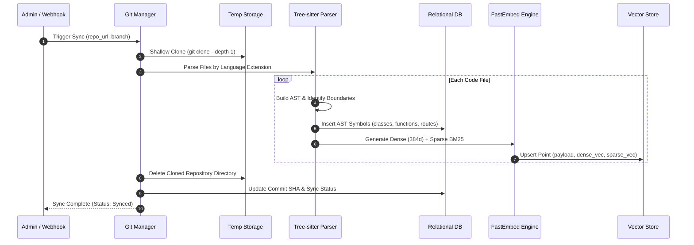
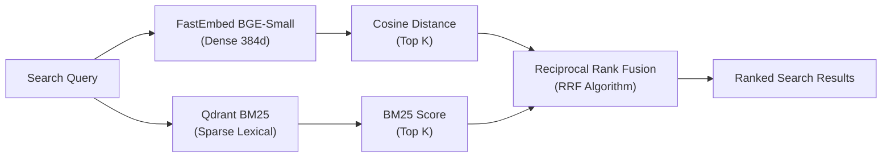
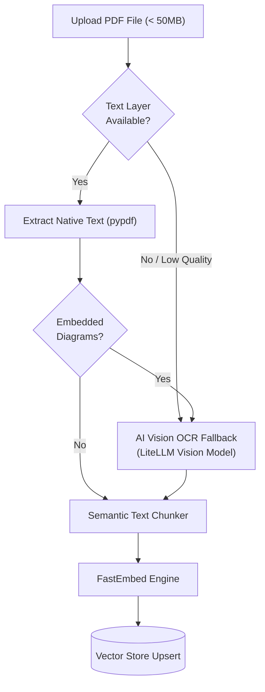

# Data Pipeline and Ingestion

This document details the data ingestion, parsing, chunking, and embedding pipelines.

## Ingestion and Chunking Sequence

The following sequence diagram illustrates the lifecycle of a repository synchronization request:

---

## 1. Syntax-Aware AST Chunking

Unlike naive fixed-window chunkers, ContextCortex uses Tree-sitter grammars to parse source code files into concrete syntax trees.

### Supported Language Grammars
ContextCortex includes pre-compiled Tree-sitter grammars for:
- Python (`.py`)
- TypeScript / JavaScript (`.ts`, `.tsx`, `.js`, `.jsx`)
- Go (`.go`)
- Rust (`.rs`)
- C# (`.cs`)
- C / C++ (`.c`, `.cpp`, `.h`, `.hpp`)
- Java (`.java`)
- Ruby (`.rb`)
- PHP (`.php`)

### Chunking Logic
1. The parser identifies high-level AST nodes (`function_definition`, `class_definition`, `method_declaration`).
2. If a node size is within the maximum token threshold (typically 512 tokens), the system preserves the node as an atomic chunk.
3. If a class or function exceeds the threshold, the system splits child blocks while maintaining the parent class signature header.
4. Each chunk preserves exact source metadata: `filepath`, `start_line`, `end_line`, `symbol_name`, and `language`.

---

## 2. Hybrid Embedding Generation and Search

ContextCortex uses hybrid dense and sparse embeddings to achieve high retrieval accuracy.

### Reciprocal Rank Fusion (RRF) Formula
The final relevance score for a document $d$ combines rankings from dense and sparse search lists:

$$RRF(d) = \sum_{m \in M} \frac{1}{k + r_m(d)}$$

Where:
- $M$ is the set of retrieval methods (Dense semantic and Sparse BM25).
- $r_m(d)$ is the rank position of document $d$ in retrieval method $m$.
- $k$ is a smoothing constant (default: 60).

---

## 3. PDF Document Ingestion and Vision OCR

When administrators upload PDF files to managed local storage:

1. **Native Text Extraction**: The system extracts digital text using `pypdf` or `pymupdf`.
2. **Quality Evaluation**: If a page contains minimal text or scanned bitmaps, the system flags the page for OCR.
3. **AI Vision OCR**: ContextCortex renders pages to images and queries the configured vision model (for example, `gemini-2.5-flash`) to transcribe technical text and diagrams.
4. **Interactive Preview**: Users can review extracted chunks and OCR flags in the web dashboard before confirming ingestion.
