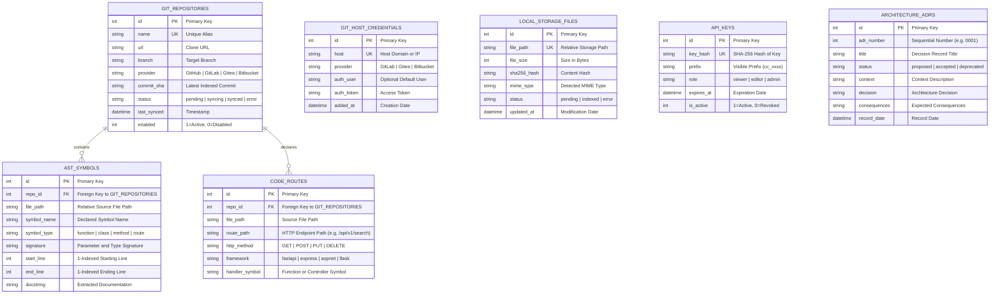

# Database and Storage Schema

This document details the relational data model, entity relationships, and vector storage structures.

## Entity Relationship Diagram (ERD)

ContextCortex uses a unified SQLAlchemy 2.0 relational schema shared between PostgreSQL 16 and SQLite.



---

## Relational Tables Specification

### 1. `git_repositories`
Stores remote repository tracking configurations, clone URLs, authentication overrides, and synchronization states.

### 2. `git_host_credentials`
Stores domain-wide access tokens for internal Git servers. All repositories on a matching host inherit these credentials unless an explicit token override exists.

### 3. `local_storage_files`
Manages files uploaded directly to local storage (`/app/data/storage`). Prevents directory traversal attacks and tracks incremental indexing status.

### 4. `ast_symbols`
Maintains the index of source code symbols extracted by Tree-sitter. Powers instant symbol search (`find_symbol`) and file outlines (`get_file_outline`) without querying vector databases.

### 5. `code_routes`
Indexes REST API endpoint declarations and handler functions across multiple backend frameworks (FastAPI, ASP.NET Core, Express, Flask).

### 6. `api_keys`
Stores cryptographically hashed API keys for client authentication and role-based access control.

---

## Vector Store Payload Schema

Each point in the vector database contains a dense vector embedding, optional sparse lexical tokens, and this metadata payload:

```json
{
  "id": "uuid4-identifier",
  "text": "Extracted source code block or markdown text",
  "metadata": {
    "source_type": "git | local_path | local_storage",
    "repo_name": "contextcortex",
    "filepath": "app/services/embeddings.py",
    "start_line": 45,
    "end_line": 85,
    "symbol_name": "FastEmbedEngine",
    "symbol_type": "class",
    "language": "python",
    "commit_sha": "4bcf9e8"
  }
}
```
