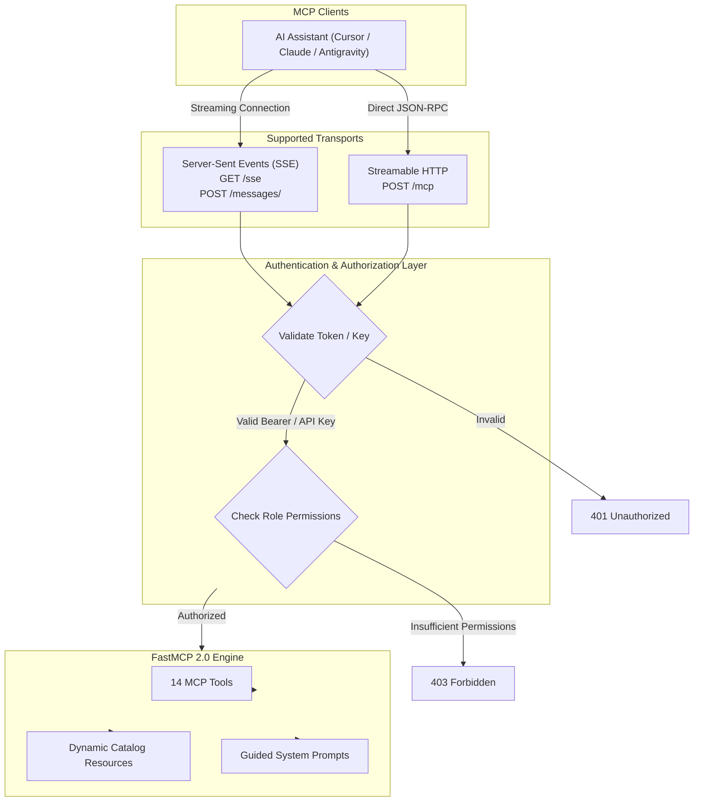

# MCP Protocol and Security Engine

This document describes the Model Context Protocol (MCP) implementation and the security authentication architecture.

## Model Context Protocol Overview

ContextCortex implements the official **Model Context Protocol (MCP) Specification (2026-07-28)** using the `FastMCP` framework.



---

## Dual Transport Support

ContextCortex provides two production MCP transports:

### 1. Server-Sent Events (SSE)
- **Endpoint**: `GET /sse`
- **Session Messaging**: `POST /messages/?session_id=<id>`
- **Behavior**: Client maintains an open HTTP connection to receive continuous server events. The client sends JSON-RPC requests via the messages endpoint.

### 2. Streamable HTTP Transport
- **Endpoint**: `POST /mcp`
- **Behavior**: Direct bidirectional JSON-RPC exchange over standard HTTP requests. Enables simplified integration with cloud proxies and stateless environments.

---

## RFC 9728 OAuth 2.1 and RBAC Security

When `AUTH_ENABLED=true`, ContextCortex acts as an **OAuth 2.1 Protected Resource Server**.

### RFC 9728 Protected Resource Metadata
Clients can discover authorization requirements dynamically at:
`GET /.well-known/oauth-protected-resource`

Response payload:
```json
{
  "resource": "https://contextcortex.wileyriley.com",
  "authorization_servers": [
    "https://auth.wileyriley.com"
  ],
  "scopes_supported": [
    "mcp:viewer",
    "mcp:editor",
    "mcp:admin"
  ],
  "bearer_methods_supported": [
    "header"
  ]
}
```

### 3-Tier Role-Based Access Control (RBAC)

ContextCortex defines three permission levels:

| Role Name | Access Level | Permitted Actions |
| :--- | :---: | :--- |
| `viewer` | Level 10 | Search code and docs, find symbols, view file outlines, list repositories, inspect catalog. |
| `editor` | Level 20 | Trigger repository synchronization, upload and delete local storage files, manage ADRs. |
| `admin` | Level 30 | Modify system configuration, switch vector databases, manage API keys and Git credentials. |

### API Key Verification
The system supports static and database-backed API keys:
- Keys use the prefix `cc_` followed by cryptographically secure random bytes.
- Keys are stored in the database as SHA-256 hashes.
- Keys can be assigned specific roles and expiration timestamps.
- Administrators can revoke keys instantly from the settings interface.
