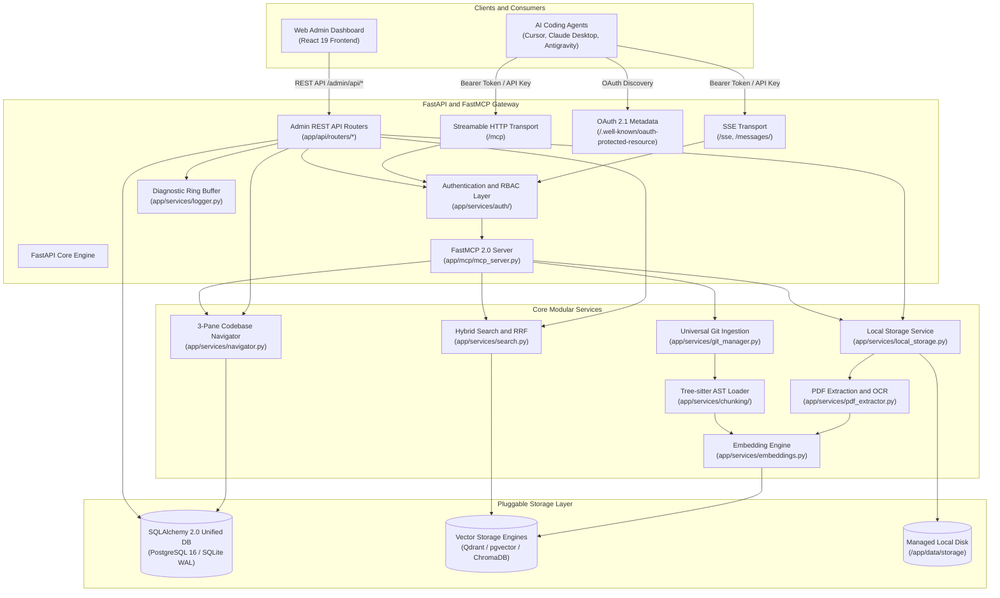

# System Design and Components

This document describes the runtime components of ContextCortex and their interactions.

## High-Level System Flowchart

The following diagram illustrates the system boundaries, client interfaces, core services, and storage engines:

---

## Component Breakdown

### 1. Client Layer
- **MCP Clients**: AI agents communicate via JSON-RPC over Server-Sent Events (SSE) or Streamable HTTP.
- **Admin Dashboard**: React 19 single-page application communicating over standard REST API endpoints.

### 2. Gateway and Security Layer
- **FastAPI Lifespan Session Manager**: Manages application startup, database migrations, connection pool initialization, and graceful shutdown.
- **Authentication Layer**: Intercepts requests, validates OAuth 2.1 JWT tokens and API keys, and enforces role-based permission checks.
- **Diagnostic Ring Buffer**: Captures the last 500 server events, errors, and traces in memory.

### 3. Core Processing Services
- **Universal Git Manager**: Handles authenticated shallow repository clones across GitHub, GitLab, Gitea, and Bitbucket.
- **Tree-sitter Chunking Package**: Parses 10 major programming languages and extracts AST nodes, API routes, and call references.
- **Embedding Engine**: Generates 384-dimensional dense vectors (FastEmbed BGE-small) and BM25 sparse vectors.
- **Search Engine**: Merges dense cosine similarity and sparse BM25 scores using Reciprocal Rank Fusion (RRF).
- **PDF Extraction Service**: Extracts text from PDF files with automated AI vision OCR fallback for embedded diagrams.
