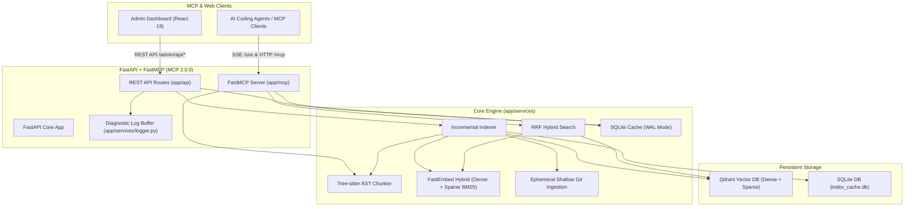

# Design Specification: MCP 2.0 Upgrade, Diagnostics Logging, Comprehensive Test Coverage & Documentation

**Date:** 2026-08-17  
**Version:** 2.2.0 -> 2.3.0  
**Target:** Notes & Code RAG MCP Server  

---

## 1. Executive Summary

This design specification details the full-stack modernization of the **Notes & Code RAG MCP Server** to:
1. Native **Model Context Protocol (MCP) SDK 2.0.0+** (`FastMCP` / `MCPServer`) with decorator-based tool definitions, resource providers, and dual transport support (Server-Sent Events `/sse` + Streamable HTTP `/mcp`).
2. Robust **Diagnostics & Logging System** featuring an in-memory ring buffer, REST API endpoint (`GET /admin/api/logs`), and a dedicated "Diagnostics & Logs" tab in the Web Admin Dashboard.
3. Enhanced **Notification & Real-Time Sync Feedback System** for instantaneous UI responsiveness and MCP client list change broadcasts.
4. Comprehensive **Playwright E2E & Backend Test Coverage** closing all identified workflow gaps.
5. Complete **Documentation Synchronization** across `README.md`, `ARCHITECTURE.md`, `DEVELOPER_DOCS.md`, and frontend documentation.

---

## 2. Architecture & Component Design

---

## 3. Detailed Component Specifications

### 3.1 Modern MCP 2.0.0 Migration (`app/mcp/`)

- **Server Foundation**: Migrate [`app/mcp/mcp_server.py`](file:///containers/dev/notes-rag-mcp/app/mcp/mcp_server.py) to `from mcp.server.fastmcp import FastMCP` (or `mcp.server.mcpserver.MCPServer`).
- **Tool Definitions**: Convert all 7 agent tools to native `@mcp.tool()` decorators with typed parameters, default values, docstrings, and strict schema validation:
  1. `search_code(query: str, repo: Optional[str], language: Optional[str], limit: int = 5) -> str`
  2. `search_docs(query: str, repo: Optional[str], category: Optional[str], tag: Optional[str], limit: int = 5) -> str`
  3. `find_symbol(name: str, repo: Optional[str], exact: bool = True, limit: int = 10) -> str`
  4. `get_file_outline(filepath: str, repo: Optional[str]) -> str`
  5. `list_repositories() -> str`
  6. `sync_repository(repo: Optional[str]) -> str`
  7. `index_status() -> str`
- **Resource Providers**:
  - `@mcp.resource("notes://catalog/summary")` generating a dynamic Markdown overview of registered Git repositories, indexed local directories, and AST symbol distributions.
- **Prompt Templates**:
  - `@mcp.prompt("search_infrastructure_docs")` and `@mcp.prompt("find_implementation_symbol")` parameterized dynamically.
- **Transports & Mounting**:
  - Expose SSE transport endpoint at `/sse` with POST message routing at `/messages/`.
  - Expose Streamable HTTP endpoint at `/mcp`.

---

### 3.2 Diagnostic Logging & System Observability

- **In-Memory Ring Buffer Handler** (`app/services/logger.py`):
  - Retain the latest 500 log events with metadata: `timestamp`, `level` (`INFO`, `WARNING`, `ERROR`), `logger_name`, `message`, `exception_traceback`.
  - Thread-safe ring buffer utilizing `collections.deque(maxlen=500)` with `threading.Lock()`.
- **REST Endpoints** ([`app/api/routes.py`](file:///containers/dev/notes-rag-mcp/app/api/routes.py)):
  - `GET /admin/api/logs`: Returns structured log records with optional query filtering (`level`, `limit`, `search`).
  - `DELETE /admin/api/logs`: Clears the diagnostic buffer.
- **Frontend "Diagnostics & Logs" Tab**:
  - New tab in [`App.tsx`](file:///containers/dev/notes-rag-mcp/frontend/src/App.tsx) and component `DiagnosticsViewer.tsx`.
  - Features: Level filter buttons (`ALL`, `INFO`, `WARNING`, `ERROR`), search input, auto-scroll toggle, expandable exception stack traces, and "Clear Logs" action.

---

### 3.3 Notification & Real-Time Sync Feedback

- **Instant Refresh Triggers**: Mutations in `GitRepoManager`, `LocalPathManager`, `Settings`, and `Overview` immediately invoke `loadStats()` and table refresh rather than waiting for 8-second interval polling.
- **Toast Notifications**: Enhance [`ToastContext.tsx`](file:///containers/dev/notes-rag-mcp/frontend/src/ToastContext.tsx) with distinct icons, clear action feedback, and click-to-dismiss.
- **MCP Client Notifications**: Emit `list_changed` events when repositories, tools, or local paths are updated.

---

### 3.4 Comprehensive Test Suite Expansion

#### Backend Pytest Coverage (`tests/backend/`)
- Expand backend unit and integration tests to achieve **>95% code coverage**:
  - Test MCP 2.0 FastMCP tool invocations, resources, and prompts.
  - Test `/admin/api/logs` GET and DELETE operations.
  - Test exception recovery in Git shallow cloning, Qdrant delete filters, and Tree-sitter fallbacks.

#### Playwright E2E Test Suite (`frontend/e2e/dashboard.spec.ts`)
- Cover all advertised user workflows:
  1. **Header & Navigation**: Title, badges, engine state changes, tab routing.
  2. **Overview Tab**: Metric cards, specs, topic tag cloud, "Reindex All Sources" flow.
  3. **Git Repositories Management**:
     - Add repository modal workflow (fill alias, url, branch, token -> submit -> assert table row + toast).
     - Trigger repository sync (click sync -> assert status change + toast).
     - Delete repository (handle confirmation dialog -> verify deletion).
     - Error state rendering (verify error badge, tooltip, and truncated message).
  4. **Local Paths Management**:
     - Filesystem browser navigation (click Browse, traverse directories, select folder).
     - Add local path form submission and verification.
     - Delete local path with confirmation dialog.
  5. **Live Search Inspector**:
     - Target type toggle (Code vs Docs).
     - Repo filter execution.
     - Search results rendering with RRF scores, code blocks, and GitHub permalinks.
     - Empty query validation and error state handling.
  6. **Settings & Token Management**:
     - Save GitHub token -> assert masked token and 5,000 req/hr rate limit badge.
     - Clear GitHub token -> assert confirmation dialog and cleared state.
  7. **Diagnostics & Logs Tab**:
     - View log entries, filter by level, search logs, clear logs.

---

### 3.5 Documentation Updates

- **`README.md`**: Update architecture diagrams, MCP 2.0.0 specs, `/sse` & `/mcp` endpoints, and feature documentation.
- **`ARCHITECTURE.md`**: Document FastMCP 2.0.0 design, ring-buffer diagnostics, and dual-transport routing.
- **`DEVELOPER_DOCS.md`**: Update test instructions (`pytest --cov`, `vitest`, `playwright test`), environment variable configurations, and MCP client connection snippets.
