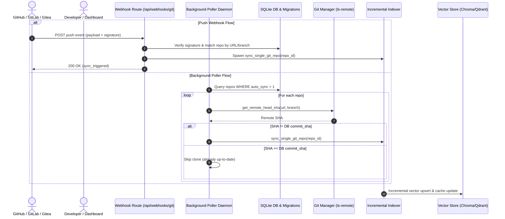

# Auto-Updating Synced Repositories (Webhooks & Polling) Design Specification

**Date:** 2026-08-18  
**Status:** Approved  
**Target Repository:** `/containers/dev/notes-rag-mcp`

---

## 1. Overview & Problem Statement

Currently, Git repositories in Knowledge RAG Hub can only be indexed initially upon registration or manually re-synced via the dashboard "Sync" button. When developers push commits to remote repositories (GitHub, GitLab, Gitea, Bitbucket), the knowledge index becomes stale unless manually refreshed.

This specification designs an automated, multi-tiered auto-update architecture:
1. **Push Webhooks (`POST /api/webhooks/git`)**: Provides instant incremental synchronization whenever a Git provider sends a push webhook event, with optional HMAC-SHA256 signature verification.
2. **Periodic Background Polling (`app/services/poller.py`)**: Runs periodic `git ls-remote` checks (costing ~50ms and zero file transfers) for firewalled or local environments where webhooks cannot reach the server.
3. **Database Schema & Safe Migrations**: Extends SQLite `git_repositories` with `auto_sync` and `webhook_secret` fields via non-destructive `ALTER TABLE` migrations.
4. **Interactive Dashboard Controls**: Adds auto-sync toggles and webhook setup modals to `GitRepoManager.tsx`, plus global polling interval and webhook secret controls in `Settings.tsx`.

---

## 2. Architecture & System Flow

---

## 3. Database Schema & Migration Strategy

### 3.1 SQLite Migration (`app/services/db.py`)
In `init_db()`, check existing columns on `git_repositories` using `PRAGMA table_info(git_repositories)` and apply non-destructive alterations:
- `auto_sync INTEGER DEFAULT 1`: Flag enabling/disabling auto-updates for this repo.
- `webhook_secret TEXT`: Optional per-repository secret override for HMAC verification.

In `metadata` table:
- `auto_sync_interval_mins`: Integer string (default `"15"` minutes; `"0"` = disabled).
- `global_webhook_secret`: String storing global HMAC secret.

### 3.2 Vector Database Compatibility
All vector store implementations (`ChromaStore`, `QdrantStore`) implement `delete_by_repo(repo_name)` and batch `upsert_documents()`. Incremental sync preserves the existing collection structure without requiring vector store migrations.

---

## 4. Multi-Provider Webhook Engine (`app/api/webhooks.py`)

### 4.1 Signature & Authentication Verification
- **GitHub**: Checks `X-Hub-Signature-256` header formatted as `sha256=<hex_digest>` computed using HMAC-SHA256 over raw payload bytes.
- **GitLab**: Checks `X-Gitlab-Token` header matching the configured secret.
- **Gitea / Forgejo**: Checks `X-Gitea-Signature` header computed using HMAC-SHA256.
- **Bitbucket**: Verifies payload structure when secret is not configured or validates token query params.
- If no secret is configured globally or per-repo, signature check passes conditionally.

### 4.2 Payload Normalization
- Extracts repository clone URLs:
  - GitHub: `repository.clone_url`, `repository.git_url`, `repository.ssh_url`
  - GitLab: `project.git_http_url`, `project.git_ssh_url`
  - Gitea: `repository.clone_url`, `repository.ssh_url`
  - Bitbucket: `repository.links.clone[*].href`
- Extracts pushed ref:
  - Strips `refs/heads/` prefix (e.g. `refs/heads/main` -> `main`).
- Matches against registered repositories by normalized URL and branch.

---

## 5. Background Poller Daemon (`app/services/poller.py`)

- **Lifespan Task**: Starts on FastAPI application startup; terminates cleanly on shutdown.
- **Poller Loop**:
  1. Reads `auto_sync_interval_mins` from DB metadata.
  2. If interval > 0, fetches all `git_repositories` where `auto_sync = 1`.
  3. Checks `is_indexing` lock; if indexing is busy, skips until next tick.
  4. For each repository, checks `get_remote_head_sha(url, branch)`.
  5. If SHA differs from DB `commit_sha`, executes `sync_single_git_repo(repo["id"])`.
  6. Sleeps for `auto_sync_interval_mins * 60` seconds before repeating.

---

## 6. REST API Endpoints

- `POST /api/webhooks/git`: Public webhook ingestion endpoint.
- `PATCH /admin/api/repos/{repo_id}/auto-sync`: Toggles repo auto-sync state (`{ "auto_sync": boolean }`).
- `GET /admin/api/settings/auto-sync`: Returns `{ "interval_mins": int, "webhook_url": str, "has_global_secret": bool }`.
- `POST /admin/api/settings/auto-sync`: Updates polling interval and global webhook secret (`{ "interval_mins": int, "global_webhook_secret"?: str }`).

---

## 7. Dashboard UI Integration

### 7.1 Git Repositories Tab (`frontend/src/GitRepoManager.tsx`)
- Table and mobile card row additions:
  - **Auto-Sync Toggle**: Quick toggle switch with immediate API persistence.
  - **Webhook Modal**: "Webhook" button showing:
    - Full Webhook URL (`http://<host>/api/webhooks/git`) with 1-click copy.
    - Instructions for configuring webhooks in GitHub, GitLab, and Gitea.
    - Secret status indicator.

### 7.2 Settings Tab (`frontend/src/Settings.tsx`)
- New **Auto-Sync & Webhooks Card**:
  - Global polling interval dropdown (`Disabled`, `5m`, `15m`, `30m`, `1h`, `6h`).
  - Global webhook secret input with reveal/mask toggle and save action.

---

## 8. Verification Strategy

1. **Unit & Integration Tests (`tests/test_auto_sync.py`)**:
   - SQLite migration tests verifying `auto_sync` and `webhook_secret` columns.
   - HMAC SHA256 signature verification tests for GitHub, GitLab, and Gitea.
   - Webhook endpoint integration tests triggering repo synchronization.
   - Poller daemon tests verifying `ls-remote` checks and conditional sync execution.
2. **Frontend Tests (`frontend/src/tests/GitRepoManager.test.tsx`, `Settings.test.tsx`)**:
   - Auto-sync toggle interaction tests.
   - Webhook modal display and copy tests.
   - Settings interval and secret update tests.
3. **E2E / Live Verification**:
   - Triggering simulated webhook push payloads and validating real-time synchronization.
