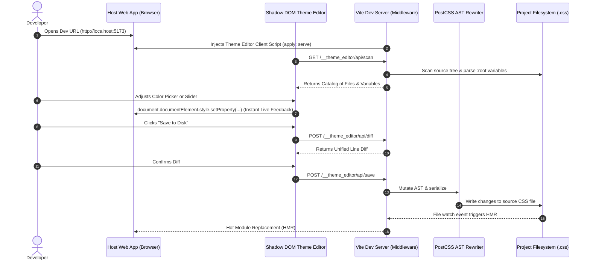

# Vite Live Theme Editor Plugin (`vite-plugin-theme-editor`) Design Specification

**Date:** 2026-08-18  
**Status:** Approved  
**Repository Target:** `/containers/dev/vite-plugin-theme-editor` (GitHub repo via `gh repo create`)

---

## 1. Overview & Problem Statement

Modern web projects frequently centralize theme tokens (colors, border radii, spacing, typography) as CSS custom properties (`:root` variables) in stylesheets like `src/index.css` or `src/theme.css`. However, tweaking these variables during development typically requires manually cycling between source code edits, browser reloads, or inspecting elements in DevTools without persistence.

`vite-plugin-theme-editor` is a reusable, lightweight, framework-agnostic Vite plugin that provides:
1. **Zero-Config File Discovery**: Automatically discovers project stylesheets declaring CSS custom properties and provides an interactive file selector.
2. **Instant Live Preview**: Directly mutates `document.documentElement.style` for sub-millisecond visual updates as sliders and color pickers are adjusted.
3. **Isolated Shadow DOM Client**: Completely encapsulated developer drawer widget that never collides with host application CSS.
4. **AST-Preserving Disk Sync**: Uses PostCSS to update CSS variables directly in source files on disk while preserving all comments, indentation, and structure.
5. **Interactive Diff Preview**: Previews exact line additions/deletions before writing changes to disk.

---

## 2. Architecture & System Flow



---

## 3. Package & Module Structure

The package will be created at `/containers/dev/vite-plugin-theme-editor` with the following structure:

```
/containers/dev/vite-plugin-theme-editor/
├── src/
│   ├── index.ts                # Vite plugin factory (themeEditorPlugin)
│   ├── types.ts                # Shared TypeScript interfaces
│   ├── server/
│   │   ├── scanner.ts          # Filesystem scanner & PostCSS variable extractor
│   │   ├── rewriter.ts         # AST-preserving CSS updater using PostCSS
│   │   ├── diff.ts             # Line diff computation engine
│   │   └── middleware.ts       # Connect middleware router (/__theme_editor/api/*)
│   └── client/
│       ├── index.ts            # Client bootstrap (web component registration)
│       ├── overlay.ts          # Shadow DOM drawer container & drag/hotkey toggle
│       ├── controls.ts         # Smart input components (Color, Slider, Text)
│       └── diff-modal.ts       # Diff preview & confirmation modal
├── tests/
│   ├── scanner.test.ts         # Unit tests for variable extraction
│   ├── rewriter.test.ts        # Unit tests for AST comment-preserving rewrites
│   └── diff.test.ts            # Unit tests for diff calculation
├── package.json
├── tsconfig.json
├── tsup.config.ts              # Build bundling setup
└── README.md
```

---

## 4. Detailed Component Design

### 4.1 Server-Side Middleware (`server/`)

1. **`scanner.ts`**:
   - Scans project directory using `fast-glob` (default pattern: `src/**/*.{css,scss,pcss,postcss,less}`, excluding `node_modules`, `dist`, `.git`).
   - Parses each file using `postcss.parse()`.
   - Traverses rules targeting `:root`, `html`, `body`, or `[data-theme*]`.
   - Collects declaration nodes starting with `--`.
   - Infers variable type:
     - `color`: Matches `#hex`, `rgb(...)`, `rgba(...)`, `hsl(...)`, `oklch(...)`, or named colors.
     - `dimension`: Contains numeric value with `px`, `rem`, `em`, `vh`, `vw`, `%`, or contains keywords like `radius`, `spacing`, `gap`, `padding`, `margin`, `size`.
     - `font`: Contains font families or generic fallback keywords.
     - `raw`: Fallback for complex values (gradients, shadows, transforms).

2. **`rewriter.ts`**:
   - Takes `{ filePath: string, updates: Record<string, string> }`.
   - Parses source file with PostCSS.
   - Finds matching declaration nodes by name.
   - Updates `decl.value = newValue` directly on AST nodes.
   - Converts AST back to string with `root.toString()`, preserving original indentation, newlines, and comments.
   - Safely writes back to disk using Node's `fs.promises.writeFile`.

3. **`middleware.ts`**:
   - Mounts connect middleware to Vite dev server (`configureServer` hook).
   - Endpoints:
     - `GET /__theme_editor/api/scan`: Returns list of files and detected variables.
     - `POST /__theme_editor/api/diff`: Returns diff between disk content and pending changes.
     - `POST /__theme_editor/api/save`: Applies updates and writes back to disk.

### 4.2 Client Overlay (`client/`)

1. **Shadow DOM Encapsulation**:
   - Custom element `<theme-editor-overlay>` with an attached `ShadowRoot`.
   - Inlined, isolated CSS for modern glassmorphism styling that does not conflict with host app.
   - Hotkey support: `Alt + T` / `Option + T` toggles the drawer.

2. **Smart Controls**:
   - **Colors**: Interactive color swatch + picker input + alpha slider for RGBA.
   - **Dimensions / Radii**: Range slider + numeric input with unit dropdown (`px`, `rem`, `em`, `%`).
   - **Text / Fonts / Shadows**: Text input with copy and reset buttons.

3. **Live DOM Synchronization**:
   - On change, calls `document.documentElement.style.setProperty(name, value)` immediately.
   - Maintains a dirty state tracking original vs. modified values.

4. **Diff Modal & Confirmation**:
   - Modal displaying deleted lines in red (`- --primary: #3b82f6;`) and added lines in green (`+ --primary: #6366f1;`).
   - "Save to Disk" button sends the payload to `/__theme_editor/api/save`.

---

## 5. Security & Build Safety

- **Dev Mode Exclusivity**: `apply: 'serve'` guarantees that neither the client script nor the server middleware is included in production builds.
- **Path Traversal Protection**: `filePath` arguments are validated and resolved against Vite's `root` configuration to prevent writes outside the repository.
- **Atomic File Writing**: Temporary buffers verify that PostCSS parsing succeeds prior to writing to the source file.

---

## 6. Testing Strategy

1. **Scanner Unit Tests**:
   - Test extraction of colors (hex, rgb, rgba, hsl, oklch), units (`px`, `rem`), multi-line declarations, and comments.
2. **Rewriter Unit Tests**:
   - Ensure modifying one variable retains all surrounding comments, empty lines, and indentation unchanged.
3. **Integration / E2E Verification**:
   - Install and test the plugin directly inside this repository's `frontend/` (`notes-rag-mcp`) dashboard.
   - Verify live editing of `:root` variables in `frontend/src/index.css` with instant visual change and successful disk persistence.
