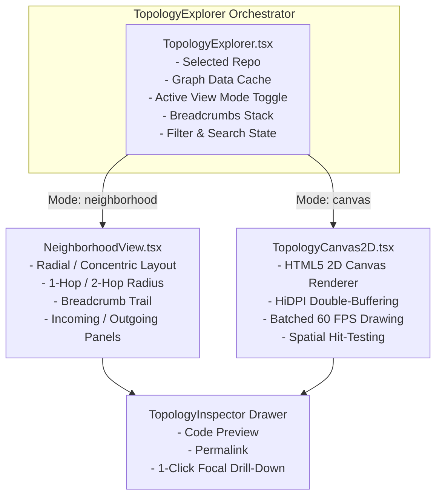

# High-Performance HTML5 2D Canvas & Focused Neighborhood Topology Design

**Date:** 2026-08-26  
**Status:** Approved  
**Author:** Antigravity  

---

## 1. Overview & Motivation

When analyzing real-world, highly dense repositories (such as projects with 500+ files, 1,600+ symbols, and 23,000+ relationships), standard client-side SVG DOM rendering encounters two fundamental bottlenecks:
1. **DOM & GPU Overload**: Thousands of `<line>` and `<circle>` elements recalculating DOM layouts at 60 FPS cause browser thread exhaustion, stuttering, and tab crashes.
2. **Visual Clutter ("Hairball Graph")**: Attempting to view all nodes and connections simultaneously in a single flat view produces an illegible web of crossing lines where architectural flow is obscured.

To solve both challenges cleanly, this design introduces two distinct, purpose-built view modes:
- **Focused Neighborhood Mode (`neighborhood`)**: A structured, deterministic radial/concentric drill-down view that isolates a focal node and its immediate 1-hop and 2-hop dependencies, complete with navigation breadcrumbs and categorized neighbor lists.
- **Global 2D Canvas Mode (`canvas`)**: A hardware-accelerated HTML5 2D Canvas renderer that draws thousands of nodes and edges in batched draw calls with zero DOM overhead, smooth 60 FPS pan/zoom, and spatial hover hit-testing.

---

## 2. Architecture & View Modes



---

## 3. Detailed Component Specifications

### 3.1 Mode 1: Focused Neighborhood View (`NeighborhoodView.tsx`)

#### Purpose
Provides an intuitive, zero-clutter architectural navigation experience. Instead of rendering everything, it centers on a specific file, class, function, or route and displays its direct relationships.

#### Layout Strategy: Concentric Radial Hierarchy
- **Focal Center**: The selected focus node positioned at the center `(x: 500, y: 320)`.
- **Ring 1 (1-Hop Neighbors)**: Immediate callers, callees, imports, and definitions arranged in an equidistant circle around the center ($R_1 = 180\text{px}$).
- **Ring 2 (2-Hop Neighbors)**: Secondary dependencies positioned on an outer orbit ($R_2 = 300\text{px}$) with soft opacity.
- **Directional Categorization**:
  - **Upstream / Incoming (Left Hemisphere)**: Nodes that call, import, or route to the focus node.
  - **Downstream / Outgoing (Right Hemisphere)**: Nodes called, imported, or defined by the focus node.

#### Navigation & History
- **Interactive Click**: Clicking any neighbor node instantly shifts focus to that node and updates the breadcrumb history.
- **Breadcrumbs Trail**: Displays navigation history (e.g. `mcp-router-code` &rarr; `RouterService.cs` &rarr; `SanitizingLoggerProvider.cs`), with 1-click step-back.
- **Relationship Breakdowns**: Left and right side cards showing categorized pills for incoming vs outgoing dependencies.

---

### 3.2 Mode 2: Global HTML5 2D Canvas Engine (`TopologyCanvas2D.tsx`)

#### Purpose
Enables fluid, full-repository macro visualization without browser lag, memory leaks, or DOM thrashing.

#### Technical Architecture
1. **Single `<canvas>` Element**: Replaces the SVG tree with a hardware-accelerated canvas.
2. **HiDPI / Retina Resolution**: Scales backing store by `window.devicePixelRatio` while maintaining CSS pixel coordinate parity.
3. **Batched Rendering Loop**:
   - **Step 1**: Clear frame and render subtle background grid dots.
   - **Step 2**: Apply viewport transformation matrix `ctx.translate(pan.x, pan.y); ctx.scale(zoom, zoom);`.
   - **Step 3 (Edges)**: Batch draw lines by color category using single `beginPath()` and `stroke()` passes, with direction arrows calculated trigonometrically.
   - **Step 4 (Nodes)**: Draw node circles, borders, and truncated labels.
   - **Step 5 (Highlights)**: Draw active hover and selection glow rings.
4. **Spatial Mouse Hit-Testing**:
   - Translates screen `clientX/Y` into world coordinates:
     $$X_{\text{world}} = \frac{X_{\text{screen}} - \text{pan.x}}{\text{zoom}}, \quad Y_{\text{world}} = \frac{Y_{\text{screen}} - \text{pan.y}}{\text{zoom}}$$
   - Detects hovered and clicked nodes in $O(N)$ (or spatial grid lookup) by testing $(X_{\text{world}} - N_x)^2 + (Y_{\text{world}} - N_y)^2 \le (N_r + 4)^2$.
   - Supports smooth node dragging and pan/zoom inertia without React re-renders.

---

### 3.3 Toolbar & Controls (`TopologyControls.tsx`)

- **View Mode Switcher**:
  - `Neighborhood View` (Icon: `fa-crosshairs` / `fa-diagram-project`)
  - `Global Canvas` (Icon: `fa-network-wired` / `fa-globe`)
- **Hop Radius Selector** (in Neighborhood View): `1-Hop` / `2-Hop`.
- **Node Limit & Type Filters** (in Global Canvas View): `50`, `100`, `200`, `400`, `800`, with File/Class/Function/Route chips and "Hide Orphans" toggle.
- **Export Actions**: Export Canvas as PNG/SVG or JSON graph data.

---

## 4. Data Structures (`frontend/src/types.ts` & `components/topology/types.ts`)

```typescript
export type TopologyViewMode = 'neighborhood' | 'canvas';

export interface FocalBreadcrumb {
  id: string;
  name: string;
  type: string;
  repo: string;
}

export interface NeighborhoodSubGraph {
  focalNode: TopologyNode;
  incoming: Array<{ node: TopologyNode; edgeType: string; label?: string }>;
  outgoing: Array<{ node: TopologyNode; edgeType: string; label?: string }>;
  secondaryNodes: TopologyNode[];
  edges: TopologyEdge[];
}
```

---

## 5. Testing & Quality Assurance Plan

1. **Unit Tests (`frontend/src/tests/TopologyExplorer.test.tsx`)**:
   - Test switching between `neighborhood` and `canvas` view modes.
   - Test neighborhood concentric node positioning and 1-hop/2-hop filtering.
   - Test breadcrumbs push, pop, and direct jump navigation.
   - Test HTML5 2D Canvas rendering, mouse coordinate translation, and node click/hover hit-testing.
2. **Backend Regression Verification**:
   - Verify all 307 backend `pytest` tests pass.
3. **Build & Live Container Verification**:
   - Verify clean TypeScript build with `npm --prefix frontend run build`.
   - Test in live container preview on port `8085` (`https://p-8085.wileyriley.com/` and `http://10.0.0.10:8085/`).
