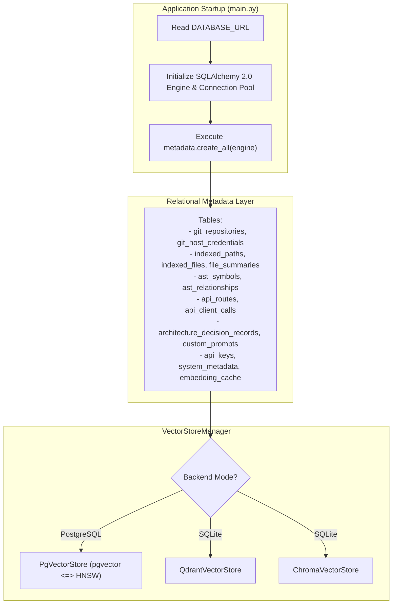
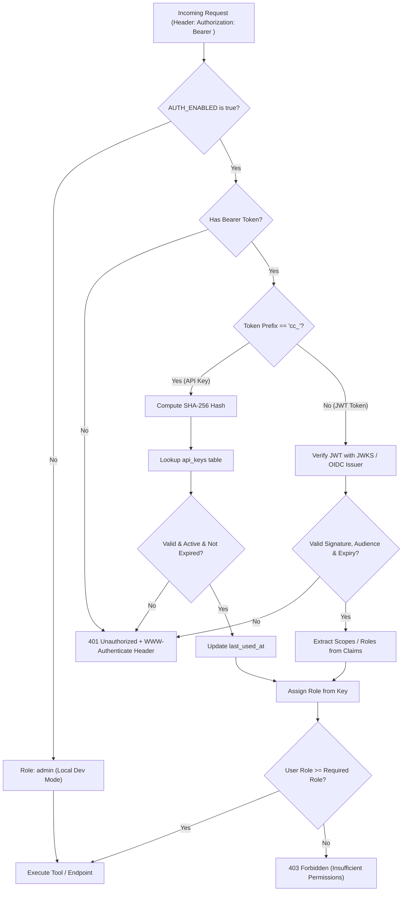

# Design Specification: Unified PostgreSQL + pgvector Storage & MCP 2026-07-28 Auth

**Date:** 2026-08-27  
**Status:** Approved  
**Author:** Antigravity & User  
**Target Version:** ContextCortex v2.12.0  

---

## 1. Executive Summary

This design specification introduces an alternate, production-grade deployment profile for **ContextCortex**:
1. **Unified PostgreSQL & pgvector Engine**: Replaces or complements the default SQLite (`index_cache.db`) and Chroma/Qdrant backends with a unified, containerized PostgreSQL 16 database running the `pgvector` extension. A single database instance manages both relational metadata (AST symbols, relationships, ADRs, file summaries, git repositories, credentials) and dense vector embeddings (384-dimensional vector cosine similarity searches).
2. **SQLAlchemy 2.0 Core Single Source of Truth**: Eliminates SQL dialect fragmentation and schema drift between SQLite and PostgreSQL by defining all table metadata once in SQLAlchemy Core.
3. **MCP 2026-07-28 OAuth 2.1 & Multi-Key RBAC Security**: Transforms ContextCortex into a standard-compliant OAuth 2.1 Protected Resource Server publishing RFC 9728 metadata (`/.well-known/oauth-protected-resource`), supporting RFC 8707 Resource Indicators, validating OIDC/JWKS tokens, and managing database-backed multi-user/group API keys with 3-tier Role-Based Access Control (`admin`, `editor`, `viewer`).
4. **Containerized Docker Compose Infrastructure**: Supplies an orchestrated `docker-compose.yml` coupling `contextcortex` with `pgvector/pgvector:pg16`, healthchecks, volume persistence, and automatic connection retry loops.

---

## 2. Architecture & Storage Layer

### 2.1 Pluggable Dual-Engine Architecture

ContextCortex automatically detects its storage profile at startup via the `DATABASE_URL` environment variable:
* **SQLite + Qdrant/Chroma (Default / Local Dev)**: If `DATABASE_URL` is omitted or starts with `sqlite://`, SQLite is used for metadata and Chroma/Qdrant is used for vector search.
* **PostgreSQL + pgvector (Containerized / Enterprise Profile)**: If `DATABASE_URL` begins with `postgresql://` or `postgresql+psycopg://`, PostgreSQL serves as the relational database, and `pgvector` is automatically registered and activated as the primary vector store.



### 2.2 SQLAlchemy Core Schema Parity

To eliminate dialect drift between SQLite and PostgreSQL:
* Tables are declared strictly in `app/services/database/schema.py` using `sqlalchemy.Table`, `Column`, `Integer`, `String`, `Text`, `Float`, `DateTime`, `Boolean`, and `JSON` / `LargeBinary`.
* `app/services/database/engine.py` provides connection factory methods (`get_db_engine()`, `get_connection()`) wrapping transactions and returning dictionary-like mapping rows across both SQLite and PostgreSQL.
* Database initialization executes `metadata.create_all(bind=engine)` idempotently on startup.
* For PostgreSQL, the initialization pipeline verifies and runs `CREATE EXTENSION IF NOT EXISTS vector;`.

### 2.3 `PgVectorStore` Implementation

A new class `PgVectorStore` (inheriting from `VectorStore`) in `app/services/vector_store/pgvector_store.py`:
* **Schema**: Maintains the `vector_documents` table:
  ```sql
  CREATE TABLE IF NOT EXISTS vector_documents (
      id VARCHAR(255) PRIMARY KEY,
      repo VARCHAR(255),
      doc_type VARCHAR(50) DEFAULT 'doc',
      path TEXT,
      rel_path TEXT,
      title TEXT,
      folder TEXT,
      category TEXT,
      tags JSONB,
      heading TEXT,
      symbol TEXT,
      language VARCHAR(50),
      start_line INTEGER,
      end_line INTEGER,
      github_url TEXT,
      permalink_url TEXT,
      content TEXT,
      embedding vector(384),
      payload JSONB,
      created_at TIMESTAMP DEFAULT CURRENT_TIMESTAMP
  );
  CREATE INDEX IF NOT EXISTS idx_vector_docs_embedding ON vector_documents USING hnsw (embedding vector_cosine_ops);
  CREATE INDEX IF NOT EXISTS idx_vector_docs_repo ON vector_documents(repo);
  CREATE INDEX IF NOT EXISTS idx_vector_docs_type ON vector_documents(doc_type);
  ```
* **Upsert**: Performs batch parameterized upserts using `INSERT ... ON CONFLICT (id) DO UPDATE SET ...`.
* **Search**: Evaluates cosine distance using the `<=>` operator:
  ```sql
  SELECT id, 1 - (embedding <=> :query_vec) AS score, payload
  FROM vector_documents
  WHERE (:repo IS NULL OR repo = :repo)
    AND (:doc_type IS NULL OR doc_type = :doc_type)
    AND (:language IS NULL OR language = :language)
  ORDER BY embedding <=> :query_vec
  LIMIT :limit;
  ```
* **Management**: Implements `delete_by_path()`, `delete_by_repo()`, `get_stats()`, and `health_check()`.

---

## 3. MCP 2026-07-28 Auth & RBAC Security Model

### 3.1 OAuth 2.1 Protected Resource Server Specification

ContextCortex conforms to the MCP 2026-07-28 Authorization specifications:
* **RFC 9728 Protected Resource Metadata**: Published at `/.well-known/oauth-protected-resource`:
  ```json
  {
    "resource": "https://contextcortex.local",
    "authorization_servers": ["https://auth.example.com"],
    "scopes_supported": ["mcp:admin", "mcp:editor", "mcp:viewer"],
    "bearer_methods_supported": ["header"],
    "resource_documentation": "https://github.com/spelech/contextcortex"
  }
  ```
* **RFC 6750 & RFC 8707 Challenge**:
  When unauthenticated, requests to protected endpoints return `401 Unauthorized` with:
  `WWW-Authenticate: Bearer realm="contextcortex", error="invalid_token", resource="https://contextcortex.local"`.

### 3.2 Hybrid Token & API Key Authentication Flow



### 3.3 Role-Based Access Control (RBAC) Matrix

| Role | Scope | Permitted Capabilities |
| :--- | :--- | :--- |
| **`admin`** | `mcp:admin` | Full administrative control: API key generation/revocation, git host credentials, repository management, vector store switching, webhook configs, plus all MCP tools. |
| **`editor`** | `mcp:editor` | Search & query tools + mutating operations (`sync_repository`, `manage_adr`, manual indexing triggers). Blocked from credential & key administration. |
| **`viewer`** | `mcp:viewer` | Read-only MCP tools (`search_code`, `search_docs`, `find_symbol`, `get_file_outline`, `get_architecture`, `get_code_routes`, `trace_call_path`, `knowledge://catalog/summary`). Blocked from mutation endpoints. |

### 3.4 API Key Data Schema

Stored in `api_keys` table:
* `id`: `INTEGER` (PK, Auto-increment)
* `name`: `VARCHAR(100)` (Descriptive label, e.g. "Cursor IDE - Alice")
* `key_prefix`: `VARCHAR(16)` (e.g. `cc_live_a1b2`)
* `key_hash`: `VARCHAR(64)` (SHA-256 hash of secret key)
* `role`: `VARCHAR(20)` (`admin`, `editor`, `viewer`)
* `group_name`: `VARCHAR(100)` (e.g. "Platform Engineering")
* `expires_at`: `TIMESTAMP` (Optional expiration date)
* `created_at`: `TIMESTAMP` (Default now)
* `last_used_at`: `TIMESTAMP` (Updated on authentication)
* `is_active`: `BOOLEAN` (Default true)

---

## 4. Containerization & Deployment

### 4.1 Docker Compose Architecture (`docker-compose.yml`)

```yaml
version: '3.8'

services:
  postgres:
    image: pgvector/pgvector:pg16
    container_name: contextcortex-postgres
    restart: unless-stopped
    environment:
      POSTGRES_DB: ${POSTGRES_DB:-contextcortex}
      POSTGRES_USER: ${POSTGRES_USER:-contextcortex}
      POSTGRES_PASSWORD: ${POSTGRES_PASSWORD:-cortexsecret}
    volumes:
      - postgres_data:/var/lib/postgresql/data
    ports:
      - "5432:5432"
    healthcheck:
      test: ["CMD-SHELL", "pg_isready -U $$POSTGRES_USER -d $$POSTGRES_DB"]
      interval: 5s
      timeout: 5s
      retries: 5

  contextcortex:
    build:
      context: .
      dockerfile: Dockerfile
    container_name: contextcortex-app
    restart: unless-stopped
    depends_on:
      postgres:
        condition: service_healthy
    ports:
      - "3000:3000"
    environment:
      DATABASE_URL: postgresql+psycopg://${POSTGRES_USER:-contextcortex}:${POSTGRES_PASSWORD:-cortexsecret}@postgres:5432/${POSTGRES_DB:-contextcortex}
      AUTH_ENABLED: ${AUTH_ENABLED:-false}
      AUTH_OIDC_ISSUER: ${AUTH_OIDC_ISSUER:-}
      AUTH_JWKS_URI: ${AUTH_JWKS_URI:-}
      AUTH_RESOURCE_INDICATOR: ${AUTH_RESOURCE_INDICATOR:-https://contextcortex.local}
      ADMIN_INITIAL_KEY: ${ADMIN_INITIAL_KEY:-}
    volumes:
      - repo_cache:/app/data

volumes:
  postgres_data:
  repo_cache:
```

### 4.2 Application Startup & Reconnection Resilience

In `app/services/database/engine.py`, the engine connection handles cold starts:
* Startup connection retry loop with up to 30 seconds wait and exponential backoff.
* Automatically creates required tables and pgvector extension upon database readiness.
* Optional initial admin key bootstrap via `ADMIN_INITIAL_KEY` if configured in `.env`.

---

## 5. Verification & Testing Strategy

1. **Unit & Dialect Parity Tests (`tests/test_database_parity.py`)**:
   * Verify schema creation, CRUD operations, and transaction management on both SQLite in-memory and PostgreSQL.
2. **PgVector Store Tests (`tests/test_pgvector_store.py`)**:
   * Validate document upserting, HNSW cosine vector search, metadata filtering, and deletion hooks.
3. **MCP Auth & Protected Resource Tests (`tests/test_mcp_auth.py`)**:
   * Verify RFC 9728 `/.well-known/oauth-protected-resource` payload.
   * Verify 401 challenge with `WWW-Authenticate` header on unauthenticated requests when `AUTH_ENABLED=true`.
   * Verify API key issuance, role validation (`admin`, `editor`, `viewer`), and token expiry.
   * Verify OIDC JWT verification mock with role extraction.
4. **Integration Test Suite**:
   * End-to-end test of hybrid search and MCP tools execution with authenticated sessions.
