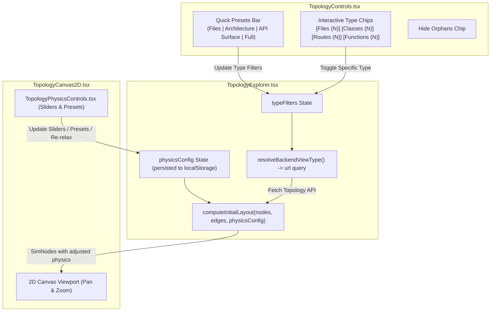

# Design Specification: Tunable 2D Canvas Physics Engine & Unified Filter Presets

**Document:** `docs/superpowers/specs/2026-08-27-tunable-canvas-and-unified-filtering-design.md`  
**Date:** 2026-08-27  
**Branch:** `fix/topology-and-repo-stats`  
**Status:** Approved by User  

---

## 1. Overview & Problem Statement

In whole-repository topology visualization:
1. **Redundant & Confusing Selectors**: Previously, the UI had two competing filter controls:
   - A top-level query selector (`FILES | SYMBOLS | ROUTES | FULL`), and
   - Separate client show/hide filter chips (`[FILE] [CLASS] [FUNCTION] [ROUTE]`).
   This created dead or confusing combinations (e.g. toggling `CLASS` in `FILES` mode had no effect because classes were not retrieved from the backend).
2. **Fixed Physics Parameters**: 2D force simulation parameters (repulsion, spring link distance, center gravity, collision radius) were hardcoded. Users exploring large vs. small repositories need the ability to adjust the node layout spread, link lengths, and clustering behavior directly in the UI with instant presets and real-time sliders.

---

## 2. Architecture & Detailed Design

### 2.1 Unified Filter Presets & Smart Backend Mapping

#### A. Architecture Presets
The toolbar will provide high-level 1-click architectural presets:
- **`📁 Files Only`**: Sets `{ file: true, class: false, function: false, route: false, module: false }`. Backend resolves `view_type=files`.
- **`🏛️ Architecture`**: Sets `{ file: true, class: true, function: false, route: false, module: true }`. Backend resolves `view_type=symbols`.
- **`🌐 API Surface`**: Sets `{ file: true, class: false, function: true, route: true, module: false }`. Backend resolves `view_type=routes`.
- **`🧠 Full Codebase`**: Sets all types to `true`. Backend resolves `view_type=full`.

#### B. Granular Multi-Select Chips
Directly beneath or alongside the presets, interactive toggle chips display real-time live node counts:
- `[📁 Files (N)]`
- `[🏛️ Classes (N)]`
- `[⚡ Functions (N)]`
- `[🌐 Routes (N)]`
- `[🚫 Hide Orphans]` (Available in 2D Canvas mode)

#### C. Smart Backend Query Resolution
A helper `resolveBackendViewType(typeFilters: Record<string, boolean>): 'files' | 'symbols' | 'routes' | 'full'` computes the minimal required backend payload:
- If only `file` is active &rarr; `files`
- If only `file` and `route` are active &rarr; `routes`
- If `class` or `function` are active (without routes) &rarr; `symbols`
- If routes and symbols are both active &rarr; `full`

---

### 2.2 Tunable 2D Canvas Physics Engine

#### A. Physics Configuration Interface (`PhysicsConfig`)
```ts
export interface TopologyPhysicsConfig {
  kRepulse: number;       // Repulsion strength: 5,000 to 75,000 (default: 25,000)
  springLength: number;   // Target edge link distance in px: 80 to 350 (default: 190)
  kSpring: number;        // Spring stiffness: 0.01 to 0.08 (default: 0.025)
  centerGravity: number;  // Center clustering pull: 0.000 to 0.010 (default: 0.002)
  collisionRadius: number;// Base node collision buffer: 12 to 36 (default: 20)
  iterations: number;     // Layout relaxation iterations: 20 to 120 (default: 60)
}
```

#### B. Physics Presets
- **`Default Balanced`**: `{ kRepulse: 25000, springLength: 190, kSpring: 0.025, centerGravity: 0.002, collisionRadius: 20, iterations: 60 }`
- **`Spacious Tree`**: `{ kRepulse: 55000, springLength: 260, kSpring: 0.018, centerGravity: 0.0005, collisionRadius: 24, iterations: 75 }`
- **`Dense Cluster`**: `{ kRepulse: 10000, springLength: 110, kSpring: 0.040, centerGravity: 0.006, collisionRadius: 16, iterations: 50 }`
- **`Compact Radial`**: `{ kRepulse: 16000, springLength: 140, kSpring: 0.030, centerGravity: 0.0035, collisionRadius: 18, iterations: 60 }`

#### C. UI Component: `TopologyPhysicsControls.tsx`
A clean, floating overlay panel or slide-down popover embedded in `TopologyCanvas2D.tsx`:
- Quick preset buttons (`Default`, `Spacious`, `Dense`, `Compact`).
- Interactive range sliders with numeric indicators for `Repulsion`, `Link Distance`, and `Center Gravity`.
- **"Re-relax / Recalculate" Action Button**: Triggers `onRecomputeLayout(physicsConfig)` to re-relax node coordinates.
- **"Auto-Fit View" Action Button**: Recalculates canvas bounding box and centers the graph.
- Persists user adjustments to `localStorage` key `contextcortex_topology_physics`.

---

## 3. Component & State Architecture



---

## 4. Testing & Verification Plan

1. **Unit Tests (`frontend/src/tests/`):**
   - `TopologyControls.test.tsx`: Test that selecting presets updates all type filters; test that individual filter chips toggle correctly; verify live counts.
   - `TopologyPhysicsControls.test.tsx`: Test slider changes, preset switching, re-relax triggers, and localStorage persistence.
   - `TopologyExplorer.test.tsx`: Test backend `view_type` resolution based on active filter combinations; test recalculating layout with custom physics.
   - `TopologyCanvas2D.test.tsx`: Verify canvas handles custom physics and re-relaxation without coordinate drift or NaN math.
2. **Build Verification:**
   - Full TypeScript compile (`tsc -b`) and Vite production bundle.
   - Run complete Vitest suite (14 test files, 140+ unit tests).
   - Run backend Pytest suite.
3. **Live Container & Preview Deployment:**
   - Rebuild Docker image `contextcortex:branch-preview` and restart `contextcortex-preview` on port 8085.
   - Verify live on `https://p-8085.wileyriley.com/` and `https://preview.wileyriley.com/contextcortex-topology/`.
