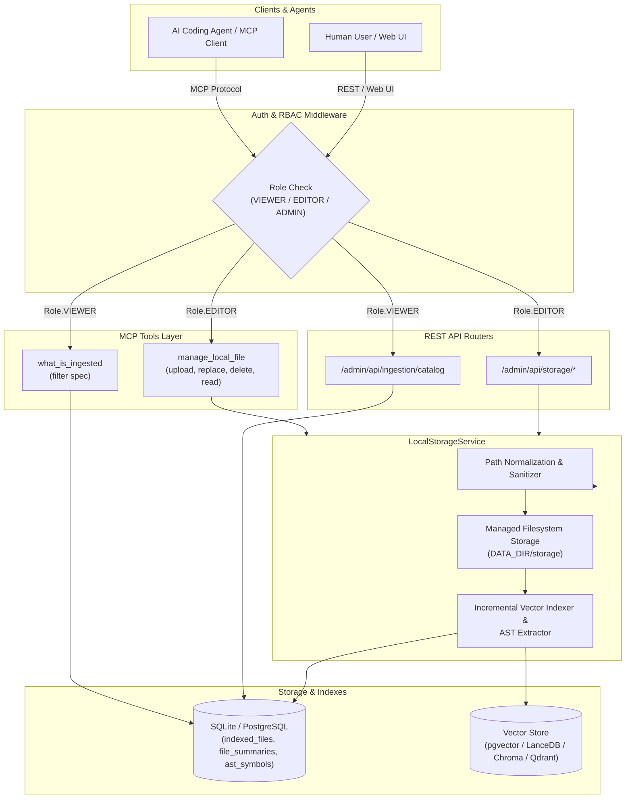

# Design Specification: Local Storage Management & Unified Ingestion Catalog

**Date:** 2026-08-28  
**Status:** Approved  
**Author:** Antigravity  

---

## 1. Overview & Goals

ContextCortex indexes Git repositories, local monitored directories, and architectural records into relational databases and vector stores for fast hybrid search and code intelligence.

This specification introduces:
1. **Managed Local Storage Option**: Enables users and AI agents to upload, replace, read, and delete documents, notes, specifications, and code files directly under a managed local storage data directory (`DATA_DIR/storage` or configurable `LOCAL_STORAGE_PATH`) with instant incremental vector store indexing and AST symbol extraction.
2. **File Structure Query & Navigation**: Exposes hierarchical directory tree browsing and metadata queries for local storage.
3. **Unified "What Is Ingested" Catalog (`what_is_ingested`)**: A comprehensive tool and REST endpoint aggregating all ingested Git repositories, monitored local paths, and uploaded local storage files with rich filtering specifications (`source_type`, `repo_name`, `path_prefix`, `file_extension`, `detail_level`).
4. **RBAC & Security**: Strict role-based access control enforcing `Role.EDITOR` for storage mutations and `Role.VIEWER` for ingestion queries, backed by canonical path sanitization to prevent path traversal attacks.

---

## 2. System Architecture

---

## 3. Storage Directory & Filesystem Design

### 3.1 Path Configuration & Security
* **Environment Variable**: `LOCAL_STORAGE_PATH` (defaults to `os.path.join(DATA_DIR, "storage")`, e.g., `/app/data/storage` or `data/storage`).
* **Path Sanitization**:
  * All input paths (e.g. `engineering/specs/api.md`) are sanitized using `os.path.abspath(os.path.join(root, rel_path))`.
  * The canonical path is verified using `os.path.commonpath([resolved_path, root_dir]) == root_dir`.
  * Paths containing `..`, absolute root escapes, or null bytes (`\x00`) are rejected immediately with `400 Bad Request` or an error string in MCP.
* **Directory Creation**: Parent directories under the local storage root are created automatically on upload.

### 3.2 Supported File Types & Limits
* Supported document and code file extensions: `.md`, `.txt`, `.yaml`, `.yml`, `.json`, `.py`, `.js`, `.jsx`, `.ts`, `.tsx`, `.go`, `.rs`, `.cs`, `.cpp`, `.c`, `.h`, `.java`, `.rb`, `.php`, `.sh`, `.sql`, `.html`, `.css`.
* Maximum file size for real-time text chunking and vector indexing: `500 KB`. Larger files generate metadata summaries without dense chunk embeddings.

---

## 4. Incremental Indexing Engine

### 4.1 File Upload & Replace Flow
When a file is uploaded or replaced:
1. File content is written to disk under `LOCAL_STORAGE_PATH / <rel_path>`.
2. `LocalStorageService` immediately calls `process_file_content(...)`:
   - Extracts AST symbols, relationships, API routes, and file summaries.
   - Chunks text/code using semantic boundary chunking.
   - Computes hybrid dense & sparse embeddings (leveraging SQLite embedding cache).
   - Upserts vector points into the active Vector Store (`VectorStore.upsert_points`).
   - Upserts records into relational tables: `indexed_files`, `file_summaries`, `ast_symbols`, `ast_relationships`, `api_routes`, `api_calls`.
3. Dispatches `trigger_list_changed_notification()` to notify active MCP sessions of updated resources and catalog descriptions.

### 4.2 File Deletion Flow
When a file is deleted:
1. File is removed from disk.
2. `store.delete_by_path(abs_filepath)` removes all chunk points from the vector store.
3. Relational rows for `filepath` are deleted from `indexed_files`, `file_summaries`, `ast_symbols`, `ast_relationships`, `api_routes`, and `api_calls`.

---

## 5. MCP Tools Specification

### 5.1 `manage_local_file`
* **Description**: "Manage files in ContextCortex local storage: upload, replace, read, or delete files with immediate vector indexing."
* **Role**: `Role.EDITOR`
* **Parameters**:
  * `action` (*str, required*): `"upload"`, `"replace"`, `"delete"`, or `"read"`.
  * `file_path` (*str, required*): Relative file path under local storage (e.g., `"rfcs/caching-v2.md"`).
  * `content` (*str, optional*): Text/code content to write (required for `"upload"` and `"replace"`).
  * `repo` (*str, optional, default: `"local_storage"`*): Repository/namespace identifier.
  * `category` (*str, optional*): Document category (defaults to relative folder name).

### 5.2 `what_is_ingested`
* **Description**: "Inspect all ingested Git repositories, monitored local paths, and uploaded local storage files with optional filtering and detailed file trees."
* **Role**: `Role.VIEWER`
* **Parameters**:
  * `source_type` (*str, optional, default: `"all"`*): `"all"`, `"git"`, `"monitored_path"`, or `"local_storage"`.
  * `repo_name` (*str, optional*): Filter by repository or namespace name.
  * `path_prefix` (*str, optional*): Filter files starting with this folder/path prefix.
  * `file_extension` (*str, optional*): Filter by file extension (e.g. `".md"`, `".py"`).
  * `detail_level` (*str, optional, default: `"summary"`*): `"summary"` for counts and status; `"detailed"` for full file listings and tree hierarchy.

---

## 6. REST API Endpoints

All endpoints are mounted under `/admin/api/*` and protected by `AuthMiddleware`.

### 6.1 Local Storage Endpoints
* **`POST /admin/api/storage/upload`** (`Role.EDITOR`):
  * Accepts `multipart/form-data` (file upload + `path` + optional `repo` + `category`) OR JSON payload (`{"path": "...", "content": "...", "repo": "...", "category": "..."}`).
  * Returns: `{"status": "success", "path": "...", "repo": "...", "size_bytes": 1234, "chunks_indexed": 4}`.
* **`PUT /admin/api/storage/file`** (`Role.EDITOR`):
  * Replaces existing file and re-indexes vector store.
  * Returns: `{"status": "success", "path": "...", "updated": true}`.
* **`DELETE /admin/api/storage/file`** (`Role.EDITOR`):
  * Query parameter `path=...`.
  * Deletes file from disk and purges vector records.
  * Returns: `{"status": "success", "path": "...", "deleted": true}`.
* **`GET /admin/api/storage/file`** (`Role.VIEWER`):
  * Query parameter `path=...`.
  * Returns raw file content and metadata (`mtime`, `size`, `repo`, `category`).
* **`GET /admin/api/storage/tree`** (`Role.VIEWER`):
  * Query parameter `folder=...` (optional subfolder).
  * Returns directory hierarchy with file counts, sizes, and last modified timestamps.

### 6.2 Ingestion Catalog Endpoint
* **`GET /admin/api/ingestion/catalog`** (`Role.VIEWER`):
  * Query parameters: `source_type`, `repo_name`, `path_prefix`, `file_extension`, `detail_level`.
  * Returns unified JSON catalog of sources, branches, commit SHAs, file summaries, AST symbol counts, and vector health.

---

## 7. Frontend UI Integration

* **Admin UI Local Storage Tab**:
  * File Explorer: Interactive directory tree viewer for `LOCAL_STORAGE_PATH`.
  * Upload Modal: Drag-and-drop file upload with custom folder path input and category tagger.
  * File Actions: View/Edit preview, Replace file, Delete file with instant confirmation.
* **Unified Ingestion Catalog Explorer**:
  * Filterable table/tree showing Git repositories, monitored directories, and uploaded files.

---

## 8. Documentation Deliverables

The following core documentation files will be updated:
1. **`ARCHITECTURE.md`**: Add Local Storage architecture section, data flow diagram, and `what_is_ingested` catalog tool reference.
2. **`README.md`**: Document `LOCAL_STORAGE_PATH` configuration, REST endpoints, and new MCP tools.
3. **`DEVELOPER_DOCS.md`**: Add API payload schemas, MCP tool signatures, and RBAC role requirements.
4. **`REQUIREMENTS.md`**: Update system capabilities matrix and requirements checklist.

---

## 9. Testing Strategy

1. **`tests/test_local_storage_service.py`**:
   - Verify file creation, reading, replacing, and deletion.
   - Verify path traversal security (reject `../`, leading slashes, null bytes).
   - Verify directory creation for nested paths.
2. **`tests/test_incremental_indexing.py`**:
   - Verify upload immediately indexes chunks in vector store and rows in `indexed_files` / `file_summaries` / `ast_symbols`.
   - Verify delete cleans up vector points and relational metadata.
3. **`tests/test_mcp_local_storage_and_ingestion.py`**:
   - Verify `manage_local_file` (upload, replace, read, delete).
   - Verify `what_is_ingested` with all filter options (`source_type`, `repo_name`, `path_prefix`, `file_extension`, `detail_level`).
   - Verify RBAC role enforcement (`Role.EDITOR` vs `Role.VIEWER`).
4. **`tests/test_storage_api_routes.py`**:
   - Test REST endpoints `/admin/api/storage/*` and `/admin/api/ingestion/catalog` with valid and invalid auth tokens.
