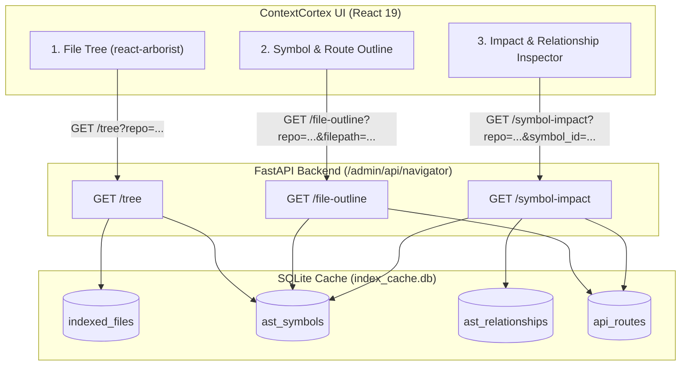

# High-Performance Codebase Navigator Design Specification

**Date:** 2026-08-31  
**Status:** Approved for Implementation  
**Topic:** Replacing legacy 2D force-directed topology graph with a high-density, high-performance Codebase Navigator.

---

## 1. Executive Summary & Problem Statement

### 1.1 The Problem
The current `Topology` view uses an in-browser 2D Canvas force-directed physics simulation (`TopologyCanvas2D.tsx` & `NeighborhoodView.tsx`). For medium to large repositories (such as `model-context-gateway` with 466 files, 1,645 symbols, and 24,648 relationships, or `context-cortex` with 197 files, 2,834 symbols, and 36,262 relationships), this approach:
1. Executes an $O(N^2 \times \text{iterations})$ physics algorithm synchronously on the main JavaScript thread, locking up the browser UI.
2. Produces an unreadable "spaghetti hairball" graph where nodes overlap, labels are illegible, and clicking or navigating is difficult.
3. Fails to provide intuitive, actionable codebase navigation.

### 1.2 The Solution
Replace the 2D physics graph with a deterministic, structured, high-performance **3-Pane Codebase Navigator**:
1. **Pane 1 (File Tree):** Virtualized hierarchical directory and module tree with fuzzy search, file type badges, and symbol counts.
2. **Pane 2 (Symbol & Route Outline):** Categorized list of AST symbols (classes, functions, methods) and API routes with line ranges and signature previews.
3. **Pane 3 (Impact & Relationship Inspector):** Deep code intelligence inspector showing callers, callees, imports, API route mappings, docstrings, and click-through navigation.

**Performance Goal:** Instant response ($<5\text{ms}$ frontend render time, $<2\text{ms}$ backend SQLite queries) scaling seamlessly to $100,000+$ files without UI freezing.

---

## 2. Architecture & Data Flow



---

## 3. Backend API Specifications

### 3.1 Tree Endpoint: `GET /admin/api/navigator/tree`
**Query Parameters:**
* `repo` (string, required): Repository name or `__all__`.

**Response Schema:**
```json
{
  "repo": "model-context-gateway",
  "total_files": 466,
  "total_symbols": 1645,
  "tree": [
    {
      "id": "dir:app",
      "name": "app",
      "is_dir": true,
      "children": [
        {
          "id": "dir:app/api",
          "name": "api",
          "is_dir": true,
          "children": [
            {
              "id": "file:app/api/routers/chat.py",
              "name": "chat.py",
              "path": "app/api/routers/chat.py",
              "is_dir": false,
              "language": "python",
              "symbol_count": 3,
              "route_count": 2
            }
          ]
        }
      ]
    }
  ]
}
```

### 3.2 File Outline Endpoint: `GET /admin/api/navigator/file-outline`
**Query Parameters:**
* `repo` (string, required)
* `filepath` (string, required)

**Response Schema:**
```json
{
  "repo": "model-context-gateway",
  "filepath": "app/api/routers/chat.py",
  "language": "python",
  "symbols": [
    {
      "id": 1042,
      "name": "chat_completion_endpoint",
      "full_symbol": "app.api.routers.chat.chat_completion_endpoint",
      "kind": "function",
      "start_line": 42,
      "end_line": 98,
      "signature": "async def chat_completion_endpoint(request: Request, body: ChatCompletionRequest) -> Response",
      "route": {
        "framework": "FastAPI",
        "http_method": "POST",
        "path_pattern": "/v1/chat/completions"
      }
    }
  ]
}
```

### 3.3 Symbol Impact Endpoint: `GET /admin/api/navigator/symbol-impact`
**Query Parameters:**
* `repo` (string, required)
* `symbol_id` (int, required)

**Response Schema:**
```json
{
  "symbol": {
    "id": 1042,
    "name": "chat_completion_endpoint",
    "kind": "function",
    "filepath": "app/api/routers/chat.py",
    "start_line": 42,
    "end_line": 98,
    "signature": "async def chat_completion_endpoint(request: Request, body: ChatCompletionRequest) -> Response",
    "docstring": "OpenAI-compatible chat completion endpoint supporting streaming and routing."
  },
  "route": {
    "framework": "FastAPI",
    "http_method": "POST",
    "path_pattern": "/v1/chat/completions"
  },
  "callers": [
    {
      "source_symbol_id": 512,
      "source_symbol": "test_chat_completions_e2e",
      "source_filepath": "tests/e2e/test_chat.py",
      "line_number": 55,
      "relationship_type": "CALLS"
    }
  ],
  "callees": [
    {
      "target_symbol": "LiteLLMGateway.execute_call",
      "target_filepath": "app/services/llm_gateway.py",
      "line_number": 120,
      "relationship_type": "CALLS"
    }
  ],
  "imports": [
    {
      "target_symbol": "fastapi.APIRouter",
      "relationship_type": "IMPORTS"
    }
  ]
}
```

---

## 4. Frontend Component Breakdown

### 4.1 Component Hierarchy
* `frontend/src/CodeNavigator.tsx` (Main view replacing `TopologyExplorer.tsx`)
  * `NavigatorToolbar.tsx` (Repo selector, density mode toggle, search shortcut)
  * `NavigatorTree.tsx` (Virtualized file/folder tree with search input)
  * `NavigatorOutline.tsx` (Symbol list with category filter chips and quick filter)
  * `NavigatorInspector.tsx` (Deep relationship details, metrics, callers, callees, signatures)

### 4.2 Density Modes
* **Compact (IDE Mode):** 20px item heights, 0.76rem font size, tight padding.
* **Balanced Mode (Default):** 28px item heights, 0.84rem font size, comfortable modern spacing.
* **Spacious Mode:** 36px item heights, 0.90rem font size, card-style padding.

### 4.3 Click-through Navigation Flow
1. User clicks an incoming caller in the Inspector (e.g., `test_chat_completions_e2e` in `tests/e2e/test_chat.py`).
2. The Navigator automatically opens `tests/e2e/test_chat.py` in Pane 1.
3. Pane 2 loads symbols for `test_chat.py` and highlights `test_chat_completions_e2e`.
4. Pane 3 immediately loads the impact and relationship inspector for `test_chat_completions_e2e`.

---

## 5. Testing & Verification Matrix

### 5.1 Backend Unit & Integration Tests (`pytest tests/backend/`)
* `test_navigator_service.py`:
  * Tree construction correctness (hierarchy, counts, empty repos).
  * Outline generation (line numbers, signatures, routes).
  * Impact analysis (callers, callees, imports, missing IDs).
* `test_navigator_router.py`:
  * HTTP status codes (200, 404 for missing repo/symbol, 422 for bad params).

### 5.2 Frontend Unit Tests (`vitest run`)
* `CodeNavigator.test.tsx`: 3-pane rendering and state management.
* `NavigatorTree.test.tsx`: Folder expansion, file selection, fuzzy filtering.
* `NavigatorOutline.test.tsx`: Category chip filtering, selection triggers.
* `NavigatorInspector.test.tsx`: Metric rendering, caller click-through events, permalink copy.

### 5.3 Playwright E2E Tests (`playwright test e2e/navigator.spec.ts`)
* Complete cross-pane navigation workflow.
* Repository switching.
* Caller click-through jump verification.
* Density toggle verification.
