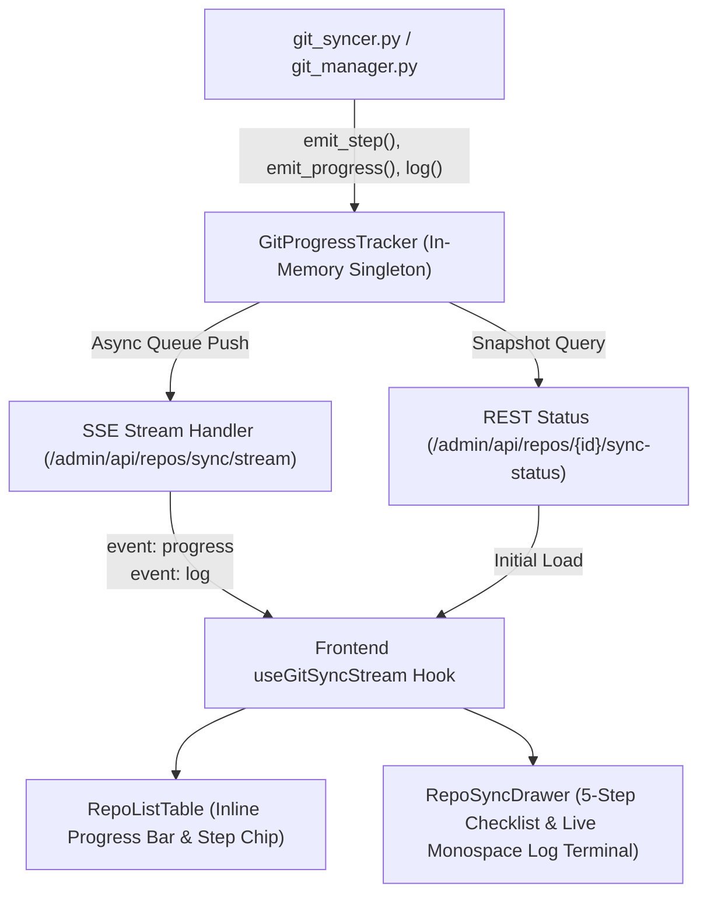

# Git Repo Ingestion Real-Time Progress & Live Log Visibility Design

## Overview
Currently, during Git repository cloning and indexing, users have minimal visibility into what the system is doing, seeing only a static "Syncing" badge. This document details the end-to-end architecture for granular 5-step progress tracking, real-time Server-Sent Events (SSE) telemetry, and an interactive slide-out log drawer.

---

## 1. Architecture & Data Flow



---

## 2. Backend Components

### 2.1 Progress Registry (`app/services/indexing/git_progress.py`)
- Thread-safe singleton managing state for each repository.
- Maintains in-memory ring buffer (up to 300 log entries per repo) to avoid SQLite disk thrashing during high-speed batch loops.
- Emits progress events to registered asyncio subscriber queues.

```python
class GitSyncJob:
    repo_id: int
    repo_name: str
    status: str             # "pending" | "syncing" | "synced" | "error"
    step: int               # 1 to 5
    total_steps: int        # 5
    step_name: str          # e.g., "Cloning repository", "Parsing AST symbols"
    current_file: Optional[str]
    processed_files: int
    total_files: int
    percent: int            # 0 to 100
    started_at: float
    updated_at: float
    error: Optional[str]
    logs: deque             # Ring buffer of recent log dicts {timestamp, level, message}
    cancelled: bool
```

### 2.2 5-Stage Indexer Instrumentation (`app/services/indexing/git_syncer.py` & `git_manager.py`)
1. **Stage 1: Connecting & Remote Check**:
   - Checks `git ls-remote` for remote commit SHA without cloning.
   - Emits commit comparison status.
2. **Stage 2: Shallow Clone**:
   - Emits clone start with sanitized URL and branch.
   - Measures clone duration and emits clone completion.
3. **Stage 3: File Delta Computation**:
   - Scans cloned files and computes hash delta vs SQLite.
   - Emits summary: `+X added, ~Y modified, -Z deleted, W unchanged`.
4. **Stage 4: AST & Route Parsing**:
   - Emits granular per-file progress: `[48/120] 40% - src/api/routes.ts`.
   - Emits AST symbol counts, route handlers, and file summaries.
5. **Stage 5: Vector Embedding & Cleanup**:
   - Emits batch upsert status to vector store.
   - Cleans up ephemeral disk storage and marks repo `synced`.

### 2.3 API Endpoints (`app/api/routers/repositories.py`)
- `GET /admin/api/repos/sync/stream`: SSE endpoint streaming `progress` and `log` events in real-time.
- `GET /admin/api/repos/{repo_id}/sync-status`: Snapshot endpoint returning current state and log history.
- `POST /admin/api/repos/{repo_id}/cancel-sync`: Flags cancellation for in-flight tasks.

---

## 3. Frontend Components

### 3.1 `useGitSyncStream` React Hook (`frontend/src/hooks/useGitSyncStream.ts`)
- Subscribes to `/admin/api/repos/sync/stream` when active syncs are running.
- Tracks per-repo progress records and active log buffers.
- Reconnection resilience with automatic fallback to `/admin/api/repos` polling.

### 3.2 Enhanced Table Row (`frontend/src/components/git/RepoListTable.tsx`)
- Displays multi-phase progress bar with animated stripe or fill.
- Displays step pill: `Step 3/5: Parsing (48/120 • 40%)`.
- Displays active file caption: `📄 src/services/git_manager.py`.
- Clicking row or progress chip opens the Live Drawer.

### 3.3 `RepoSyncDrawer` (`frontend/src/components/git/RepoSyncDrawer.tsx`)
- **Header**: Repo alias, branch, commit SHA, elapsed timer (`00:34s`), and "Cancel Sync" button.
- **5-Step Stepper**: Vertical checklist showing Completed (green check), Active (pulsing spinner), and Pending steps.
- **Monospace Log Terminal**:
  - Dark terminal theme with timestamp and color-coded level badges (`INFO`, `WARN`, `ERROR`).
  - Auto-scroll lock toggle.
  - Search / filter input.
  - "Copy All Logs" button.

---

## 4. Testing & Quality Gates

### Unit Tests
- `tests/backend/test_git_progress.py`: Test state transitions, log buffer rotation, event subscriber broadcasting, and cancellation flags.
- `tests/backend/test_git_syncer_progress.py`: Verify each of the 5 stages triggers appropriate progress events.
- `frontend/src/tests/RepoSyncDrawer.test.tsx`: Test stepper rendering, log streaming, autoscroll toggle, search filtering, and cancel button.
- `frontend/src/tests/RepoListTable.test.tsx`: Test progress bar and step chip rendering.

### End-to-End Tests
- Playwright E2E scenario in `frontend/e2e/git-sync-progress.spec.ts`:
  1. Trigger git repo sync.
  2. Verify table row transitions through `Connecting` -> `Cloning` -> `Parsing` -> `Synced` with advancing progress bar.
  3. Open `RepoSyncDrawer` and verify live logs stream in real-time.
  4. Verify completed 5-step checklist.
