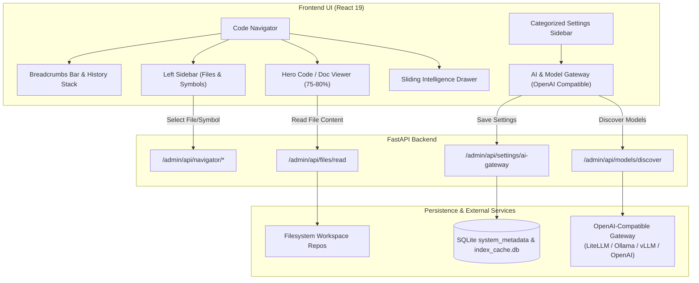

# Design Specification: Code Navigator Hero Layout, Stable Toolbar, OpenAI-Compatible Model Gateway, and Settings Dashboard Overhaul

- **Date**: 2026-09-29
- **Status**: Approved for Planning
- **Author**: Antigravity Assistant & Engineering Team
- **Target Release**: ContextCortex Next Local Release

---

## 1. Executive Summary & Goals

This specification resolves critical usability, architectural, and layout issues identified in ContextCortex:
1. **Code-First Navigator**: Refactor the Code Navigator into an IDE/GitHub-style experience where the full code/document viewer is the primary hero (~75–80% width) with clear breadcrumbs, back/forward history, and a unified collapsible sidebar.
2. **Stable Single-Row Toolbar**: Condense the Navigator toolbar into a single, non-wrapping row (44px height) to eliminate viewport resizing and vertical jitter.
3. **Repository Tree Root Hygiene**: Eliminate phantom empty folders created by double-slash URI tokens (`repo://...`).
4. **Reliable Document & Code Viewing**: Ensure clicking any document or source file immediately displays its full content without dead buttons or empty states.
5. **UI-First OpenAI-Compatible Model Gateway**: Decouple LLM gateway configuration from local FastEmbed embeddings. Store API URL, API key, and model choices directly in SQLite (`system_metadata`) with secure masked credentials (`sk-••••••••`), live connection testing, and dynamic model discovery.
6. **Settings Page Redesign**: Replace the long vertical page with a categorized left-sidebar dashboard with clean Material/SVG icons (strictly no emojis).
7. **Ingestion Catalog Formatting & Search Spinners**: Standardize catalog stat cards, pill filters, and tables, and replace font-dependent search spinners with robust SVG animations.
8. **End-to-End Quality Gates**: Back all changes with rigorous, non-mock-theater unit, component, and Playwright layout/behavioral tests.

---

## 2. Architecture & Detailed Component Design

### 2.1 Code Navigator: Code as Hero & Navigation History

#### Component Structure:
* [`frontend/src/CodeNavigator.tsx`](file:///containers/dev/contexthub/frontend/src/CodeNavigator.tsx):
  * **Layout**:
    * **Top**: Compact `NavigatorToolbar` (Repo selector, stats, Omni-Search, density, refresh).
    * **Sub-Header / Breadcrumb Bar**:
      * Back / Forward navigation buttons (`<`, `>`) tied to a navigation stack (`history: string[]`, `historyIndex: number`).
      * Breadcrumb trail: `[Repo]` &rarr; `[Folder]` &rarr; `[File.ext]` &rarr; `[Symbol/Route (if selected)]`. Each segment is clickable to navigate upward.
      * Quick actions: Copy Permalink, Raw view toggle, Intelligence drawer toggle button.
    * **Main Workspace**: Two-section flex layout:
      * **Left Sidebar (~260px, collapsible via toggle button or `Ctrl+B`)**:
        * Header tab pills: **Files** (File Tree) vs. **Outline** (AST Symbols & Routes).
        * For document files (`.md`, `.txt`, `.json`), Outline displays Markdown headers/sections rather than an empty dead-end card.
      * **Center Hero Viewport (Full remaining width, ~75–80%)**:
        * Renders [`NavigatorCodeViewer`](file:///containers/dev/contexthub/frontend/src/components/navigator/NavigatorCodeViewer.tsx) or [`NavigatorDocReader`](file:///containers/dev/contexthub/frontend/src/components/navigator/NavigatorDocReader.tsx) immediately upon file selection.
        * Highlights symbol start/end lines smoothly and automatically scrolls into view.
      * **Collapsible Sliding Drawer / Side-Dock (Callers, Callees & Impact)**:
        * Slides in from the right or docks at the bottom when requested.
        * Renders caller/callee chips and API route cards without intruding on code reading.

#### Tree Protocol Sanitization:
* [`app/services/navigator.py`](file:///containers/dev/contexthub/app/services/navigator.py):
  * `_clean_path(path: str)` strips any leading protocol like `repo://` or `storage://` and removes empty split segments.
  * Ensures `parts = [p for p in raw_path.split("/") if p.strip()]`.
  * The root tree node contains only valid top-level directories and files; no node with `name: ""` is ever generated.

---

### 2.2 Navigator Toolbar Condensation

* **CSS / Layout (`frontend/src/styles/navigator.css`)**:
  * `.nav-toolbar` updated with `flex-wrap: nowrap`, `height: 44px`, `overflow-x: auto`, `overflow-y: hidden`.
  * Left section: Compact repo select dropdown + minimal stats chips (`12 files`, `48 symbols`).
  * Center section: `NavigatorOmniSearch` with fixed responsive width (`min-width: 220px; max-width: 380px;`).
  * Right section: Segmented density toggle (Compact / Balanced / Spacious) and SVG refresh button.
  * Responsive breakpoint: At `<768px`, toolbar stays single-line with horizontally scrollable or iconified density buttons.

---

### 2.3 Search Loading Spinner Fix

* Replace FontAwesome `fa-spinner fa-spin` in [`SearchInspector.tsx`](file:///containers/dev/contexthub/frontend/src/SearchInspector.tsx) and [`NavigatorOmniSearch.tsx`](file:///containers/dev/contexthub/frontend/src/components/navigator/NavigatorOmniSearch.tsx) with a standalone inline SVG:
  ```tsx
  <svg className="nav-svg-spinner animate-spin" width="14" height="14" viewBox="0 0 24 24" fill="none">
    <circle className="opacity-25" cx="12" cy="12" r="10" stroke="currentColor" strokeWidth="4"></circle>
    <path className="opacity-75" fill="currentColor" d="M4 12a8 8 0 018-8V0C5.373 0 0 5.373 0 12h4zm2 5.291A7.962 7.962 0 014 12H0c0 3.042 1.135 5.824 3 7.938l3-2.647z"></path>
  </svg>
  ```
* Standardize CSS animation `nav-spin` with `1s linear infinite` rotation.

---

### 2.4 UI-First OpenAI-Compatible Model Gateway & Settings Redesign

#### Database & Backend Persistence:
* Database table `system_metadata` in SQLite stores:
  * `openai_api_url`: string (e.g. `http://litellm:4000/v1`)
  * `openai_api_key`: string (encrypted or raw masked token)
  * `openai_chat_model`: string (e.g. `gemini-2.5-flash`)
  * `openai_vision_model`: string (e.g. `gemini-2.5-flash`)
  * `openai_embedding_model`: string (e.g. `text-embedding-3-small`)
* **Environment Fallback Seeding**:
  * On initial boot, if `openai_api_url` or `openai_api_key` are not set in the database, seed them once from `LITELLM_URL` and `LITELLM_API_KEY`.
  * After initial seeding, the database is the **exclusive source of truth**.
  * Endpoint `GET /admin/api/settings/ai-gateway` returns:
    * `url`: configured URL
    * `has_api_key`: boolean
    * `masked_api_key`: e.g. `sk-••••••••••••3a9f` or `••••••••`
    * `chat_model`, `vision_ocr_model`, `embedding_model`
  * Endpoint `POST /admin/api/settings/ai-gateway`:
    * Accepts `url`, `api_key` (optional, only updated if provided), `chat_model`, `vision_ocr_model`, `embedding_model`.
    * Clears API key if explicitly passed as empty string.
  * Decouple from `/admin/api/settings/embedding` so saving embedding limits (threads, batch size) never wipes or modifies the AI Gateway configuration.

#### Settings Dashboard Layout:
* [`frontend/src/Settings.tsx`](file:///containers/dev/contexthub/frontend/src/Settings.tsx) redesigned into a two-column responsive layout:
  * **Left Sidebar (220px)** with clean SVG / Material design icons (strictly no emojis):
    1. **AI & Model Gateway** (`fa-solid fa-robot` or SVG chip)
    2. **Vector Database** (`fa-solid fa-database`)
    3. **Embedding Engine** (`fa-solid fa-microchip`)
    4. **Auto-Sync & Webhooks** (`fa-solid fa-arrows-rotate`)
    5. **Git & Host Credentials** (`fa-solid fa-key`)
    6. **File Processing & Summaries** (`fa-solid fa-file-lines`)
    7. **Appearance & Theme** (`fa-solid fa-palette`)
  * **Right Panel**: Shows only the currently active category card.
  * Mobile view: Collapses into an accessible top dropdown or scrollable sub-tabs.

#### Model Discovery & Connection Testing:
* "Test Connection & Discover Models" button pings `<openai_api_url>/models`.
* Displays real status: Latency in ms, total model count, and populates model dropdowns for Chat, Vision OCR, and Embedding models, with a custom input fallback.

---

### 2.5 Ingestion Catalog UI Formatting Fixes

* [`frontend/src/IngestionCatalogViewer.tsx`](file:///containers/dev/contexthub/frontend/src/IngestionCatalogViewer.tsx):
  * **Stat Counters**: Clean CSS grid with 4 equal cards. Distinct SVG icons, bold numbers, and subtitle labels without clipping.
  * **Filter Bar**: Consistent 36px inputs, clean pill buttons with active states, and aligned action buttons.
  * **Data Tables**: Explicit column widths, monospace font for branches and commits (`git` provider badges, `synced` status badges), responsive horizontal scrolling.

---

## 3. Data Flow & State Management



---

## 4. Verification & Testing Strategy

### 4.1 Backend Pytest
* `tests/backend/test_navigator_router.py`:
  * Verify `get_navigator_tree` strips URI schemes and contains no directory node with `name: ""`.
* `tests/backend/test_ai_gateway_settings.py`:
  * Verify `GET /admin/api/settings/ai-gateway` masks the API key (`sk-••••••••`).
  * Verify `POST /admin/api/settings/ai-gateway` updates URL and models without requiring key re-entry.
  * Verify initial seeding from environment variables only occurs if database rows are absent.
  * Verify saving embedding settings never clobbers AI Gateway settings.

### 4.2 Frontend Vitest Tests
* `NavigatorCodeViewer.test.tsx` & `CodeNavigator.test.tsx`:
  * Verify selecting a file renders code/doc content immediately in the hero viewer.
  * Verify breadcrumbs render clickable segments and update on navigation.
  * Verify Back and Forward history buttons navigate through previously visited files.
  * Verify left sidebar collapses and expands cleanly.
* `Settings.test.tsx` & `AIGatewaySettings.test.tsx`:
  * Verify category sidebar switches between settings views.
  * Verify masked API key display and "Change Key" input revelation.
  * Verify Model Discovery populates Chat, Vision, and Embedding select menus.
* `SearchInspector.test.tsx` & `NavigatorOmniSearch.test.tsx`:
  * Verify SVG spinner renders during loading states.

### 4.3 Playwright E2E & Layout Tests
* Layout Inspector test checking toolbar height stability (`expect(toolbarHeight).toBeLessThanOrEqual(48)`) across 1280px, 1024px, and 768px viewports.
* Document Reader test: Click `README.md` &rarr; verify markdown rendered immediately in the hero viewer with zero dead buttons.
